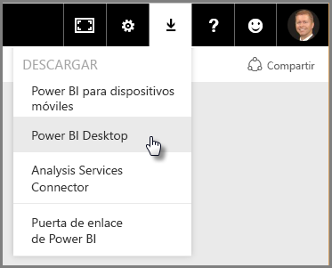
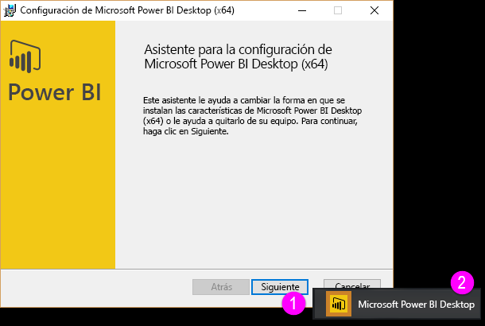
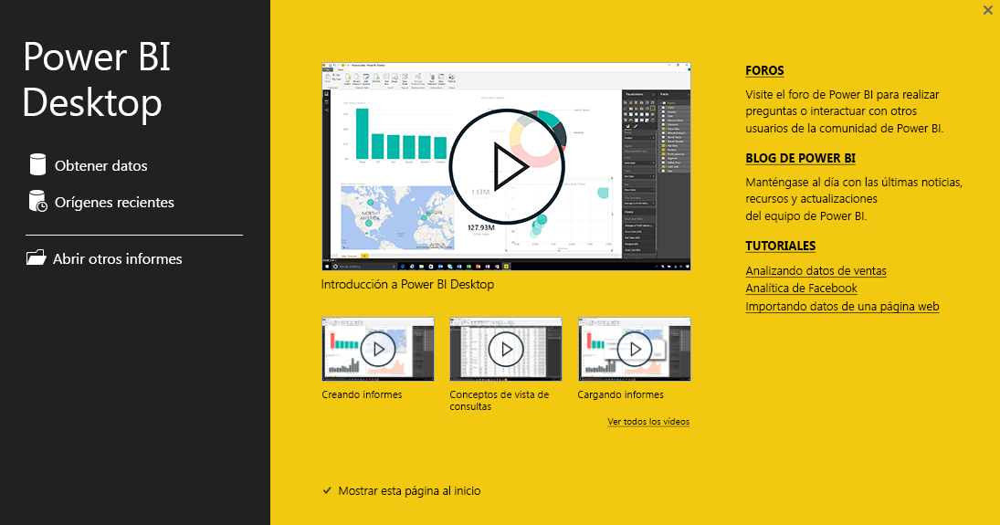

# Introducción a Power BI Desktop
Esta es la **Guía de introducción de Power BI Desktop**. En este breve paseo introductorio por Power BI Desktop se familiarizará con su funcionamiento y sus capacidades. Al final, será capaz de crear modelos de datos eficaces, junto con increíbles informes, que expandirán sus esfuerzos de inteligencia empresarial. 

¿Prefiere ver en lugar de leer? No dude en [echar un vistazo al vídeo de introducción](desktop-videos.md). Y si desea ver el vídeo con los datos de ejemplo correspondientes, [descargue este libro de Excel de ejemplo](http://go.microsoft.com/fwlink/?LinkID=521962).

Power BI Desktop le permite crear una colección de consultas, conexiones de datos e informes que se pueden compartir fácilmente con otros usuarios. Power BI Desktop integra tecnologías de eficacia comprobada de Microsoft (un potente motor de consultas, capacidades de modelado de datos y visualizaciones) y funciona en línea sin problemas con el [**servicio Power BI**](https://app.powerbi.com/).

Con la combinación de **Power BI Desktop** (donde los analistas y otros usuarios pueden crear conexiones de datos eficaces, modelos e informes) y el [**servicio Power BI**](https://preview.powerbi.com/) (donde se pueden compartir informes de Power BI Desktop para que otros usuarios los vean e interactúen con ellos) se obtiene nueva información del mundo de los datos que es más fácil de modelar, crear, compartir y ampliar.

Los analistas de datos encontrarán en Power BI Desktop una herramienta eficaz, flexible y muy accesible para conectarse con datos y darles forma, crear modelos eficaces y elaborar informes con la estructura adecuada.

## Cómo usar esta guía
Puede usar a esta guía de dos maneras: darle un rápido vistazo general o leer cada sección completa para adquirir una comprensión segura del funcionamiento de Power BI Desktop.

Si tiene prisa, puede realizar un reconocimiento visual de la guía en un par de minutos y tener una idea clara de cómo funciona y cómo se usa Power BI Desktop. En su mayor parte, esta guía se compone de pantallas que muestran visualmente el funcionamiento de Power BI Desktop.

Para obtener una comprensión más completa puede leer cada sección, llevar a cabo los pasos descritos y crear su propio archivo de Power BI Desktop, que podrá publicar en el servicio **Power BI** y compartirlo con otros usuarios.

## Funcionamiento de Power BI Desktop
Con Power BI Desktop, puede *conectarse a datos* (que normalmente son varios orígenes de datos), *dar forma a dichos datos* (con las consultas que crean modelos de datos precisos y convincente) y usar modelos para *crear informes* (que otros pueden aprovechar, compartir y usar como punto de partida).

Una vez que haya completado los pasos (conectarse a datos, darles forma, crear el informe) satisfactoriamente, puede guardar el trabajo en el formato de archivos de Power BI Desktop, que es la extensión .pbix. Los archivos de Power BI Desktop se pueden compartir como cualquier otro archivo, pero la forma más contundente de hacerlo es cargarlos (compartirlos) en el [**servicio Power BI**](https://preview.powerbi.com/). 

Power BI Desktop centraliza, simplifica y agiliza lo que de otro modo podría ser un proceso de diseño y creación de repositorios e informes de inteligencia empresarial disperso, arduo y desconectado.

¿Listo para probarlo? Comencemos.

## Instalar y ejecutar Power BI Desktop
Puede descargar Power BI Desktop desde el servicio **Power BI**, seleccionando el icono de **engranaje**. A continuación, seleccione **Power BI Desktop**.

Power BI Desktop se instala como una aplicación y se ejecuta en el escritorio.

Cuando se ejecuta Power BI Desktop, aparece una pantalla de *bienvenida* .

Puede **Obtener datos**, ver **Orígenes recientes**o **Abrir otros** **Informes** directamente desde la pantalla de *bienvenida* (desde los vínculos del panel izquierdo). Si cierra la pantalla (seleccione la **x** situada en la esquina superior derecha), se muestra la vista **Informe** de Power BI Desktop.

Hay tres vistas en Power BI Desktop: vista **Informe** , vista **Datos** y vista **Relaciones** . Power BI Desktop también incluye el **Editor de consultas**, que se abre en una ventana independiente. En el **Editor de consultas**, puede crear consultas y transformar los datos para luego cargar dicho modelo de datos refinados en Power BI Desktop y crear informes.

La pantalla siguiente muestra los iconos de las tres vistas en la parte izquierda de Power BI Desktop: **Informe**, **Datos**y **Relaciones**, de arriba a abajo. La vista actual se indica mediante la barra amarilla de la parte izquierda. En este caso, se muestra la vista **Informe** . Puede cambiar las vistas haciendo clic en cualquiera de los tres iconos.

Con Power BI Desktop instalado, está listo para conectarse a datos, darles forma y generar informes (normalmente en ese orden). En las siguientes secciones, se hace un recorrido por cada operación.

## Conectar a datos
Con Power BI Desktop instalado, está listo para conectarse con el mundo en expansión continua de los datos. Hay *todo tipo* de orígenes de datos disponibles en la ventana de consulta. La siguiente imagen muestra cómo conectarse a datos, seleccionando la cinta **Inicio** y, a continuación, **Obtener datos \> Más**.

 

Para este paseo, nos conectaremos a dos orígenes de datos **web** diferentes.

Imagine que se jubila (desea vivir donde hay mucho sol, mejores tasas de impuestos y buena cobertura de servicios médicos), o quizás que es un analista de datos y desea información para ayudar a sus clientes. Por ejemplo, quizás desee ayudar a su distribuidor de gafas de sol a alcanzar su objetivo de ventas en un lugar donde siempre brilla el sol.

Cualquiera que sea el caso, el siguiente recurso web tiene datos interesantes acerca de estos temas y mucho más:

[*http://www.bankrate.com/finance/retirement/best-places-retire-how-state-ranks.aspx*](http://www.bankrate.com/finance/retirement/best-places-retire-how-state-ranks.aspx)

Seleccione **Obtener datos \> Web** y pegue la dirección.

 

Al seleccionar **Aceptar**, la funcionalidad de **consulta** de Power BI Desktop entra en acción. La consulta se conecta con el recurso web y la ventana **Navegador** devuelve la información encontrada en la página web. En este caso, encuentra una tabla (*Tabla 0*) y el documento web general. Nos interesa la tabla, así que la seleccionamos de la lista. La ventana **Navegador** muestra una vista previa.

 

En este punto, se puede modificar la consulta antes de cargar la tabla (para ello, seleccione **Editar** desde la parte inferior de la ventana) o se puede cargar directamente la tabla.

Si seleccionamos **Editar**, el Editor de consultas inicia una vista representativa de la tabla. Se muestra el panel **Configuración de consulta** (si no es así, puede seleccionar **Vista** desde la cinta de opciones y, a continuación, seleccionar **Mostrar \> Configuración de consulta** para mostrar el panel **Configuración de consulta**). Ofrece el siguiente aspecto.

 

Para obtener más información sobre cómo conectarse a datos, consulte [Conectarse a los datos en Power BI Desktop](desktop-connect-to-data.md).

En la siguiente sección, ajustaremos los datos de acuerdo con nuestras necesidades. El proceso de ajustar datos conectados se conoce como *dar forma* a los datos.

## Combinar y dar forma a datos
Ahora que nos hemos conectado a un origen de datos, es necesario ajustar los datos según se requiere. Ajustar a veces significa *transformar* los datos, por ejemplo, al cambiar el nombre de columnas o tablas, convertir texto en números, quitar filas, configurar una primera fila como encabezado, etcétera.

El Editor de consultas de Power BI Desktop hace un amplio uso de los menús contextuales, además de tener las tareas disponibles en la cinta de opciones. La mayor parte de lo que se puede seleccionar en la cinta **Transformar** también está disponible en el menú que aparece al hacer clic con el botón secundario en un elemento (por ejemplo, una columna).

## Dar forma a datos
Al dar forma a los datos en el **Editor de consultas**, se proporcionan instrucciones paso a paso (que el **Editor de consultas** lleva a cabo automáticamente) para ajustar los datos a medida que el **Editor de consultas** los carga y presenta. El origen de datos original no se ve afectado; únicamente la vista de los datos se ajusta o se *forma*.

Los pasos especificados (como cambiar el nombre de una tabla, transformar un tipo de datos o eliminar columnas) se registran en el **Editor de consultas**y, cada vez que este se conecta al origen de datos, dichos pasos se vuelven a aplicar para que los datos siempre muestren la forma que eligió. Este proceso se produce siempre que se use la consulta en Power BI Desktop, o cuando alguien más use su consulta compartida, como en el servicio **Power BI** . Estos pasos se capturan, de manera secuencial, en el panel **Configuración de consulta** en **Pasos aplicados**.

La siguiente imagen muestra el panel **Configuración de consulta** de una consulta a la que se ha dado forma; en los párrafos siguientes se examinará cada uno de los pasos.

 

Volvamos a los datos para la jubilación que encontramos al conectar con el origen de datos web para darles forma según lo requerimos.

Para empezar, la mayoría de las clasificaciones se presentaron en el **Editor de consultas** como números enteros, pero no todos ellos (una columna contiene texto y números, por lo tanto, no se convirtió automáticamente). Es necesario que los datos sean números. No hay problema, simplemente haga clic con el botón secundario en el encabezado de la columna y seleccione **Cambiar tipo \> Número entero** para cambiar el tipo de datos. Si se necesita elegir más de una columna, puede seleccionar una columna, mantener presionada la tecla **MAYÚS**, seleccionar columnas adyacentes adicionales y, a continuación, hacer clic en un encabezado de columna para cambiar todas las columnas seleccionadas. También se puede usar **CTRL** para seleccionar columnas no adyacentes.

 

También puede cambiar, o *transformar,* las columnas de texto a encabezado desde la cinta **Transformar** . Esta es la cinta de opciones **Transformar** , con una flecha que señala hacia el botón **Tipo de datos** , que permite transformar el tipo de datos actual.

 

Tenga en cuenta que en la **Configuración de consulta**, los **Pasos aplicados** reflejan los cambios realizados. Si desea quitar cualquier paso del proceso de forma, simplemente seleccione el paso y, a continuación, seleccione la **X** a la izquierda del paso.

 

Es preciso realizar algunos cambios más para que la consulta llegue al punto donde la queremos:

* *Quitar la primera columna* : no se necesita, solo incluye las filas redundantes que dicen "Mira cómo clasifica su estado para la jubilación", que es un defecto de esto que era una tabla basada en web

<!-- -->

* *Corregir algunos errores* : en la página web, una columna tenía texto combinado con los números (varios estados están vinculados en una categoría). Eso funciona bien en el sitio web, pero no en nuestro análisis de datos. El asunto es fácil de corregir, en este caso, y nos permite ver algunas características y capacidades interesantes del **Editor de consultas** y los **Pasos aplicados**

<!-- -->

* *Cambiar el nombre de la tabla* : **Tabla 0** no es un descriptor útil, pero cambiarlo es sencillo

Cada uno de estos pasos se muestra en **[Combinar y dar forma a datos en Power BI Desktop](desktop-shape-and-combine-data.md)**. No dude en consultar la página, o continúe revisando este documento para ver lo que haría a continuación. La siguiente sección retoma el proceso después de que se han aplicado los cambios anteriores.

## Combinar datos
Los datos acerca de los diferentes estados son interesantes y serán útiles en la creación de consultas y esfuerzos de análisis adicionales. Pero hay un problema: la mayoría de los datos usa una abreviatura de dos letras para los códigos de estado, no el nombre completo del estado. Se necesita una manera de asociar las abreviaturas con los nombres de los estados.

Estamos de suerte: hay otro origen de datos públicos que hace justamente eso, pero necesita algunos ajustes de forma considerables antes de que podamos conectarlo con la tabla de jubilación. Este es el recurso web de las abreviaturas de los estados:

<http://en.wikipedia.org/wiki/List_of_U.S._state_abbreviations>

Desde la cinta **Inicio** del **Editor de consultas**, seleccione **Obtener datos \> Web** y escriba la dirección, seleccione **Aceptar** y la ventana **Navegador** mostrará la información encontrada en la página web.

 

Seleccionamos **Table[edit]** porque incluye los datos deseados, pero será necesario aplicar bastante forma para reducir los datos de la tabla. Cada uno de estos pasos también se muestra en **[Combinar y dar forma a datos en Power BI Desktop](desktop-shape-and-combine-data.md)**. Para resumir los pasos, esto es lo que haremos:

Primero, seleccionamos **Editar**y, a continuación:

* *Quitar las dos primeras filas* : son el resultado de la forma en que se creó la tabla de la página web y no las necesitamos.

<!-- -->

* *Quitar las 26 filas inferiores* : son todos los territorios, que no es necesario incluir.

<!-- -->
* *Filtrar Washington DC* : la tabla de estadísticas de jubilación no incluye el controlador de dominio, por lo que la excluiremos de nuestra lista.

<!-- -->

* *Quitar unas cuantas columnas innecesarias* : únicamente se necesita la correspondencia entre las abreviaturas oficiales de dos letras y los estados, por lo que se pueden eliminar las demás columnas.

<!-- -->

* *Usar la primera fila como encabezado* : puesto que se eliminaron las primeras tres filas, queremos que la fila superior actual sea el encabezado.

>[!NOTE]
>Es un buen momento para señalar que la *secuencia* de los pasos aplicados en el **Editor de consultas** es importante y puede afectar a la manera en que se da forma a los datos. También es importante tener en cuenta cómo un paso puede afectar a otro paso posterior; si quita un paso de los **Pasos aplicados**, es posible que los pasos siguientes no tengan el efecto buscado originalmente, debido al impacto de la secuencia de pasos de la consulta.

* *Cambiar el nombre de las columnas y la tabla*: como de costumbre, existe un par de formas para cambiar el nombre de una columna. Puede elegir la que prefiera.

Una vez que se ha dado forma a la tabla *StateCodes* , es posible combinar las dos tablas, o consultas, en una; ya que las tablas que ahora tenemos son el resultado de las consultas aplicadas a los datos, a menudo se les denomina *consultas*.

Hay dos métodos principales para combinar las consultas, que son *fusionar* y *anexar*.

Cuando se tienen una o varias columnas para agregar a otra consulta, se **fusionan** las consultas. Cuando se tienen filas de datos adicionales que desea agregar a una consulta existente, se **anexa** la consulta.

En este caso queremos fusionar las consultas. Para empezar, se selecciona la consulta *en la que* se quiere fusionar la otra consulta, a continuación, se selecciona **Fusionar consultas** desde la pestaña **Inicio** en la cinta de opciones.

 

Aparecerá la ventana **Fusionar** , donde se le pide seleccionar la tabla que se quiere combinar con la tabla seleccionada y, a continuación, las columnas coincidentes que se usarán para la fusión. Seleccione *Estado* desde la tabla (consulta) *RetirementStats* , a continuación, seleccione la consulta *StateCode* (en este caso es fácil, dado que solo hay otra consulta; cuando se conecta a muchos orígenes de datos, hay muchas consultas para elegir). Al seleccionar las columnas coincidentes correctas ( *Estado* de *RetirementStats*, y *Nombre del estado* de *StateCode* ) la ventana **Fusionar** tiene una apariencia similar a la siguiente y el botón **Aceptar** está habilitado.

 

Se crea una **Nueva columna** al final de la consulta, con el contenido de la tabla (consulta) que se combinó con la consulta actual. Todas las columnas de la consulta combinada se comprimen en la **Nueva columna**, pero puede seleccionar **Expandir** la tabla e incluir cualquier columna que desee. Para expandir la tabla combinada y seleccionar qué columnas desea incluir, seleccione el icono de expandir (). Aparecerá la ventana **Expandir** .

 

En este caso, solamente queremos la columna *Código de estado* , así que seleccione solo dicha columna y, a continuación, seleccione **Aceptar**. Desactive la casilla de **usar el nombre de la columna original como prefijo** puesto que no es necesaria; si deja la casilla seleccionada, la columna combinada se denominará *NewColumn.State Code* (el nombre de la columna original, o *NewColumn*, un punto, y a continuación el nombre de la columna que se incorporó a la consulta).

>[!NOTE]
>¿Desea experimentar con diferentes maneras de incorporar la tabla *NewColumn*? Puede experimentar un poco y si no le gustan los resultados, elimine ese paso de la lista de **Pasos aplicados** en el panel **Configuración de consulta** y la consulta regresará al estado anterior a la aplicación del paso **Expandir** . Es como una segunda oportunidad, que puede tomar tantas veces como sea necesario hasta que el proceso de expansión tenga la apariencia que desee.

Ahora tiene una sola consulta (tabla) que combina dos orígenes de datos, a los cuales se dio forma para ajustarse a las necesidades pertinentes. Esta consulta puede servir como base para una gran cantidad de conexiones de datos interesantes, como estadísticas de costes de alojamiento, datos demográficos y oportunidades de trabajo en cualquier estado.

Para obtener una descripción más completa de cada uno de estos pasos para dar forma a datos y combinarlos, consulte [Combinar datos y darles forma en Power BI Desktop](desktop-shape-and-combine-data.md).

Por ahora, tenemos datos suficientes para crear algunos informes interesantes, todo ello en Power BI Desktop. Puesto que estamos ante un hito, guardemos este archivo de Power BI Desktop con el nombre de **Introducción a Power BI Desktop**. Para aplicar los cambios en el **Editor de consultas** y cargarlos en Power BI Desktop, seleccione **Cerrar y aplicar** en la cinta **Inicio**.

## Elaborar informes
Una vez cargada la tabla, pueden realizarse cambios adicionales y es posible volver a cargar un modelo para aplicar los cambios realizados. Pero por ahora basta con esto. En la vista **Informe** de Power BI Desktop, puede empezar a generar informes.

La vista **Informe** tiene cinco áreas principales:

1. La cinta de opciones, que muestra las tareas comunes asociadas con los informes y visualizaciones
2. La vista **Informe** , o lienzo, donde se crean y se organizan las visualizaciones
3. El área de pestaña **Páginas** situada a lo largo de la parte inferior, que permite seleccionar o agregar una página de informe
4. El panel **Visualizaciones** , donde puede cambiar las visualizaciones, personalizar los colores o ejes, aplicar filtros, arrastrar campos, etc
5. El panel de **Campos**, donde elementos de consulta y filtros se pueden arrastrar a la vista **Informe**, o bien al área **Filtros**del panel **Visualizaciones**.
   
   

Los paneles **Visualizaciones** y **Campos** se pueden contraer al seleccionar la flecha pequeña situada junto al borde, lo que proporciona más espacio en la vista **Informe** para crear visualizaciones interesantes. Cuando se modifican visualizaciones, también verá estas flechas hacia arriba o hacia abajo, lo que significa que se puede expandir o contraer la sección, según corresponda.

 

Para crear una visualización, basta con arrastrar un campo desde la lista **Campos** hasta la vista **Informe** . En este caso, arrastre el campo *Estado* de *RetirementStats* y vea qué sucede.

 

Preste atención... Power BI Desktop crea automáticamente una visualización basada en un mapa, ya que reconoce que el campo *State* contiene datos de geolocalización.

Observe que en el panel **Visualizaciones** , puedo seleccionar diferentes tipos de visualizaciones y en el área situada debajo de los iconos, puedo arrastrar campos a las distintas áreas para aplicar una leyenda o modificar la visualización.

 

Avancemos un poco más rápido para ver qué apariencia tiene la vista de **informes** después de agregar un puñado de visualizaciones y algunas páginas de informe nuevas. Para más información sobre los informes, consulte [Vista de informes en Power BI Desktop](desktop-report-view.md).

La primera página del informe proporciona una perspectiva de los datos basados en la *Clasificación general*. Cuando se selecciona una de las visualizaciones, el panel **Campos y filtros** muestra los campos seleccionados y la estructura de la visualización (qué campos se aplicaron al **Eje compartido**, los **Valores de columnas**y los **Valores de líneas**).

 

Hay seis **páginas** en este informe y en cada una se muestran determinados elementos de los datos.

1. En la primera página, que se muestra anteriormente, se muestran todos los estados según la *Clasificación general*.
2. La segunda página se centra en los 10 principales estados según la *Clasificación general*.
3. En la tercera página se visualizan los 10 mejores estados según el coste de la vida (y los datos asociados).
4. En la cuarta página los datos se abordan desde una perspectiva climática, filtrándose por los 15 estados más soleados.
5. En la quinta página, se muestran y representan gráficamente los 15 estados con mayor bienestar social.
6. Por último, se muestran las estadísticas sobre la delincuencia, que muestran los mejores (y bueno, los últimos) 10 estados.

Este es la apariencia de la página del informe que se centra en el coste de la vida.

 

Hay todo tipo de informes y visualizaciones interesantes que puede crear.

## Compartir su trabajo
Ahora que tiene un informe de Power BI Desktop razonablemente completo, puede compartirlo con otras personas en el servicio **Power BI** . Hay varias maneras de compartir su trabajo en Power BI Desktop. Puede publicar en el servicio **Power BI** , puede cargar el archivo .pbix directamente desde el servicio Power BI o puede guardar el archivo .pbix y enviar como cualquier otro archivo.

Primero, echemos un vistazo a la publicación en el servicio **Power BI** directamente desde Power BI Desktop. En la cinta de opciones **Inicio** , seleccione **Publicar**.

Se le pedirá que inicie sesión en Power BI.

Cuando haya iniciado sesión y finalizado el proceso de publicación, se mostrará el siguiente cuadro de diálogo.

Cuando inicia sesión en Power BI, verá el archivo de Power BI Desktop que acaba de cargar en las secciones **Paneles**, **Informes**y **Conjuntos de datos** del servicio.

Otra manera de compartir su trabajo es realizar la carga desde el servicio **Power BI** . El siguiente vínculo abre el servicio **Power BI** en un explorador:

`https://app.powerbi.com`

Seleccione **Obtener datos** para iniciar el proceso de carga del informe de Power BI Desktop.

 

Aparece la página **Obtener datos** , donde puede seleccionar de dónde desea obtener los datos. En este caso, seleccionamos **Obtener** desde el cuadro **Archivos** .

Se muestra la vista **Archivos** . En este caso, seleccionamos **Archivo local**.

Cuando se selecciona el archivo, Power BI carga el archivo.

Una vez cargado el archivo, puede seleccionarlo en **Informes** en el panel izquierdo del servicio Power BI.

El servicio **Power BI** muestra la primera página del informe. En la parte inferior de la página, puede seleccionar cualquier pestaña para mostrar esa página del informe.

 

Puede realizar cambios en un informe del servicio **Power BI** seleccionando **Editar informe** desde la parte superior del lienzo de informe.

Para guardar el informe, seleccione **Archivo \> Guardar como** desde el servicio. Puede crear todo tipo de efectos visuales interesantes en el servicio **Power BI** de su informe para anclarlos a un *panel*. Para más información sobre los paneles del servicio **Power BI****[, consulte las Sugerencias para diseñar un excelente panel](service-dashboards-design-tips.md)**.

 

Una vez guardado, seleccione el icono **Compartir** de la página principal.

 

Desde aquí, puede enviar un correo electrónico a los colegas con quienes desea compartir el panel.

 

Para más información sobre cómo crear, compartir y modificar los paneles, consulte [Compartir un panel con compañeros y otros usuarios](service-share-dashboards.md).

Hay todo tipo de mezclas y visualizaciones relacionadas con los datos que puede realizar con Power BI Desktop y con el servicio Power BI. Consulte la sección siguiente para obtener más información.

## Pasos siguientes
Se puede hacer todo tipo de cosas con Power BI Desktop. Para obtener más información sobre sus capacidades, consulte los siguientes recursos:

* [Información general sobre consultas con Power BI Desktop](desktop-query-overview.md)
* [Orígenes de datos en Power BI Desktop](desktop-data-sources.md)
* [Conectarse a los datos en Power BI Desktop](desktop-connect-to-data.md)
* [Combinar datos y darles forma con Power BI Desktop](desktop-shape-and-combine-data.md)
* [Tareas de consultas comunes en Power BI Desktop](desktop-common-query-tasks.md)   

