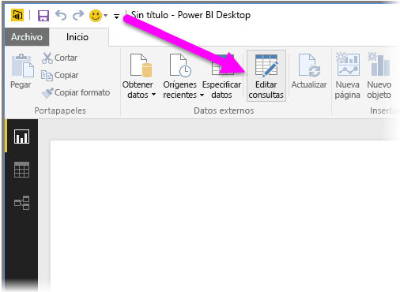
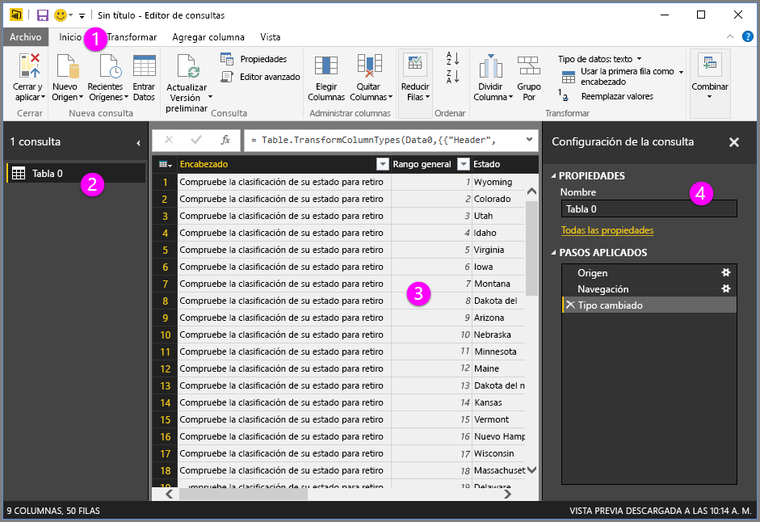
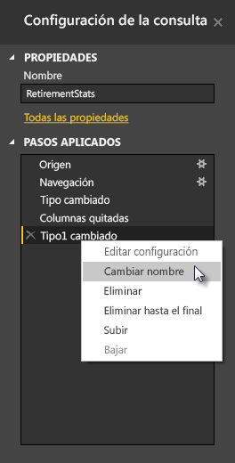
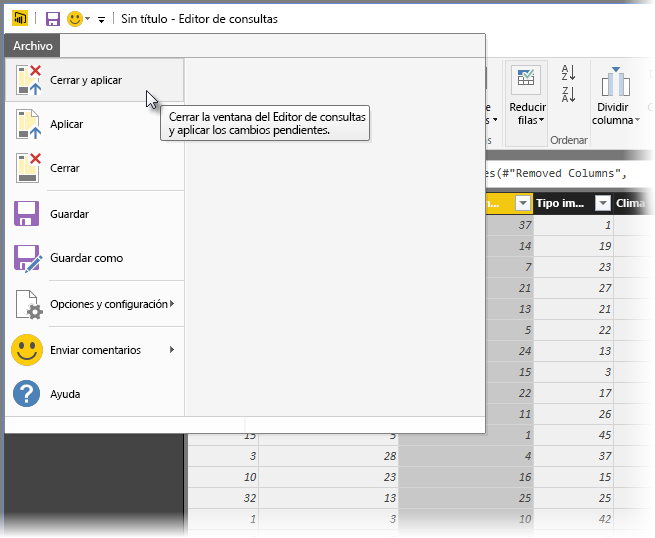

# Información general sobre consultas en Power BI Desktop
**Power BI Desktop** le permite conectarse con el mundo de los datos, crear informes básicos y atractivos y compartir sus esfuerzos con otros usuarios, quienes a su vez pueden basarse en el trabajo que comparte con ellos y expandir sus propios esfuerzos de inteligencia empresarial.

Power BI Desktop tiene tres vistas:

* **Vista de informes** : donde usa las consultas que crea para generar visualizaciones atractivas, que se ordenan como quiere que aparezcan, y con varias páginas, que puede compartir con los demás
* **Vista de datos** : vea los datos en el informe en el formato de modelo de datos, donde puede agregar medidas, crear nuevas columnas y administrar relaciones
* **Vista de relaciones** : obtenga una representación gráfica de las relaciones que se han establecido en el modelo de datos y adminístrelas o modifíquelas según corresponda.

Se puede obtener acceso a estas vistas seleccionando uno de los tres iconos en el lado izquierdo de Power BI Desktop. En la siguiente imagen, la vista de informes está seleccionada y se indica mediante la banda de color amarillo situada junto al icono.  

Power BI Desktop también incorpora el **Editor de consultas**, donde puede conectarse a uno o varios orígenes de datos, dar forma y transformar los datos para satisfacer sus necesidades y, a continuación, cargar ese modelo en Power BI Desktop.

Este documento proporciona información general del funcionamiento de los datos en el **Editor de consultas**. Hay mucho más que aprender. Por lo tanto, al final de este documento encontrará vínculos que proporcionan información detallada acerca de los tipos de datos compatibles, la conexión a los datos, el modelado de los datos y la creación de relaciones, y sobre cómo comenzar.

Pero primero, vamos a familiarizarnos con el **Editor de consultas**.

## Editor de consultas
Para obtener el **Editor de consultas**, seleccione **Editar consultas** desde la pestaña **Inicio** de Power BI Desktop.  

Si no existe ninguna conexión de datos, el **Editor de consultas** aparece como un panel en blanco listo para mostrar datos.  

Una vez que se carga una consulta, el **Editor de consultas** resulta más interesante. Si se conecta al siguiente origen de datos web, el **Editor de consultas** carga información acerca de los datos, a los que puede comenzar a dar forma enseguida.

[*http://www.bankrate.com/finance/retirement/best-places-retire-how-state-ranks.aspx*](http://www.bankrate.com/finance/retirement/best-places-retire-how-state-ranks.aspx)

Aquí se muestra la apariencia del **Editor de consultas** una vez establecida la conexión de datos:

1. En la cinta de opciones aparecen muchos botones activos que permiten interactuar con los datos de la consulta
2. En el panel izquierdo se enumeran las consultas, disponibles para su selección, visualización y forma
3. En el panel central se muestran los datos de la consulta seleccionada, disponibles para darles forma
4. Aparece la ventana **Configuración de la consulta**, con una lista de las propiedades de la consulta y de los pasos aplicados  
   
   

En las siguientes secciones analizaremos cada una de estas cuatro áreas: la cinta de opciones, el panel de consultas, la vista de datos y el panel de configuración de la consulta.

## La cinta de opciones de consulta
La cinta de opciones del **Editor de consultas** consta de cuatro pestañas: **Inicio**, **Transformar**, **Agregar columna** y **Vista**.

La pestaña **Inicio** contiene las tareas de consulta más comunes, incluyendo el primer paso en cualquier consulta, que es **Obtener datos.** La siguiente imagen muestra la cinta de opciones **Inicio**.  

Para conectarse a los datos y comenzar el proceso de creación de la consulta, seleccione el botón **Obtener datos** . Aparece un menú que proporciona los orígenes de datos más comunes.  

Para obtener más información acerca de los orígenes de datos disponibles, consulte **Orígenes de datos**. Para obtener información sobre cómo conectarse a datos, con ejemplos y pasos a seguir, consulte **Conectar a datos**.

La pestaña **Transformar** proporciona acceso a tareas comunes de transformación de datos, como agregar o quitar columnas, cambiar tipos de datos, dividir columnas y otras tareas orientadas a datos. La siguiente imagen muestra la pestaña **Transformar** .  

Para obtener más información acerca de la transformación de datos, incluidos ejemplos, vea **Combinar y dar forma a datos**.

La pestaña **Agregar columna** proporciona tareas adicionales relacionadas con agregar una columna, aplicar formato a los datos de una columna y agregar columnas personalizadas. La siguiente imagen muestra la pestaña **Agregar columna** .  

La pestaña **Vista** de la cinta de opciones se usa para alternar si se muestran determinados paneles o ventanas. También sirve para mostrar el Editor avanzado. La siguiente imagen muestra la pestaña **Vista**.  

Resulta útil saber que muchas de las tareas disponibles en la cinta también están disponibles haciendo clic en una columna u otros datos, en el panel central.

## El panel izquierdo
El panel izquierdo muestra el número de consultas activas, así como el nombre de cada consulta. Cuando selecciona una consulta en el panel izquierdo, los datos se muestran en el panel central, donde se les puede dar forma y transformar según sea necesario. La siguiente imagen muestra el panel izquierdo con varias consultas.  

## El panel central (panel de datos)
En el panel central, o en el panel Datos, se muestran los datos de la consulta seleccionada. Aquí es donde se realiza gran parte del trabajo de la vista de consultas.

En la siguiente imagen, se muestra la conexión de datos web establecida anteriormente, la columna **Puntuación general** está seleccionada y el encabezado muestra los elementos de menú disponibles al hacer doble clic en él. Tenga en cuenta que muchos de estos elementos de menú contextual son los mismos que los botones que se encuentran en las fichas de la cinta.  

Cuando se selecciona un elemento de menú contextual (o un botón de la cinta), en la vista de consultas se aplica el paso a los datos y se guarda como parte de la propia consulta. Los pasos se registran en el panel **Configuración de consulta** en orden secuencial, como se describe en la sección siguiente.  

## El panel Configuración de consulta
El panel **Configuración de consulta** es donde se muestran todos los pasos asociados con una consulta. Por ejemplo, en la imagen siguiente, la sección **Pasos aplicados** del panel **Configuración de consulta** refleja el hecho de que se acaba de cambiar el tipo de la columna **Puntuación general** .

A medida que se aplican más pasos de conformación a la consulta, estos se capturan en la sección **Pasos aplicados** .

Es importante saber que los datos subyacentes *no* cambian; en su lugar, se ajusta y da forma a la vista de los datos y cualquier interacción con los datos subyacentes se basa en la vista formada y modificada de los datos de la consulta.

En el panel **Configuración de consulta** , puede eliminar pasos y cambiar el nombre o el orden de estos como considere oportuno. Para ello, haga clic en el paso en la sección **Pasos aplicados** y, a continuación, elija la opción deseada del menú que aparece. Todos los pasos de consulta se llevan a cabo en el orden en que aparecen en el panel **Pasos aplicados**.

## El Editor avanzado
Si desea ver el código que el Editor de consultas está creando con cada paso, o si desea crear su propio código de forma, puede usar el **Editor avanzado**. Para iniciar el editor avanzado, seleccione **Vista** desde la cinta de opciones y después seleccione **Editor avanzado**. Aparecerá una ventana que muestra el código de la consulta actual.  

Puede modificar directamente el código en la ventana **Editor avanzado** . Para cerrar la ventana, seleccione el botón **Listo** o el botón **Cancelar** .  

## Guardar el trabajo
Cuando la consulta se encuentre en el lugar deseado, puede hacer que el Editor de consultas aplique los cambios en el modelo de datos en Power BI Desktop y cerrar dicho editor. Para ello, seleccione **Cerrar y aplicar** en el menú **Archivo** del Editor de consultas.  

Como la operación avanza, Power BI Desktop proporciona un cuadro de diálogo para mostrar su estado.  

Una vez que ha llegado al punto de consulta deseado, o si desea asegurarse de que el trabajo está guardado, Power BI Desktop puede guardar su trabajo en forma de un archivo .pbix.

Para guardar el trabajo, seleccione **Archivo \> Guardar** (o **Archivo \> Guardar como**), como se muestra en la siguiente imagen.  

## Pasos siguientes
Se puede hacer todo tipo de cosas con Power BI Desktop. Para obtener más información sobre sus capacidades, consulte los siguientes recursos:

* [Introducción a Power BI Desktop](desktop-getting-started.md)
* [Orígenes de datos en Power BI Desktop](desktop-data-sources.md)
* [Conectarse a los datos en Power BI Desktop](desktop-connect-to-data.md)
* [Combinar datos y darles forma con Power BI Desktop](desktop-shape-and-combine-data.md)
* [Tareas de consultas comunes en Power BI Desktop](desktop-common-query-tasks.md)   

