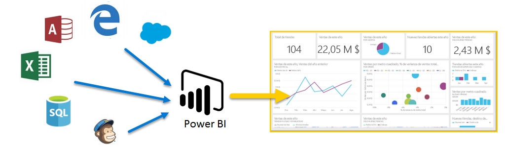

Este es el curso de **Aprendizaje guiado** de Power BI. Este curso en línea de autoaprendizaje explica qué es Power BI de forma progresiva, para que pueda aumentar sus conocimientos desde lo más básico.

El curso está diseñado para ofrecer orientación en fragmentos comprensibles, con un flujo lógico que lo ayuda a asimilar conceptos, detalles y ejemplos. También incluye una gran cantidad de objetos visuales y vídeos para contribuir a su aprendizaje.

Este curso de **Aprendizaje guiado** consta de muchas **secciones**, cada una de las cuales engloba numerosos **temas**. Después de los temas de esta primera sección **Introducción**, casi todos los demás incluyen un vídeo en el que se describe lo que aprenderá. En el contenido que aparece tras el vídeo, se explica el concepto para que pueda repasarlo y aprender a su propio ritmo.

Si está **empezando** a utilizar Power BI, con este curso podrá comenzar a dar sus primeros pasos, mientras que si está **familiarizado** con este servicio, podrá asociar conceptos y suplir las lagunas de conocimiento. Esperamos que disfrute del curso. Iremos incluyendo más contenidos en el futuro.

## ¿Qué es Power BI?
**Power BI** es una colección de servicios de software, aplicaciones y conectores que funcionan conjuntamente para convertir orígenes de datos sin relación entre sí en información coherente, interactiva y atractiva visualmente. Tanto si se trata de una sencilla hoja de cálculo de Excel como de una colección de almacenes de datos híbridos locales o basados en la nube, **Power BI** le permite conectar fácilmente los orígenes de datos, visualizar (o descubrir) lo más importante y compartirlo con quien quiera.

**Power BI** puede ser sencillo y rápido; capaz de crear información rápida a partir de una hoja de cálculo de Excel o una base de datos local. Sin embargo, **Power BI** también es estable y tiene una funcionalidad apta para empresas, listo para un modelado exhaustivo y un análisis en tiempo real, así como para un desarrollo personalizado. Por tanto, puede convertirse en su herramienta personal de creación de informes y visualización, así como actuar como el motor de análisis y de decisión que impulsa proyectos en grupo, divisiones o empresas enteras.

## Las partes de Power BI
Power BI consta de una aplicación de escritorio de Windows denominada **Power BI Desktop**, un servicio SaaS (*software como servicio*) en línea denominado **servicio Power BI**, y **aplicaciones** móviles de Power BI disponibles para teléfonos y tabletas Windows, así como para dispositivos iOS y Android.

Estos tres elementos, **Desktop**, el **servicio** y el destinado a **dispositivos móviles**, están diseñados para permitir a los usuarios crear, compartir y utilizar información empresarial de la forma que les resulte más eficaz para su rol.

## Adaptación de Power BI a su rol
Es posible que la forma en que utilice Power BI dependa de su rol en un proyecto o equipo. Por tanto, otras personas con otros roles podrían utilizar Power BI de un modo distinto, lo cual es normal.

Por ejemplo, podría darse el caso de que usted utilizara sobre todo el **servicio Power BI**, mientras que su compañero de trabajo, dedicado a procesar los números y crear informes empresariales, usara **Power BI Desktop** (y publicara informes de Desktop en el servicio Power PI, de forma que usted podría verlos). Por su parte, otra compañera que se dedica a las ventas podría utilizar principalmente la aplicación para móviles de Power BI para supervisar el progreso de sus cuotas de venta y profundizar en los detalles de los nuevos clientes potenciales.

También podría utilizar cada elemento de **Power BI** en distintos momentos, en función de su objetivo o su rol en un proyecto o trabajo determinados.

Quizás vea el progreso de inventario y fabricación en un panel en tiempo real en el servicio y también utilice **Power BI Desktop** a fin de crear informes para su equipo sobre las estadísticas de afiliación de los clientes. El modo en que utiliza Power BI puede depender de qué característica o servicio de Power BI sea el mejor para su caso. No obstante, tendrá Power BI al completo a su disposición, por eso es tan flexible y atractivo.

Trataremos estos tres elementos, **Desktop**, el **servicio** y las aplicaciones para **dispositivos móviles**, con más detalle más adelante en este curso de **Aprendizaje guiado**. En los próximos artículos también aprenderá a crear informes en Power BI Desktop, compartirlos en el servicio y analizarlos en profundidad en su dispositivo móvil.

## El flujo de trabajo en Power BI
Un flujo de trabajo habitual de Power BI comienza en **Power BI Desktop**, donde se crea un informe. Luego, ese informe se publica en el **servicio** Power BI y después se comparte para que los usuarios de las aplicaciones de **Power BI Mobile** puedan usar la información.

No siempre tiene que realizarse de esa forma, pero utilizaremos ese flujo para ayudarlo a descubrir las distintas partes de Power BI y cómo se complementan.

Ahora que tenemos una visión general de este curso, sabemos qué es Power BI y conocemos sus tres elementos principales, veamos cómo utilizar **Power BI**.

