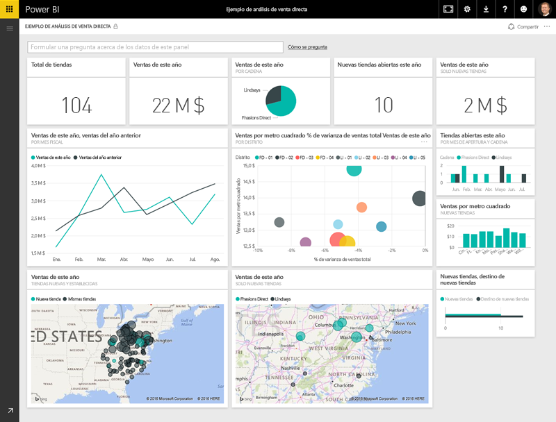
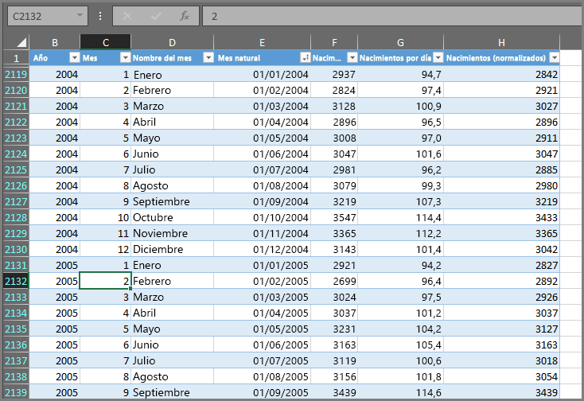
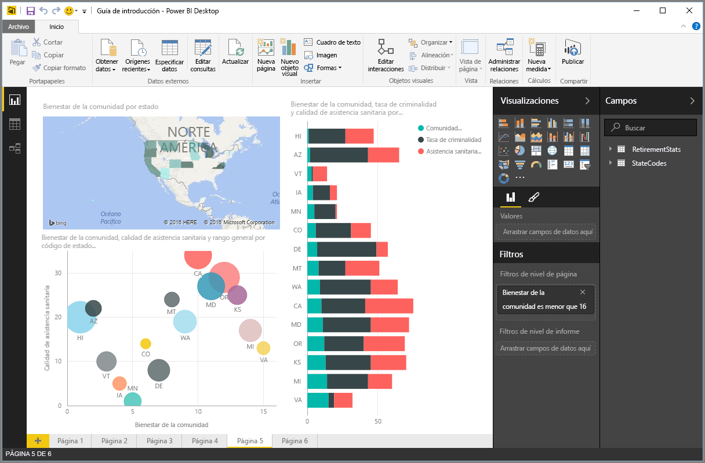
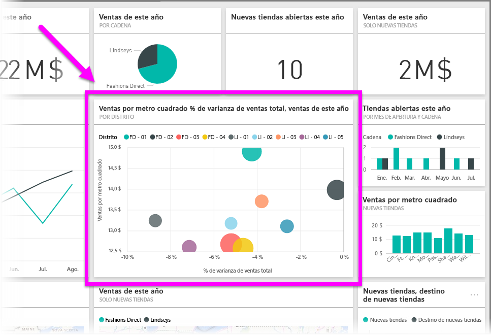

Todo lo que haga en Power BI puede dividirse en unos pocos **bloques de creación** básicos. Una vez que los comprenda, podrá partir de cada uno de ellos para crear informes elaborados y complejos. Al fin y al cabo, incluso los objetos en apariencia complejos se crean a partir de bloques de creación básicos; por ejemplo, los edificios se construyen con madera, acero, hormigón y cristal. Los automóviles, por su parte, se fabrican con metal, tejidos y goma. Por supuesto, los edificios y automóviles pueden ser básicos o más elaborados, en función de cómo se organicen esos bloques de creación básicos.

Vamos a echar un vistazo a estos bloques de creación básicos, analizar algunos elementos sencillos que pueden compilarse con ellos y, por último, descubrir cómo se pueden crear también elementos complejos.

Los bloques de creación básicos de Power BI son los siguientes:

* Visualizaciones
* Conjuntos de datos
* Informes
* Paneles
* Iconos

## Visualizaciones
Las **visualizaciones** (a veces también denominadas **objetos visuales**) constituyen una representación visual de datos, como un gráfico, un mapa codificado por colores u otros elementos interesantes que puede crear para representar la información de forma visual. Power BI tiene numerosos tipos de visualizaciones distintos y se introducen otros nuevos continuamente. En la siguiente imagen se muestra una colección de distintas visualizaciones creadas en el servicio Power BI.

Las visualizaciones pueden ser sencillas, como un único número que representa un aspecto significativo, o visualmente complejas, como un mapa de colores degradados que muestra la opinión del votante con respecto a un determinado problema o preocupación social. La finalidad de un objeto visual es presentar los datos de una manera que ofrezca contexto e información detallada, lo que probablemente resultaría difícil de discernir en una tabla sin formato de números o texto.

## Conjuntos de datos
Un **conjunto de datos** es una colección de datos que utiliza Power BI para crear sus visualizaciones.

Puede tener un conjunto de datos sencillo basado en una sola tabla de un libro de Excel, similar al que se muestra en la siguiente imagen.

Los **conjuntos de datos** también pueden ser una combinación de muchos orígenes distintos, que puede filtrar y combinar a fin de ofrecer una colección de datos (conjunto de datos) exclusiva para su uso en Power BI.

Por ejemplo, podría crear un conjunto de datos a partir de tres campos distintos de una base de datos, una tabla de un sitio web, una tabla de Excel y los resultados en línea de una campaña de marketing por correo electrónico. Esa combinación única se sigue considerando un único **conjunto de datos**, aunque se haya formado a partir de muchos orígenes distintos.

Puede filtrar los datos antes de integrarlos en Power BI para centrarse solo en aquellos que le interesen. Por ejemplo, podría filtrar su base de datos de contactos para que solo se incluyan en el conjunto de datos los clientes que hayan recibido correos electrónicos de la campaña de marketing. Luego podría crear objetos visuales basándose en ese subconjunto (la colección filtrada) de los clientes que se incluyeron en la campaña. Gracias al filtrado, podrá centrarse en los datos que le importen, con lo que ahorrará tiempo.

Una parte esencial y muy útil de Power BI es la gran cantidad de **conectores** de datos que incluye. Con independencia de que los datos que le interesan estén en Excel o en una base de datos SQL, en Azure u Oracle, o en un servicio como Facebook, Salesforce o MailChimp, Power BI tiene conectores de datos integrados que le permiten conectarse fácilmente a ellos, filtrarlos si resulta necesario e incorporarlos a su conjunto de datos.

Una vez que tenga un conjunto de datos, podrá empezar a crear visualizaciones que muestren distintas partes de dicho conjunto de diferentes maneras y, de esa forma, alcanzar un claro entendimiento de la información. Ahí es donde entran en juego los informes.

## Informes
En Power BI, un **informe** es una colección de visualizaciones que aparecen juntas en una o varias páginas. Al igual que cualquier otro tipo de informe que podría crear para una presentación de ventas o para un trabajo escolar, en Power BI, un **informe** está compuesto por elementos relacionados entre sí. En la siguiente imagen se muestra un **informe** de Power BI Desktop; en este caso, es la quinta página de un informe de seis. También puede crear informes en el servicio Power BI.

Los informes le permiten crear numerosas visualizaciones en varias páginas diferentes si resulta necesario, así como organizarlas de la forma más adecuada para presentar los datos.

Por ejemplo, podría tener un informe sobre las ventas trimestrales y otro sobre el crecimiento de un producto en un segmento determinado, o bien crear un informe sobre los patrones de migración de los osos polares. Independientemente del tema, con ellos podrá recopilar y organizar las visualizaciones en una o varias páginas.

## Paneles
Cuando esté preparado para compartir una página de un informe o una colección de visualizaciones, puede crear un **panel**. De forma similar a los de los automóviles, los **paneles** de Power BI son colecciones de objetos visuales de una sola página que puede compartir con otros usuarios. A menudo, se trata de un grupo de objetos visuales que ofrecen una perspectiva rápida de los datos o el caso de que intenta presentar.

Los paneles tienen que caber en una sola página, que a menudo se denomina "lienzo" (este es el fondo en blanco de Power BI Desktop o el servicio, en el que coloca las visualizaciones). Puede compararlo con el lienzo que utiliza un artista o pintor: un área de trabajo donde crear, combinar y rehacer objetos visuales interesantes y atractivos.
Puede compartir paneles con otros usuarios o grupos, que pueden interactuar con ellos cuando estén en el servicio Power BI o en su dispositivo móvil.

## Iconos
En Power BI, un **icono** es una visualización única dentro de un informe o panel. Se trata del rectángulo que contiene cada objeto visual individual. En la siguiente imagen, verá un icono (resaltado mediante un cuadro de color vivo) que también está rodeado por otros iconos.

Cuando esté *creando* un informe o un panel en Power BI, puede mover u organizar los iconos de la forma que desee para presentar la información. También puede hacerlos más grandes, cambiar su altura o anchura, y acoplarlos con otros del modo que prefiera.

Cuando esté *viendo* o *utilizando* un panel o informe (lo que implica que no es el creador o propietario, pero que se han compartido con usted), puede interactuar con ellos, pero no cambiar el tamaño de los iconos ni su organización.

## Resumen
Estos son los aspectos básicos de Power BI y sus bloques de creación. Dediquemos un momento a hacer un repaso.

Power BI es una colección de servicios, aplicaciones y conectores que le permite conectarse a sus datos dondequiera que estén, filtrarlos si procede y, luego, integrarlos en Power BI, donde podrá crear atractivas visualizaciones que puede compartir con otros usuarios.  

Ahora que conoce los bloques de creación básicos de Power BI, queda claro que puede generar conjuntos de datos que tengan sentido *para usted*, así como informes atractivos visualmente para transmitir su mensaje. Los mensajes presentados con Power BI no tienen por qué ser complejos o complicados para que resulten convincentes.

Para algunas personas, utilizar una sola tabla de Excel en un conjunto de datos y luego compartir un panel con su equipo supone una forma muy valiosa de usar Power BI.

Otras, en cambio, aprovechan Power BI para utilizar Azure SQL Data Warehouse que combinan con otras bases de datos y orígenes y que, después, filtran para crear un conjunto de datos que supervisa el progreso de fabricación a cada momento; todo ello en tiempo real.

En ambos casos, el proceso es el mismo: crear conjuntos de datos, generar objetos visuales atractivos y compartirlos con otras personas. Y, de forma similar, el resultado en los dos casos es el mismo: aprovechar el número de datos en continuo aumento y convertirlos en información procesable.

Independientemente de si requiere conjuntos de datos sencillos o complejos para presentar su información, Power BI lo ayuda a empezar a trabajar rápidamente y se puede expandir a la par que sus necesidades para alcanzar la complejidad que precisen sus datos. Además, puesto que Power BI es un producto de Microsoft, puede dar por sentado que es sólido, ampliable, compatible con Office y listo para las empresas.

Ahora, veamos cómo funciona. Comenzaremos echando un vistazo al servicio Power BI.

