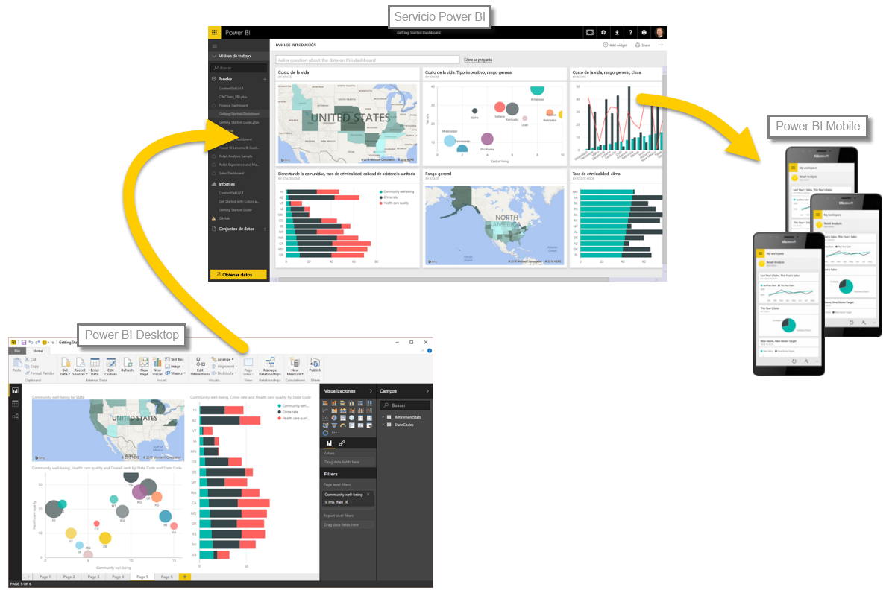

Ahora que conoce los aspectos básicos de Power BI, pasemos a algunas experiencias prácticas y una visita guiada. Su guía en el vídeo es **Will Thompson**, administrador de programas del equipo de Power BI en Microsoft. Más adelante en el curso se sumarán algunos guías invitados.

A medida que Will explica las numerosas posibilidades que le ofrece Power BI, tenga en cuenta que todas estas actividades y los análisis que puede realizar con Power BI suelen seguir un flujo habitual. El **flujo habitual** de actividad de Power BI es el siguiente:

* Integrar datos en Power BI Desktop y crear un informe
* Publicarlo en el servicio Power BI, donde creará nuevas visualizaciones o confeccionará paneles
* Compartir sus paneles con otros usuarios, especialmente con personas que se estén desplazando
* Ver informes y paneles compartidos e interactuar con ellos en aplicaciones de Power BI Mobile

Como mencionamos anteriormente, podría dedicar todo su tiempo al **servicio Power BI**, recopilando datos y creando paneles, y no habría ningún problema. También puede darse el caso de que una persona de su equipo pase todo su tiempo en **Power BI Desktop**; lo cual también es correcto. Para ayudarlo a entender Power BI al completo y lo que puede hacer con él, se lo mostraremos todo. Así, luego podrá decidir cómo usarlo de la forma que más le convenga.

Vamos a empezar y dejar que Will nos guíe por todo el proceso. Lo primero que vamos a explicar son los bloques de creación básicos de Power BI, con lo que obtendremos una base sólida para descubrir cómo este servicio convierte los datos en informes y objetos visuales atractivos.

