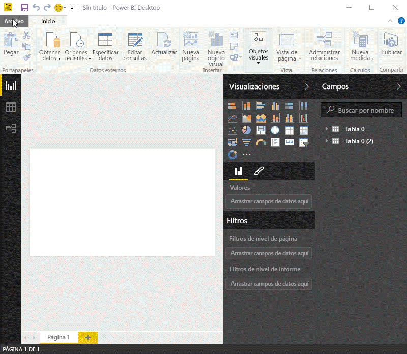
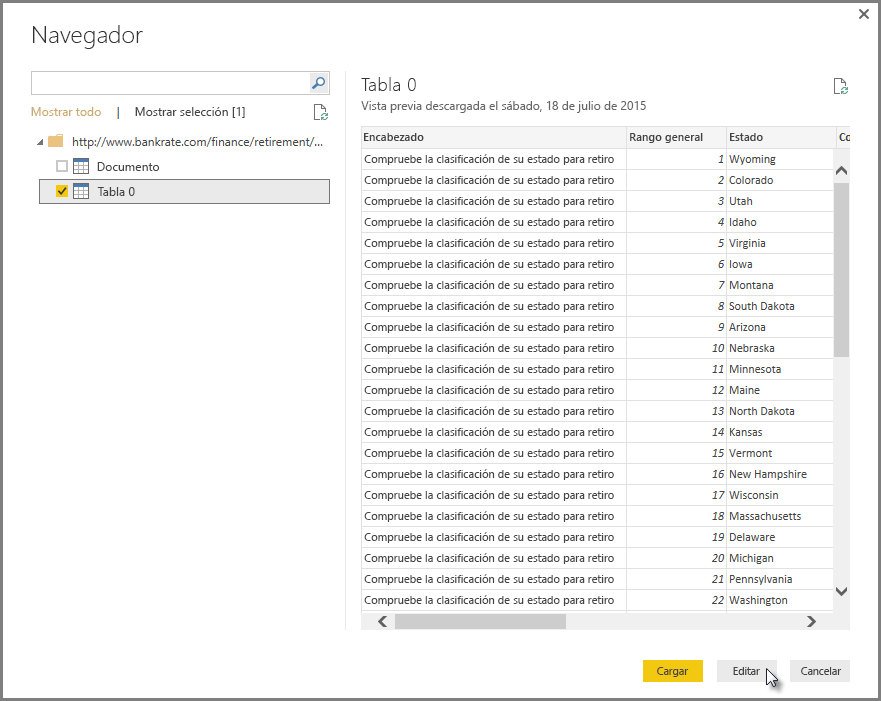
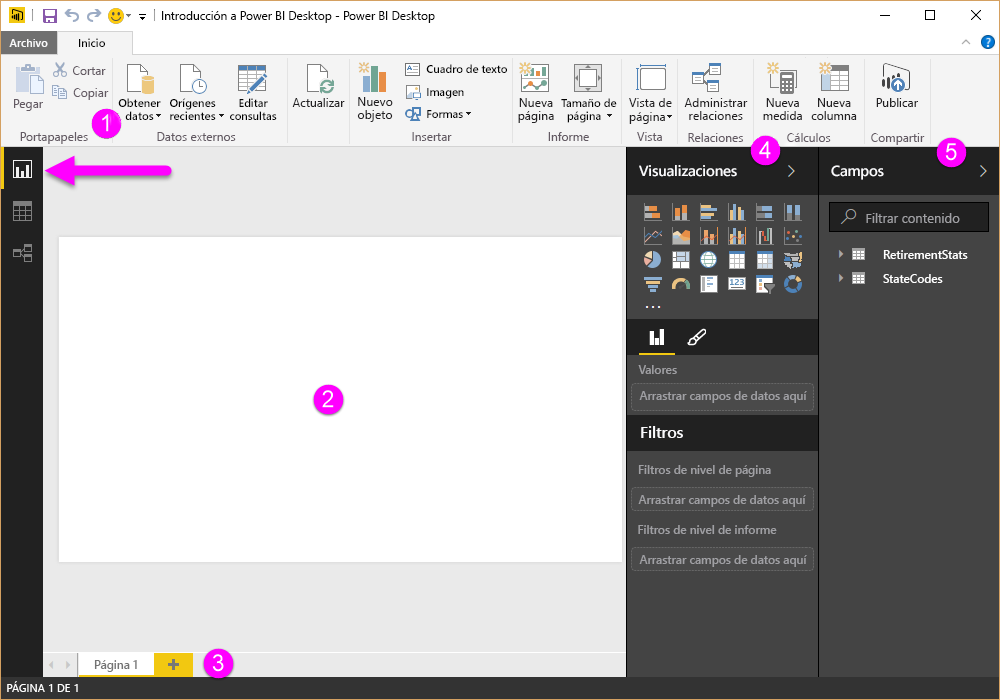
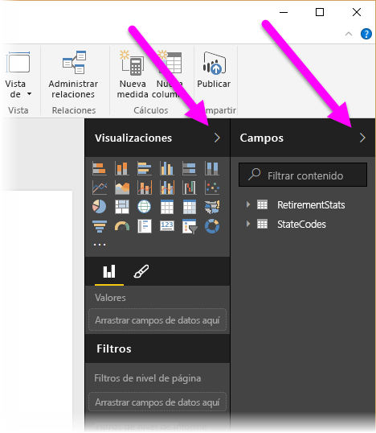
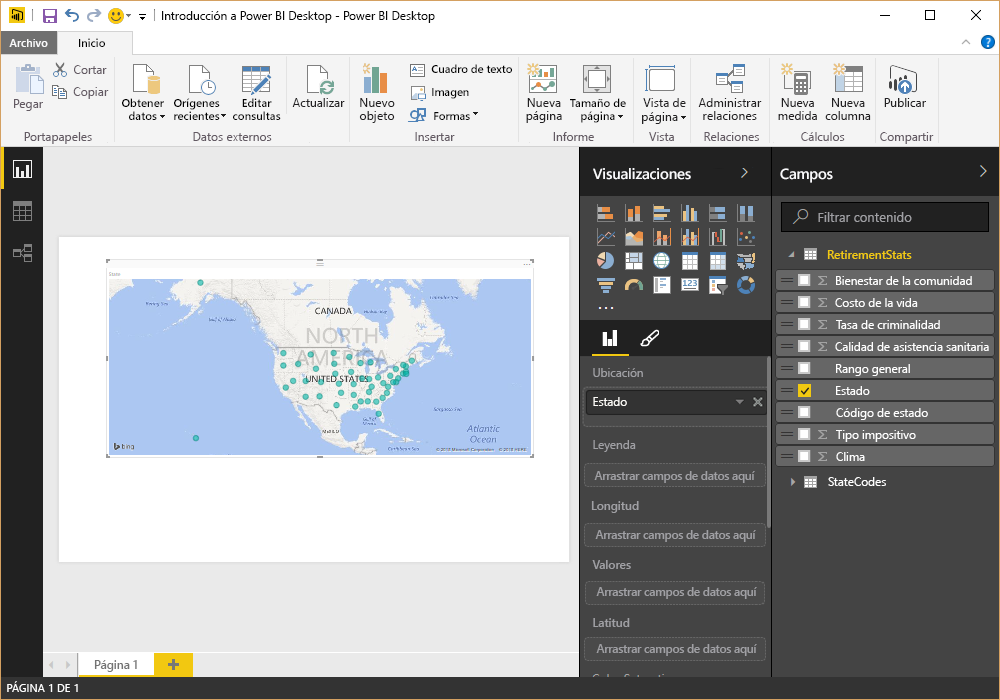
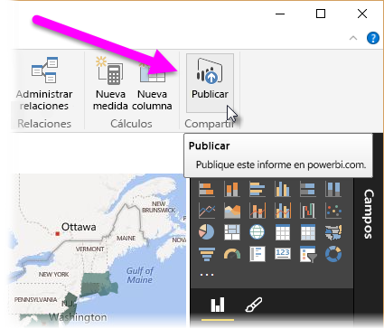
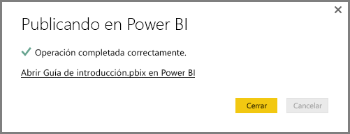
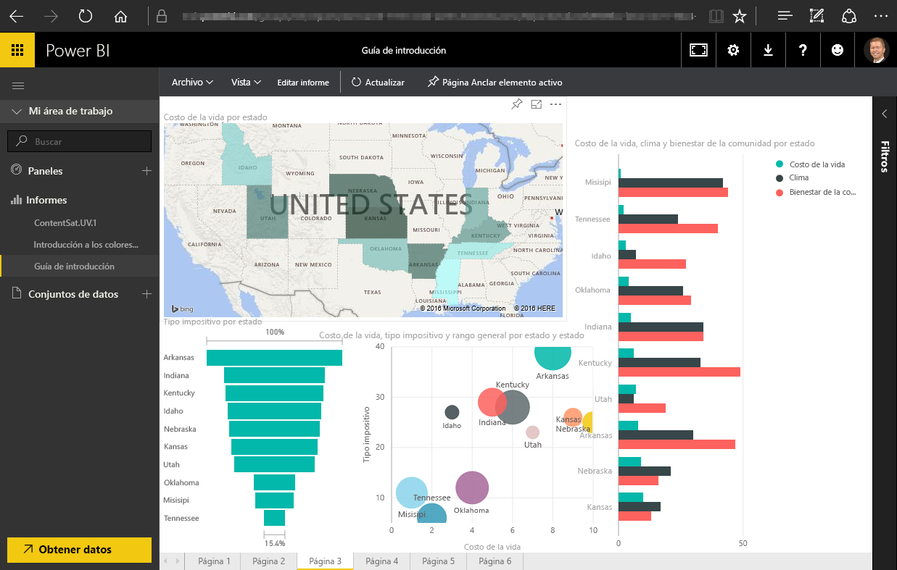
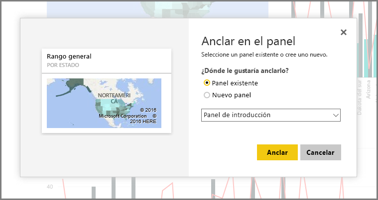

En este tema, vamos a profundizar en cómo encajan las dos primeras partes de Power BI:

* Crear un informe en **Power BI Desktop**
* Publicar el informe en el **servicio Power BI**

En Power BI Desktop, seleccione **Obtener datos**. Aparecerá la colección de orígenes de datos para que pueda elegir uno de ellos. En la siguiente imagen se muestra la selección de una página web como el origen, mientras que, en el vídeo anterior, Will selecciona un libro de **Excel**.

Independientemente del origen de datos que elija, Power BI se conecta a él y le muestra los datos disponibles. En la siguiente imagen se muestra otro ejemplo, esta vez de una página web que analiza distintos estados y algunas estadísticas de jubilación interesantes.

En la vista **Informe** de Power BI Desktop, puede empezar a generar informes.

La vista **Informe** tiene cinco áreas principales:

1. La cinta de opciones, que muestra las tareas comunes asociadas con los informes y visualizaciones
2. La vista **Informe** , o lienzo, donde se crean y se organizan las visualizaciones
3. El área de pestaña **Páginas** situada a lo largo de la parte inferior, que permite seleccionar o agregar una página de informe
4. El panel **Visualizaciones** , donde puede cambiar las visualizaciones, personalizar los colores o ejes, aplicar filtros, arrastrar campos, etc
5. El panel de **Campos**, donde elementos de consulta y filtros se pueden arrastrar a la vista **Informe**, o bien al área **Filtros**del panel **Visualizaciones**.

Los paneles **Visualizaciones** y **Campos** se pueden contraer al seleccionar la flecha pequeña situada junto al borde, lo que proporciona más espacio en la vista **Informe** para crear visualizaciones interesantes. Cuando se modifican visualizaciones, también verá estas flechas hacia arriba o hacia abajo, lo que significa que se puede expandir o contraer la sección, según corresponda.

Para crear una visualización, basta con arrastrar un campo desde la lista **Campos** hasta la vista **Informe** . En este caso, arrastre el campo State de *RetirementStats* y vea qué sucede.

Preste atención... Power BI Desktop crea automáticamente una visualización basada en un mapa, ya que reconoce que el campo State contiene datos de geolocalización.

Ahora vamos a avanzar un poco rápidamente y, una vez que haya creado un informe con algunas visualizaciones, estará listo para publicarlo en el servicio Power BI. En la cinta **Inicio** de Power BI Desktop, seleccione **Publicar**.

Se le pedirá que inicie sesión en Power BI.

Cuando haya iniciado sesión y finalizado el proceso de publicación, se mostrará el siguiente cuadro de diálogo. Puede seleccionar el vínculo (debajo de **Correcto**) para acceder al servicio Power BI, donde puede ver el informe que acaba de publicar.

Cuando inicie sesión en Power BI, verá el archivo de Power BI Desktop recién publicado en el servicio. En la imagen siguiente, el informe creado en Power BI Desktop aparece en la sección **Informes**.

En dicho informe, puede elegir el icono **Anclar** para anclar ese objeto visual a un panel. En la siguiente imagen se muestra el icono de anclaje resaltado con un cuadro de color vivo y una flecha.

Al seleccionarlo, aparecerá el siguiente cuadro de diálogo, que le permite anclar el objeto visual a un panel existente o crear un nuevo panel.

Tras anclar varios objetos visuales del informe, podrá verlos en el panel.

Power BI ofrece muchas más opciones, como compartir los paneles que cree. Trataremos el uso compartido más adelante en el curso.

Ahora vamos a pasar a una función que puede crear paneles automáticamente con solo conectarse a un servicio en la nube, como Facebook y Salesforce, entre muchos otros.

