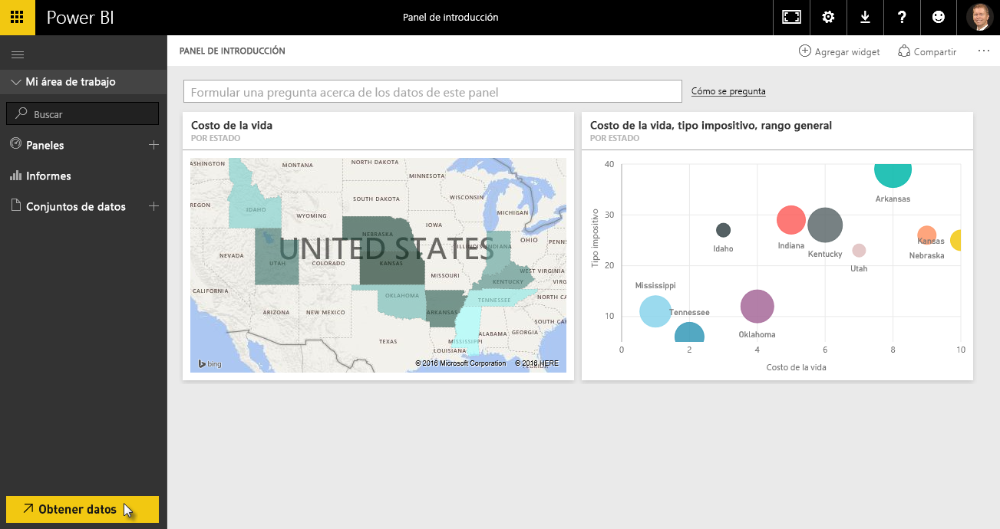
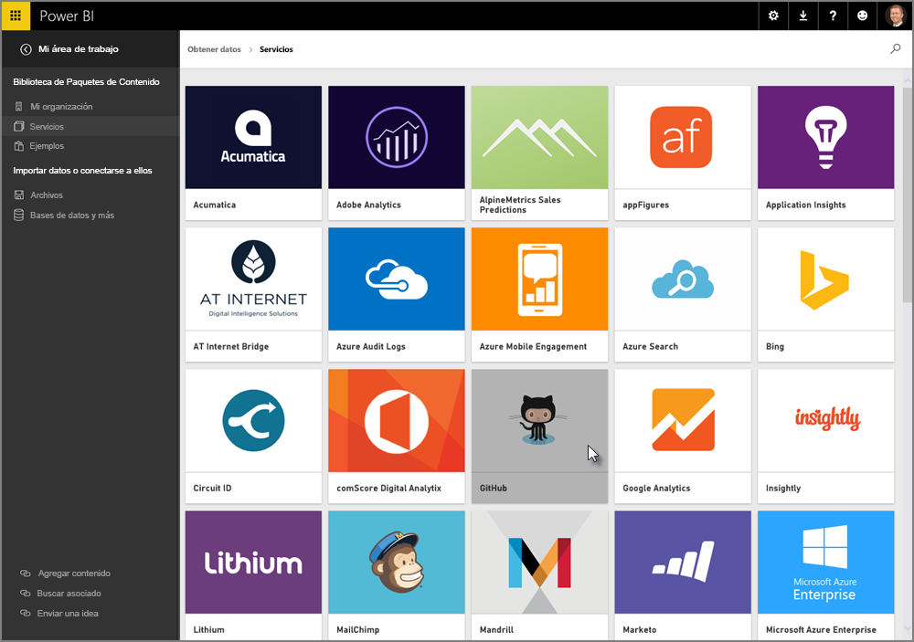
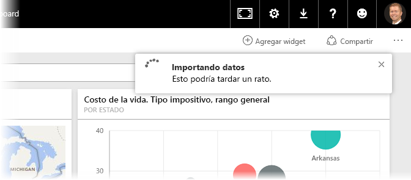
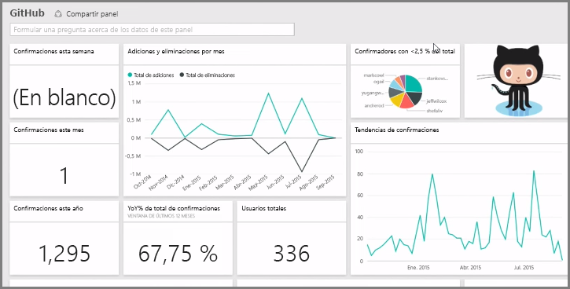
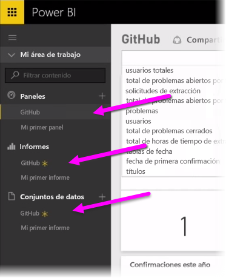
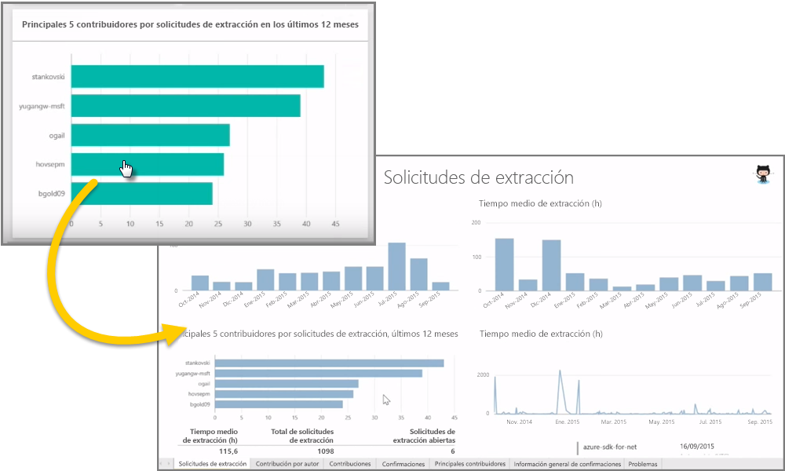
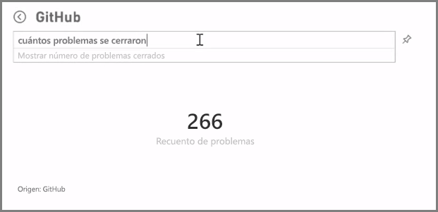
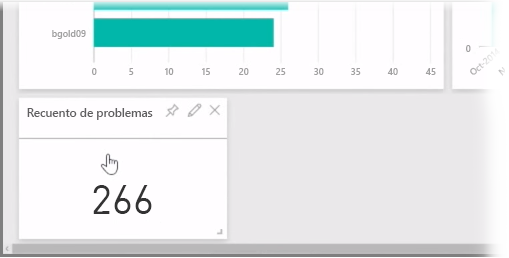
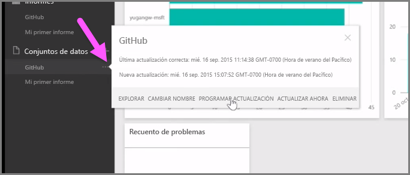

Como hemos visto, el flujo de trabajo habitual de Power BI consiste en crear un informe en Power BI Desktop, publicarlo en el servicio Power BI y, después, compartirlo con otros usuarios para que puedan verlo en el servicio o en una aplicación móvil.

Sin embargo, algunas personas empiezan en el servicio Power BI, por lo que vamos a echar un vistazo al servicio y descubrir una forma sencilla y popular de crear objetos visuales rápidamente en Power BI: los *paquetes de contenido*.

Un **paquete de contenido** es una colección de informes y objetos visuales configurados previamente y listos para su uso que se basan en orígenes de datos específicos, como Salesforce. Usar un paquete de contenido podría compararse con calentar en el microondas un plato precocinado o pedir comida rápida: con solo unos clics y comentarios, tendrá una colección de platos principales diseñados para que combinen perfectamente entre sí y presentados en un paquete ordenado y listo para su consumo.

Vamos a echar un vistazo a los paquetes de contenido, el servicio y su funcionamiento. Entraremos en más detalles sobre los paquetes de contenido (y el servicio) en las próximas secciones; esto es solo una degustación para abrir el apetito.

## Creación de paneles inmediatos con servicios en la nube
Con Power BI, resulta muy sencillo conectarse a los datos. Desde el servicio Power BI, puede seleccionar el botón **Obtener datos** situado en la esquina inferior izquierda de la pantalla principal.

En el *lienzo* (el área en el centro del servicio Power BI) se muestran los orígenes de datos disponibles en el servicio Power BI. Además de los orígenes de datos habituales, como archivos de Excel, bases de datos o datos de Azure, Power BI puede conectarse fácilmente a **servicios de software** (también denominados "proveedores de SaaS" o "servicios en la nube"), como Salesforce, Facebook, Google Analytics y otros muchos servicios de SaaS.

Para estos servicios de software, el **servicio Power BI** ofrece una colección de objetos visuales listos para su uso, organizados previamente en paneles e informes, denominados **paquetes de contenido**. Estos le permiten empezar a trabajar en Power BI rápidamente con los datos del servicio que seleccione. Por ejemplo, cuando utiliza el paquete de contenido de Salesforce, Power BI se conecta a su cuenta de Salesforce (una vez que escriba sus credenciales) y rellena una colección predefinida de objetos visuales y paneles en Power BI.

Power BI ofrece paquetes de contenido para todo tipo de servicios. En la siguiente imagen se muestra la primera pantalla de los servicios, en orden alfabético, que aparece al seleccionar **Obtener** en el cuadro **Servicios** (mostrado en la imagen anterior). Como puede ver, hay muchos entre los que elegir.

Para nuestros fines, elegiremos **GitHub**. GitHub es una aplicación de control de código fuente en línea. Una vez que escriba la información y las credenciales para el paquete de contenido de GitHub, comienza la importación de datos.

Cuando se hayan cargado los datos, aparecerá el panel del paquete de contenido de GitHub predefinido.

Además del **panel**, también está disponible el **informe** generado (como parte del paquete de contenido de GitHub) para crear el panel, así como el **conjunto de datos** (la colección de datos extraída de GitHub) que se creó durante la importación de los datos y que se ha utilizado para confeccionar el informe de GitHub.

En el panel, puede hacer clic en cualquiera de los objetos visuales y se le dirigirá automáticamente a la página **Informe** en la que se creó ese objeto. Por tanto, al hacer clic en el objeto visual **Top 5 users by pull requests**, Power BI abre la página **Pull Requests** en el informe (la página Informe en la que se creó ese objeto visual).

## Preguntas sobre los datos
También puede realizar preguntas sobre los datos y el servicio Power BI creará objetos visuales basándose en su pregunta, en tiempo real. En la siguiente imagen, puede ver cómo Power BI crea un objeto visual numérico que indica el recuento de problemas cerrados, basándose en lo que se escribe en la barra **Natural Language Query** (Consulta de lenguaje natural).

Cuando encuentre un objeto visual que le interese, puede seleccionar el icono **Anclar**, situado a la derecha de la barra de consulta de lenguaje natural, para anclarlo al panel. En este caso, el objeto visual se ancla al panel de GitHub, ya que es el que está seleccionado actualmente.

## Actualización de los datos en el servicio Power BI
También puede **actualizar** el conjunto de datos para un paquete de contenido u otros datos que utilice en Power BI. Para definir la configuración de actualización, seleccione los puntos suspensivos (tres puntos) que se encuentran junto a un conjunto de datos y aparecerá un menú.

Seleccione la opción **Programar actualización** en la parte inferior del menú. Aparecerá el cuadro de diálogo Configuración en el lienzo, lo que le permite establecer la configuración de actualización que se ajuste a sus necesidades.

Esto es suficiente para una breve introducción al servicio Power BI. Este servicio ofrece muchas más posibilidades que abarcaremos más adelante en este curso. Recuerde también que hay muchos tipos diferentes de datos a los que puede conectarse y numerosos tipos de paquetes de contenido; y se incorporan más continuamente.

Pasemos al tema siguiente, en el que se resume esta sección **Introducción** y se le preparará para las siguientes.

