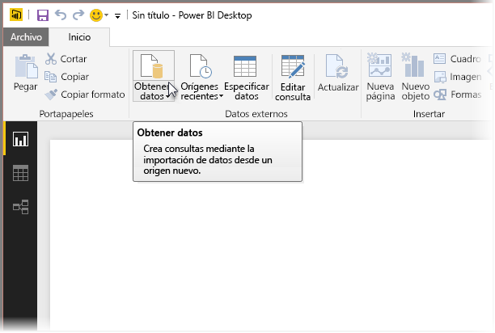
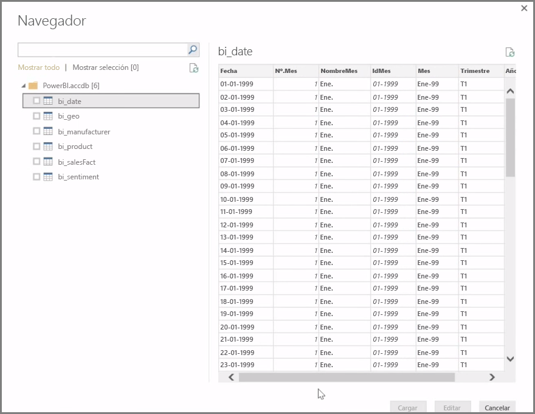
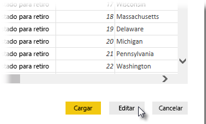

**Power BI Desktop** puede conectarse a una amplia gama de orígenes de datos, incluidas bases de datos locales, libros de Excel y servicios en la nube. Actualmente, más de 59 servicios en la nube distintos, como GitHub y Marketo, tienen conectores específicos. Puede conectarse a orígenes genéricos a través de XML, CSV, texto y ODBC. Power BI puede incluso extraer datos tabulares directamente desde la URL de un sitio web. Pero empecemos por el principio, abriendo Power BI Desktop y conectándonos a los datos.

Al iniciar **Power BI Desktop** y pasar de la pantalla Inicio, puede elegir la opción Obtener datos en la cinta de la pestaña **Inicio**.

Power BI Desktop se actualiza mensualmente y, con cada actualización, la página **Power BI Desktop What's New** (Novedades de Power BI Desktop) se pone al día con información sobre estas, vínculos al blog y un vínculo de descarga.

En Power BI Desktop existen todo tipo de orígenes de datos disponibles. Seleccione un origen para establecer una conexión. Según su selección, se le pedirá que busque el origen en el equipo o la red, o que inicie sesión en un servicio para autenticar su solicitud.

Después de conectarse, la primera ventana que verá será **Navegador**. En ella aparecen las tablas o entidades del origen de datos. Si hace clic en una de ellas, obtendrá una vista previa de sus contenidos. Luego, puede importar las tablas o entidades seleccionadas inmediatamente, o seleccionar **Editar** para transformar y limpiar los datos antes de importarlos.

Una vez que haya seleccionado las tablas que le gustaría agregar a Power BI Desktop, puede cargarlas en esta herramienta seleccionando el botón **Cargar**, que se encuentra en la esquina superior derecha de la ventana **Navegador**. Sin embargo, hay veces en las que querrá realizar cambios en las tablas antes de cargarlas en Power BI Desktop. Es posible que solo desee incluir un subconjunto de clientes o filtrar los datos de las ventas que se realizaron en un país específico. En esos casos, puede seleccionar el botón Editar, y filtrar o transformar los datos antes de agregarlo todo a Power BI Desktop.

En la sección siguiente, retomaremos este tema y descubriremos cómo editar los datos.

