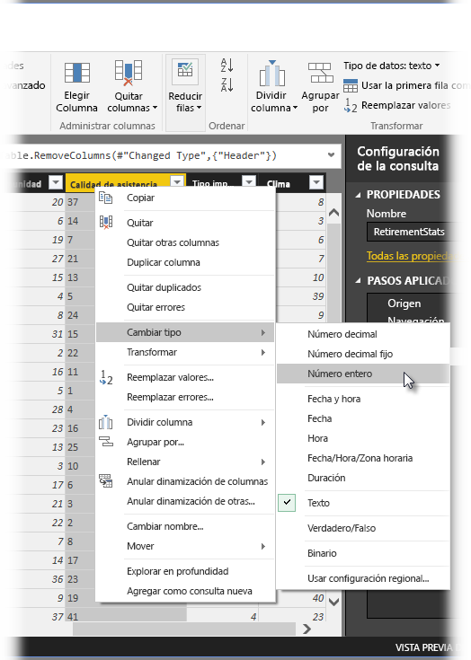
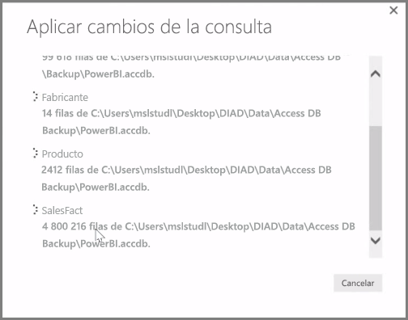

**Power BI Desktop** incluye **Editor de consultas**, una herramienta eficaz para dar forma a los datos y transformarlos con el objetivo de que estén listos para sus modelos y visualizaciones. Al seleccionar Editar en la ventana Navegador, se inicia el Editor de consultas y se rellena con las tablas u otras entidades que haya seleccionado en el origen de datos.

También puede iniciar el **Editor de consultas** directamente desde **Power BI Desktop**, utilizando el botón **Editar consultas** situado en la cinta **Inicio**.

Una vez cargado el Editor de consultas con datos listos para que les dé forma, verá una serie de secciones:

1. En la cinta de opciones aparecen muchos botones activos que permiten interactuar con los datos de la consulta
2. En el panel izquierdo se enumeran las consultas (una por cada tabla o entidad), disponibles para su selección, visualización y cambio de forma.
3. En el panel central se muestran los datos de la consulta seleccionada, disponibles para darles forma
4. Aparece la ventana Configuración de consulta, con una lista de las propiedades de la consulta y de los pasos aplicados

En el panel central, haga clic con el botón derecho en una columna. De esta forma, se mostrará un número de las distintas transformaciones disponibles, como quitar la columna de la tabla, duplicarla con un nuevo nombre y reemplazar valores. En este menú también se pueden dividir las columnas de texto en varias mediante delimitadores comunes.

La cinta **Editor de consultas** contiene herramientas adicionales que permiten, por ejemplo, cambiar el tipo de datos de columnas, agregar notaciones científicas o extraer elementos de fechas, como el día de la semana.

A medida que aplica las transformaciones, aparece cada uno de los pasos en la lista **Pasos aplicados**, en el panel **Configuración de la consulta**, a la derecha del **Editor de consultas**. Puede utilizar esta lista para deshacer o revisar cambios específicos, o incluso para cambiar el nombre de un paso. Para guardar las transformaciones, seleccione **Cerrar y aplicar** en la pestaña **Inicio**.

Una vez seleccionada la opción **Cerrar y aplicar**, el Editor de consultas realiza los cambios de la consulta que haya llevado a cabo y los aplica en Power BI Desktop.

Hay numerosas opciones disponibles al transformar los datos en el **Editor de consultas**, incluidas las transformaciones avanzadas. En la siguiente sección, echaremos un vistazo a algunas de esas transformaciones avanzadas, para que se haga una idea de las casi infinitas formas en las que puede transformar los datos con el **Editor de consultas**.

