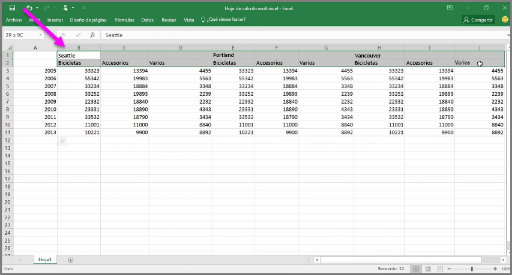
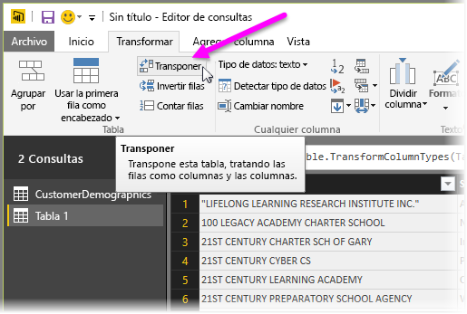
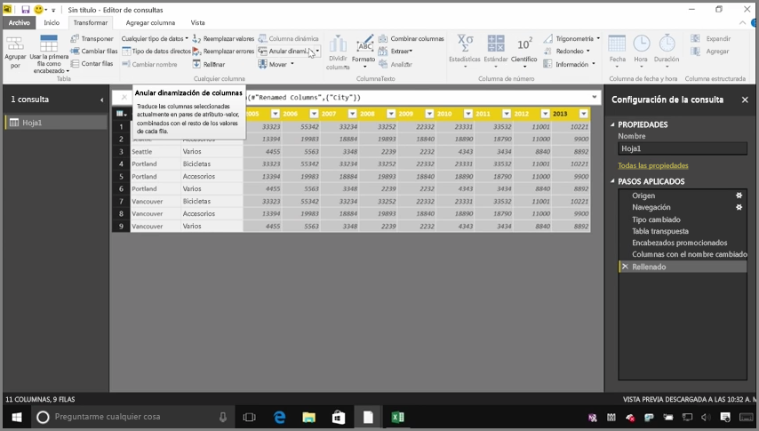
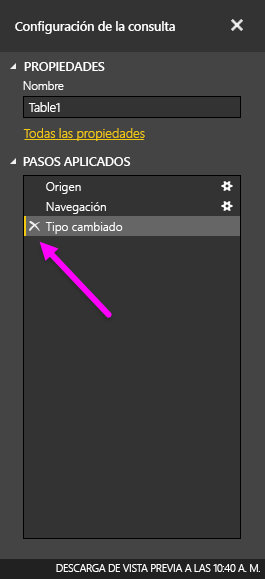

Aunque Power BI puede importar los datos desde prácticamente cualquier origen, sus herramientas de modelado y visualización funcionan mejor con los datos en columnas. A veces, los datos no tendrán un formato de columnas sencillas, como suele ocurrir con las hojas de cálculo de Excel, en las que un diseño de tabla que presenta un aspecto atractivo para la vista no siempre resulta óptimo para consultas automatizadas. Por ejemplo, la siguiente hoja de cálculo tiene encabezados que abarcan varias columnas.

Afortunadamente, Power BI dispone de herramientas para transformar rápidamente las tablas de varias columnas en conjuntos de datos listos para su uso.

## Transposición de datos
Por ejemplo, al usar la opción **Transponer** en el **Editor de consultas**, puede invertir los datos (convertir columnas en filas y viceversa) para dividirlos en formatos que se puedan manipular.

Cuando haya hecho esto varias veces, tal y como se describe en el vídeo, su tabla empezará a mostrar un formato con el que Power BI puede trabajar más fácilmente.

## Aplicación de formato a los datos
Es posible que también deba dar formato a los datos para que Power BI pueda categorizarlos e identificarlos adecuadamente una vez que se hayan importado.

Con una serie de transformaciones, incluida la *promoción de filas en encabezados*, el uso de **Rellenar** para convertir valores *nulos* en los valores que se encuentran encima o debajo en una determinada columna, y la opción **Anular dinamización de columnas**, puede limpiar los datos para convertirlos en un conjunto de datos que se pueda usar en Power BI.

Con Power BI, puede experimentar con estas transformaciones en los datos y determinar qué tipos dan a sus datos el formato en columnas que permite a esta herramienta trabajar con ellos. Recuerde que todas las acciones que realice se registrarán en la sección Pasos aplicados del Editor de consultas, por lo que si una transformación no ofrece el resultado que esperaba, puede hacer clic en la **x** que aparece junto al paso y deshacerla.

## Creación de objetos visuales
Una vez que los datos estén en un formato que Power BI pueda usar, gracias a su transformación y limpieza, puede empezar a crear objetos visuales.

## Pasos siguientes
**Enhorabuena.** Ha completado esta sección del curso de **Aprendizaje guiado** de Power BI. Ahora ya sabe cómo **obtener datos** en Power BI Desktop y cómo *dar forma* o *transformar* esos datos para poder crear objetos visuales atractivos.

El siguiente paso para descubrir cómo funciona Power BI y cómo hacer que se ajuste a *sus requisitos*, consiste en comprender qué implica el **modelado**. Como ya sabe, un **conjunto de datos** es un bloque de creación básico de Power BI, pero algunos conjuntos de datos pueden ser complejos y estar basados en muchos orígenes de datos distintos. Además, a veces resulta necesario agregar un toque especial (o *campo*) al conjunto de datos creado.

En la siguiente sección, obtendrá información sobre el **modelado** y muchas más opciones. Le espero allí.

