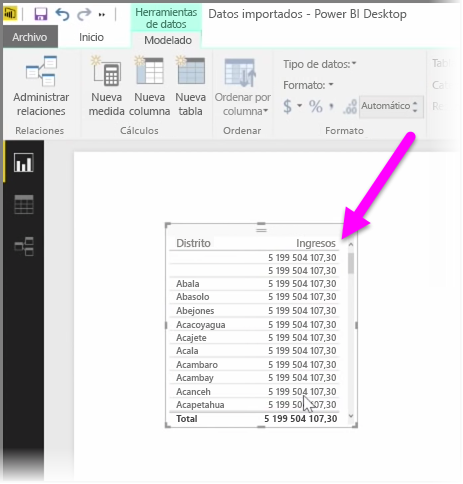
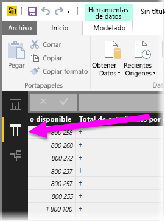
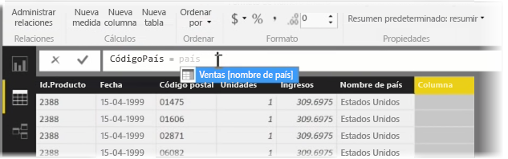
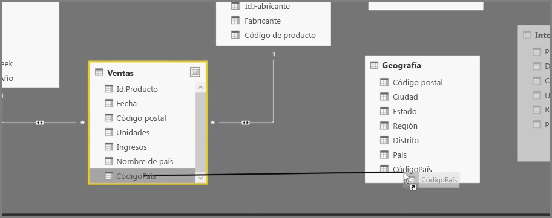
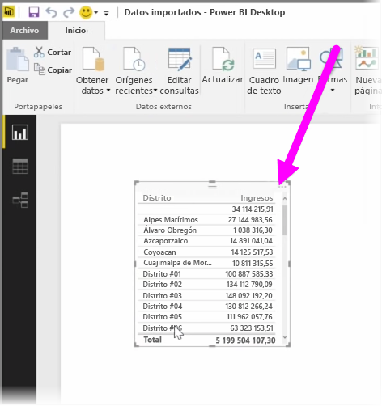

La creación de columnas calculadas representa una forma sencilla de enriquecer y mejorar sus datos. Una **columna calculada** constituye una nueva columna creada definiendo un cálculo que transforma o combina dos o más elementos de datos existentes. Por ejemplo, puede crear una nueva columna combinando dos columnas en una.

Tendríamos un motivo práctico por el que crear una columna calculada si, por ejemplo, quisiéramos establecer una relación entre tablas, pero no existiera ningún campo único que se pudiera utilizar para establecerla. La falta de una relación queda patente cuando crea un objeto visual de tabla simple en Power BI Desktop y obtiene el mismo valor para todas las entradas, pero tiene constancia de que los datos subyacentes son diferentes.

Para crear una relación con campos únicos en los datos, puede, por ejemplo, crear una nueva columna calculada para "Número de teléfono completo" combinando los valores de las columnas "Prefijo telefónico" y "Número local" cuando dichos valores estén presentes en sus datos. Las columnas calculadas representan una herramienta útil para generar rápidamente modelos y visualizaciones.

Para crear una columna calculada, seleccione la **vista de datos** en Power BI Desktop, que se encuentra en el margen izquierdo del lienzo del informe.

En la pestaña Modelado, seleccione **Nueva columna**. De este modo, habilitará la barra de fórmulas, donde podrá escribir cálculos con el lenguaje de expresiones de análisis de datos (DAX, por sus siglas en inglés). DAX es un lenguaje de fórmulas eficaz, también presente en Excel, que permite construir cálculos sólidos. A medida que escriba una fórmula, Power BI Desktop mostrará fórmulas o elementos de datos coincidentes para asistirle en su creación y reducir el tiempo que necesita para tal fin.

La barra de fórmulas de Power BI le sugerirá funciones DAX específicas y columnas de datos relacionadas a medida que escriba la expresión.

Una vez creadas las columnas calculadas en cada tabla, pueden utilizarse como una clave única para establecer una relación entre ellas. Si va a la vista de **relaciones**, podrá arrastrar el campo de una tabla a la otra para crear la relación.

Cuando regrese a la vista de **informes**, verá un valor distinto para cada distrito.

Existen muchos otros objetivos que puede lograr mediante la creación de columnas calculadas.

