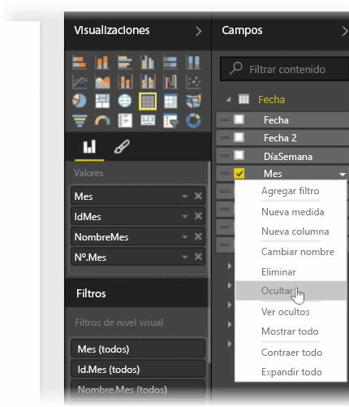
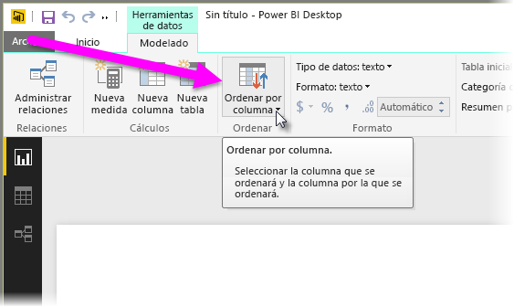
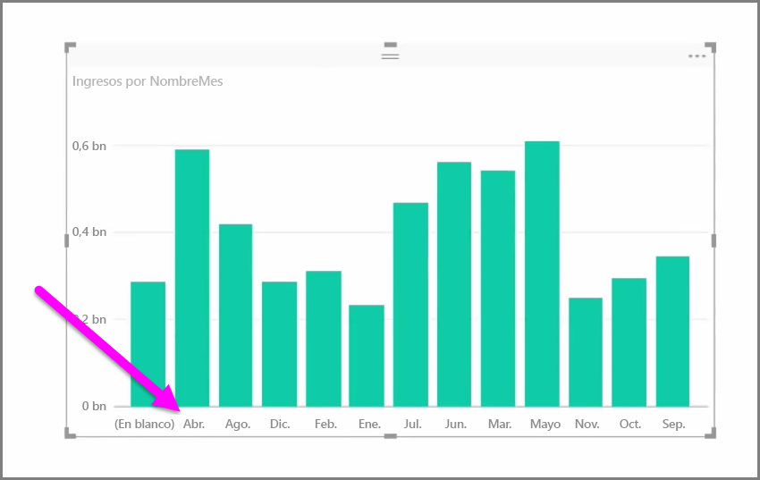
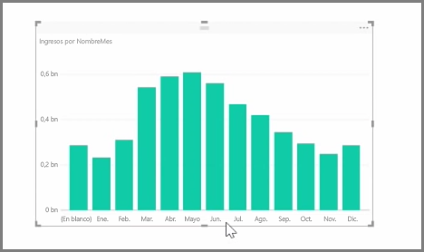

Los datos importados suelen contener campos que no necesita realmente para las tareas de generación de informes y visualización, bien porque contengan información adicional, bien porque esos datos ya estén disponibles en otra columna. Power BI Desktop cuenta con herramientas destinadas a optimizar los datos y hacer que le resulte más sencillo usarlos para crear informes y objetos visuales, así como para ver sus informes compartidos.

## Ocultación de campos
Para ocultar una columna en el panel **Campos** de Power BI Desktop, haga clic con el botón derecho en ella y seleccione **Ocultar**. Tenga en cuenta que las columnas ocultas no se eliminan; si ha usado ese campo en visualizaciones existentes, los datos seguirán mostrándose en ese objeto visual y también puede seguir utilizándolos en otras visualizaciones. Lo único que sucede es que el campo oculto no se muestra en el panel **Campos**.

Cuando vea tablas en la vista de **relaciones**, observará que los campos ocultos se muestran oscurecidos. De nuevo, sus datos siguen estando disponibles y formando parte del modelo; simplemente se han ocultado de la vista. Siempre puede mostrar cualquier campo que se ha ocultado haciendo clic con el botón derecho en el campo y seleccionando **Mostrar todo**.

## Ordenación de los datos de visualización por otro campo
La herramienta **Ordenar por columna**, disponible en la pestaña **Modelado**, resulta muy útil para garantizar que los datos se muestran en el orden deseado.

Un ejemplo común: los datos que incorporan el nombre del mes se ordenan alfabéticamente de manera predeterminada; por ejemplo, "Agosto" aparece antes de "Febrero".

En este caso, podrá solucionar el problema si selecciona el campo en la lista de campos, elige **Ordenar por columna** en la pestaña **Modelado** y, después, selecciona un campo por el que ordenar. En este ejemplo, la opción de ordenación de categoría "NroMes" ordena los meses según lo previsto.

Establecer el tipo de datos de un campo constituye otro modo de optimizar la información para que se procese correctamente. Para cambiar el tipo de datos, en el lienzo del informe, seleccione la columna en el panel **Campos** y, después, utilice el menú desplegable **Formato** para seleccionar una de las opciones de formato. Los objetos visuales que haya creado y que muestren el campo se actualizan automáticamente.

