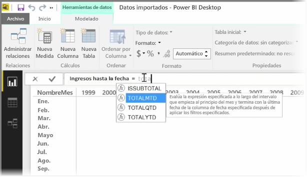
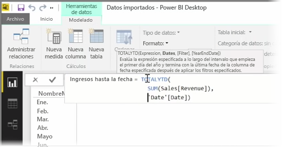
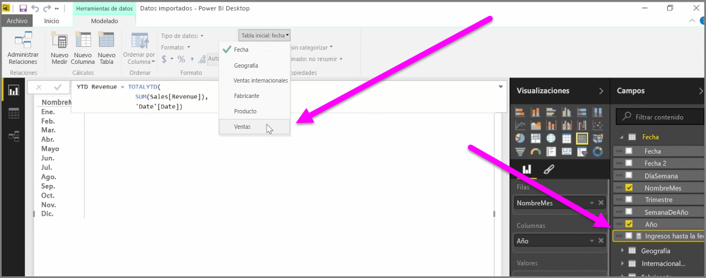

Una *medida* es un cálculo que existe en el modelo de datos de Power BI. Para crear una medida, en la vista de **informes**, seleccione **Nueva medida** en la pestaña **Modelado**.

Una de las grandes virtudes de DAX, el lenguaje de expresiones de análisis de datos de Power BI, es que tiene una enorme cantidad de funciones útiles, especialmente relativas a cálculos temporales como *Valor anual hasta la fecha* o *Year Over Year* (Diferencia interanual). Con DAX, puede definir una medida de tiempo una vez y, después, dividirla en tantos campos distintos como desee ver en su modelo de datos.

En Power BI, un cálculo definido se conoce como *medida*. Para crear una *medida*, seleccione **Nueva medida** en la pestaña **Inicio**. Se abrirá la barra de fórmulas, donde puede especificar la expresión DAX que defina la medida. A medida que escriba, Power BI sugiere funciones DAX y campos de datos pertinentes a la vez que vaya especificando el cálculo; además, verá información sobre herramientas en la que se explican parte de la sintaxis y de los parámetros de la función.

Si el cálculo es especialmente largo, puede agregar saltos de línea adicionales en el editor de expresiones presionando **Alt+Intro**.

Una vez haya creado una nueva medida, aparecerá en una de las tablas del panel **Campos**, que se encuentra en el lado derecho de la pantalla. Power BI inserta la nueva medida en la tabla que esté seleccionada en ese momento y, aunque no importa el lugar exacto donde se encuentre la medida en sus datos, puede moverla con facilidad si la selecciona y utiliza el menú desplegable **Tabla inicial**.

Puede usar una medida como cualquier otra columna de una tabla: basta con arrastrarla y colocarla en los campos de visualización o en el lienzo del informe. Las medidas también integran sin problemas en segmentaciones, con lo que sus datos se segmentan sobre la marcha. Es decir, puede definir una medida una vez y usarla en muchas visualizaciones distintas.

La eficaz función **Calcular** de DAX permite efectuar todo tipo de cálculos útiles, lo cual resulta de especial utilidad para objetos visuales e informes de índole económica.

