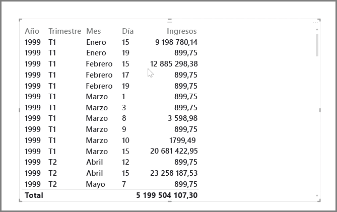
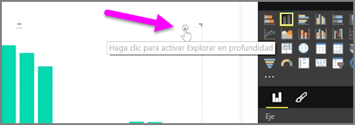
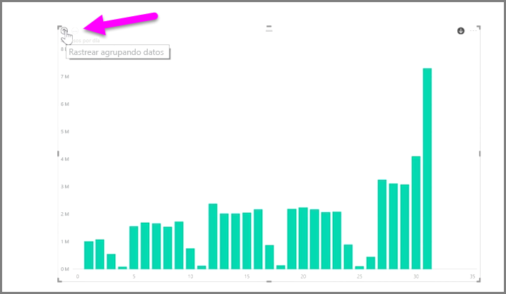
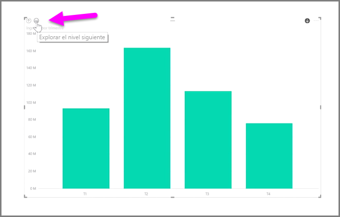
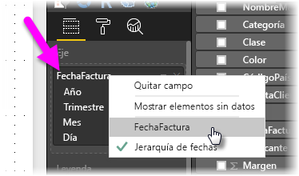

Con Power BI, resulta fácil analizar los datos de tiempo. Las herramientas de modelado de Power BI Desktop incluyen automáticamente campos generados que permiten desglosar por años, trimestres, meses y días con un solo clic.  

Cuando se crea una visualización de tabla en el informe mediante un campo de fecha, Power BI Desktop incluye automáticamente desgloses por intervalo de tiempo. Por ejemplo, Power BI separa automáticamente el campo único de fecha de la tabla **Fecha** el año, trimestre, mes y día, tal y como se muestra en la siguiente imagen.

Las visualizaciones muestran datos en el nivel de *año* de manera predeterminada, pero puede cambiarlo activando **Explorar en profundidad** en la esquina superior derecha del objeto visual.

Ahora, cuando haga clic en las barras o líneas del gráfico, se explora en profundidad hasta el siguiente nivel de la jerarquía de tiempo, por ejemplo, de *años* a *trimestres*. Puede seguir explorando en profundidad hasta llegar al nivel más detallado de la jerarquía, que en este ejemplo son los *días*. Para retroceder por la jerarquía de tiempo, haga clic en **Rastrear agrupando datos** en la esquina superior izquierda del objeto visual.

Además, puede explorar en profundidad todos los datos mostrados en el objeto visual, en lugar de un periodo seleccionado, con el icono de dos flechas **Explorar el nivel siguiente**, que también se encuentra en la esquina superior derecha del objeto visual.

Siempre y cuando el modelo cuenta con un campo de fecha, Power BI generará automáticamente distintas vistas para diferentes jerarquías de tiempo.

Para volver a fechas individuales en lugar usar la jerarquía de fechas, solo hay que hacer clic con el botón derecho en el nombre de columna en la opción **Campos** (en la imagen siguiente, el nombre de la columna es *InvoiceDate*); a continuación, seleccione el nombre de columna en el menú que aparece en lugar de **Jerarquía de fechas**. El objeto visual muestra entonces los datos basados en esos datos de columna, sin usar la jerarquía de fechas. ¿Tiene que volver a usar la jerarquía de fechas? No hay problema, solo vuelva a hacer clic con el botón derecho y seleccione **Jerarquía de fechas** en el menú.

## Pasos siguientes
**Enhorabuena.** Ha completado esta sección del curso de **Aprendizaje guiado** de Power BI. Ahora que está familiarizado con el *modelado* de datos, está preparado para obtener información sobre toda la diversión que le espera en la siguiente sección: **Visualizaciones**.

Como ya se ha mencionado, este curso amplía sus conocimientos siguiendo el flujo de trabajo habitual de Power BI:

* Integrar datos en **Power BI Desktop** y crear un informe
* Publíquelo en el servicio Power BI, donde creará nuevas **visualizaciones** y confeccionará paneles.
* **Comparta** sus paneles con otros usuarios, especialmente con personas que se estén desplazando.
* Vea informes y paneles compartidos e interactúe con ellos en aplicaciones de **Power BI Mobile**

Aunque es posible que no desempeñe todo ese trabajo personalmente, *comprenderá* cómo se crearon los paneles y cómo se conectaron a los datos, etc. Además, cuando haya terminado con este curso, podrá uno propio.

Nos vemos en la siguiente sección.

