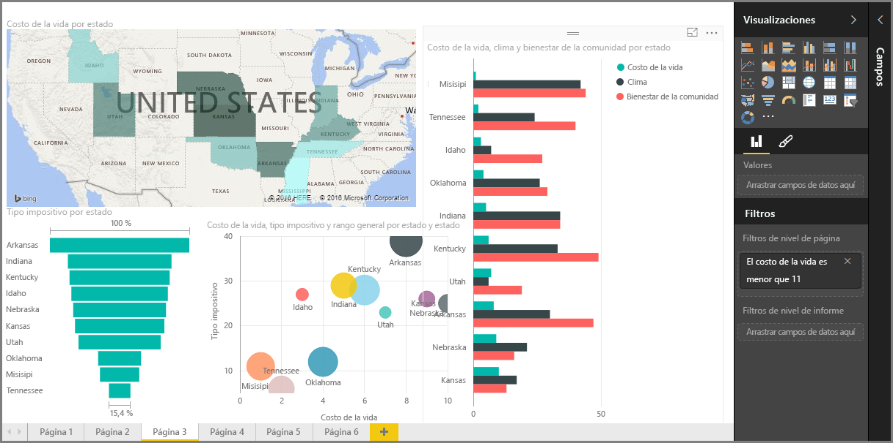

Esta es la sección **Visualizaciones** del curso de **Aprendizaje guiado** de Power BI. Prepárese para realizar un recorrido divertido, interesante y revelador por las muchísimas visualizaciones que puede ofrecer Power BI. Y esto no es todo; se incluyen nuevas visualizaciones periódicamente.

Por supuesto, los objetos visuales representan el resultado final de cualquier ejercicio de inteligencia empresarial: queremos obtener datos, presentarlos de forma atractiva y reveladora, y *mostrar* lo que destaque. En este sentido, Power BI cuenta con todo tipo de objetos visuales atractivos —y una forma casi ilimitada de personalizarlos—, por lo que esta sección es muy importante.

Puede que en un principio le parezca que esta sección se compone de muchos temas, pero no hay nada de lo que preocuparse: cada uno de ellos es breve, está repleto de (como habrá adivinado) objetos visuales y resulta muy sencillo de comprender. Es muy probable que avance rápidamente por la sección y se imagine cómo conseguirá que estos objetos visuales presenten sus propios datos.

Empezaremos por los pilares de las visualizaciones —los objetos visuales con los que todos estamos familiarizados— y nos aseguraremos de que los conoce de principio a fin. Después, veremos algunos más avanzados, o al menos un poco más infrecuentes, y descubrirá multitud de recursos para crear informes.

Diviértase; hay mucho que aprender en esta sección.

## Introducción a los objetos visuales en Power BI
La visualización de los datos es una de las partes principales de Power BI —una piedra angular, como la definimos anteriormente en este curso— y la creación de objetos visuales constituye la manera más sencilla de encontrar y compartir su información.

De manera predeterminada, Power BI pone a su disposición toda una gama de visualizaciones, desde gráficos de barras simples hasta los gráficos circulares y mapas, e incluso elementos más secretos, como cascadas, embudos, medidores, etc. Power BI Desktop también ofrece una amplia variedad de herramientas de formato, como formas e imágenes, que ayudan a que su informe cobre vida.

