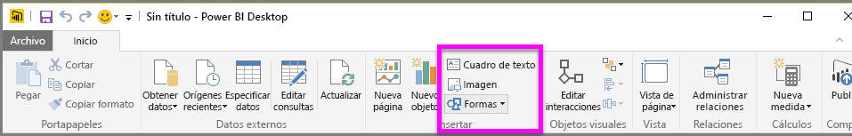
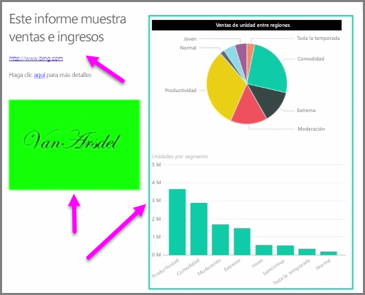

Junto con objetos visuales vinculados a datos, también puede agregar elementos estáticos, como cuadros de texto, imágenes y formas, para mejorar el diseño visual de los informes. Para agregar un elemento visual, seleccione **Cuadro de texto**, **Imagen** o **Formas** en la pestaña **Inicio**.

Los **cuadros de texto** constituyen una forma idónea de mostrar títulos grandes, subtítulos o párrafos cortos de información junto a las visualizaciones. En los cuadros de texto se pueden incluir vínculos; para ello, escriba una dirección URL o resalte una frase de anclaje y seleccione el símbolo de vínculo en la barra de opciones del cuadro de texto. Puede incluir direcciones URL en los cuadros de texto; Power BI detecta automáticamente el vínculo y le aplica el formato pertinente.

Si selecciona **Imagen**, se abrirá un explorador de archivos, donde podrá seleccionar una imagen en su equipo u otro origen conectado a la red. De manera predeterminada, al cambiar el tamaño de una imagen en el informe, se mantendrá su relación de aspecto, pero esto se puede deshabilitar en las opciones de formato visual.

En **Formas**, verá cinco opciones de forma, incluidos rectángulos y flechas. Las formas pueden ser opacas o transparentes con un borde de color. (Esta última opción resulta útil para crear bordes en torno a grupos de visualizaciones).

