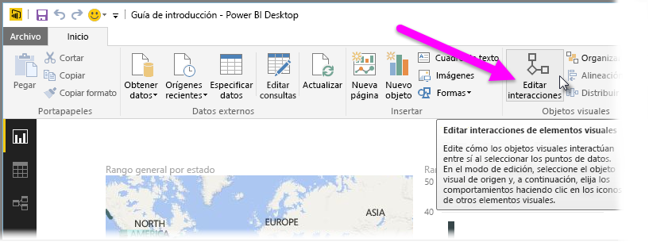
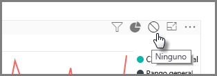
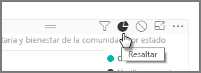
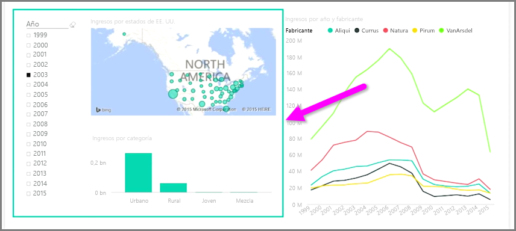

Cuando tenga varias visualizaciones en la misma página del informe, la selección de un segmento concreto haciendo clic en él o usando una segmentación repercutirá en todos los objetos visuales de la página. En algunos casos, no obstante, quizás desee segmentar únicamente objetos visuales específicos. Esto es así cuando se usan elementos como gráficos de dispersión, en los que si se limitan los datos a un segmento concreto, se perderá información importante. Por suerte, Power BI Desktop permite controlar cómo fluyen las interacciones entre objetos visuales.

Para cambiar la interacción entre las visualizaciones, seleccione **Editar** en la sección Objetos visuales de la cinta de opciones **Inicio** para activar el **modo de edición**.

>[!NOTE]
>El icono **Editar interacciones** de Power BI Desktop ha cambiado desde que se grabó el vídeo.
> 
> 

Ahora, cuando seleccione un objeto visual en el lienzo del informe, verá un pequeño icono de *filtro* opaco en la esquina superior derecha de cada otro objeto visual que se verá afectado. Para excluir un objeto visual de la interacción, haga clic en el símbolo *Ninguno* en la esquina superior derecha, cerca del icono de *filtro*.

En algunos casos, puede ajustar el tipo de interacción de filtro que se produce entre los objetos visuales. Con el **modo de edición** activado, seleccione el objeto visual se utiliza para filtrar. Si puede cambiar el tipo de interacción en otro objeto visual, aparecerá un icono de *gráfico circular* junto al de filtro en la esquina superior derecha.

Haga clic en el icono de *gráfico circular* para resaltar los datos segmentados. De lo contrario, se filtrarán los datos. Como antes, puede hacer clic en el icono *Ninguno* para quitar toda la interacción.

Una sugerencia útil consiste en dibujar una forma transparente alrededor de los objetos visuales que interactúen entre sí. De este modo, resultará evidente para el usuario que tienen una relación interactiva.

