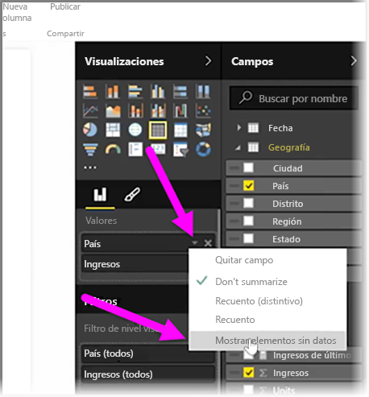
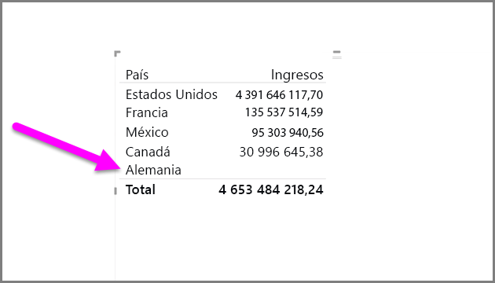
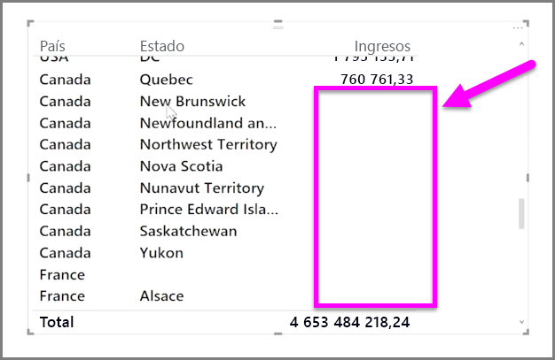

De manera predeterminada, los encabezados de columna solo se muestran en los informes si contienen datos. Por ejemplo, si estuviera mostrando los ingresos por país y no se hubiera producido ninguna venta en Noruega, dicho país nórdico no aparecerá por ninguna parte en la visualización.

Para mostrar categorías vacías, haga clic en la flecha abajo del campo que desee cambiar en el panel **Visualizaciones** y seleccione **Mostrar elementos sin datos**.

Ahora, las columnas vacías se mostrarán en el objeto visual con valores en blanco.

Una vez que seleccione **Mostrar elementos sin datos** para cualquier campo del panel **Visualizaciones**, se aplicará a todos los campos que se muestran en él. Es decir, si agrega otro campo, también se mostrarán todos los elementos sin datos, sin tener que volver a seleccionar la misma opción en el menú desplegable.

