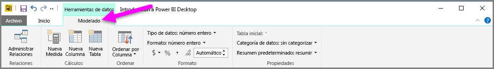
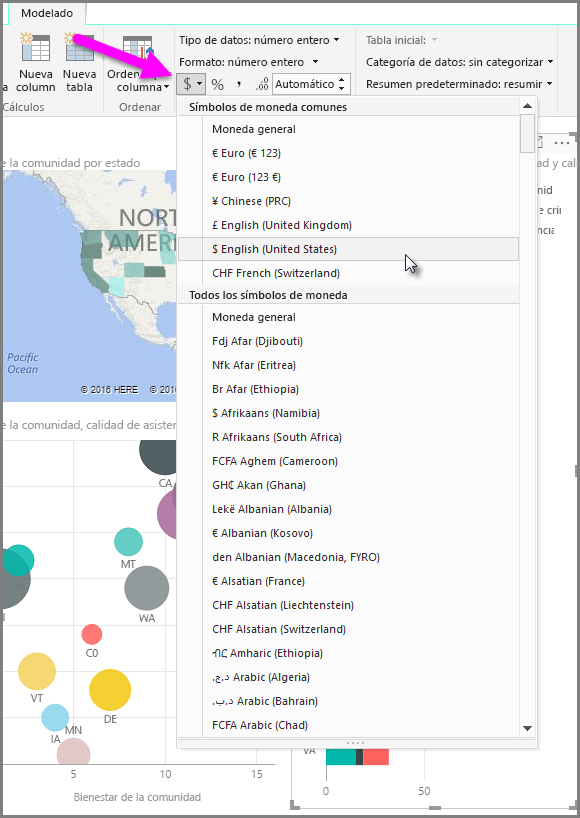
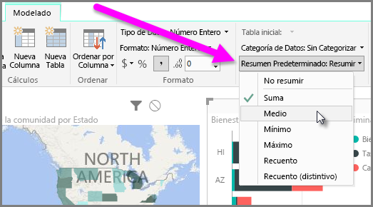
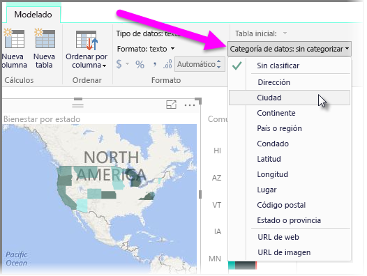

Power BI tiene propiedades que puede asignar a campos de su modelo, las cuales pueden ayudar a generar informes de los datos, así como visualizarlos y presentarlos, con mayor claridad. Por ejemplo, en ocasiones querrá sacar un promedio de una lista de números, pero Power BI suma la lista automáticamente. Con Power BI, puede ajustar cómo se resumen esas listas de números.

## Control numérico sobre el resumen
Tomemos un ejemplo y veamos cómo controlar la forma en la que Power BI resume los campos de datos numéricos.

Seleccione un objeto visual en el lienzo del informe y, después, elija un campo en el panel **Campos**. La pestaña **Modelado** aparecerá en la cinta de opciones y, en ella, se mostrarán las opciones de formato y propiedades de datos.

Puede seleccionar el tipo de símbolo de moneda utilizado si selecciona el símbolo de moneda de lista desplegable, que se muestra en la siguiente imagen.

Existen muchas opciones diferentes para dar formato a los campos. Por ejemplo, puede cambiar el formato de moneda a porcentaje.

También puede cambiar el modo en que Power BI resume los datos. Seleccione la opción **Resumen predeterminado** para cambiar cómo se resume un campo y especificar si se suma, se cuenta o se promedia, por ejemplo.

## Administración y clarificación de sus datos geográficos
Puede realizar modificaciones similares al trazar ubicaciones en un mapa. Seleccione el mapa y, después, seleccione en el panel **Campos** el campo que utilice para el valor *Ubicación*. En la pestaña **Modelado**, seleccione **Categoría de datos** y, después, elija en el menú desplegable la categoría que represente a sus datos geográficos. Por ejemplo, seleccione el estado, la provincia o la ciudad.

