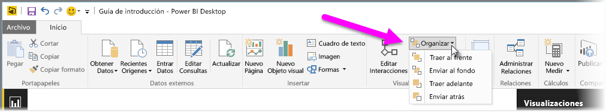
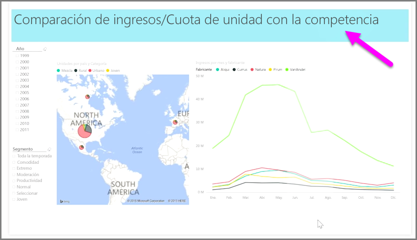

Cuando se tiene una gran cantidad de elementos en un informe, Power BI permite administrar la forma en la que se superponen entre sí. El modo en el que los elementos se organizan en capas o se colocan uno encima de otro se conoce habitualmente como el "orden Z".

Para administrar el orden Z de los elementos de un informe, seleccione un elemento y utilice el botón **Organizar** situado en la pestaña **Inicio** de la cinta de opciones para cambiar su orden Z.

Mediante las opciones del menú del botón **Organizar**, puede ordenar los elementos de su informe exactamente como desee. Puede mover un objeto visual una capa más arriba o abajo o enviarlo al principio o al final del orden.

El botón Organizar resulta especialmente útil cuando se utilizan formas como fondos decorativos o bordes, o para resaltar secciones concretas de un gráfico individual. También puede utilizarlas para crear un fondo, como el siguiente rectángulo de color azul claro que se utiliza como el fondo del título de un informe.

