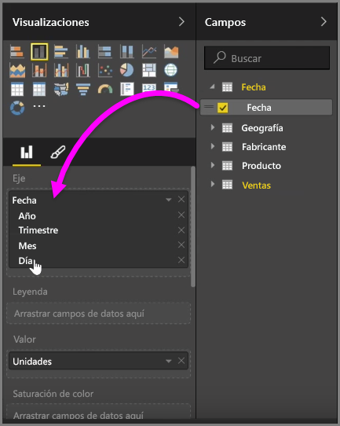
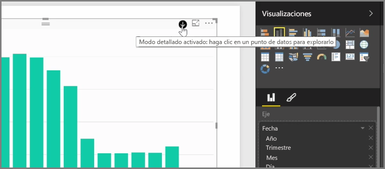
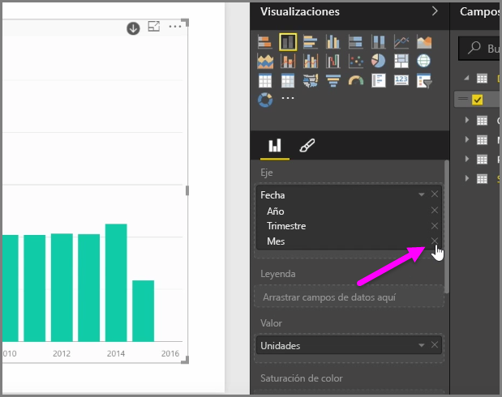
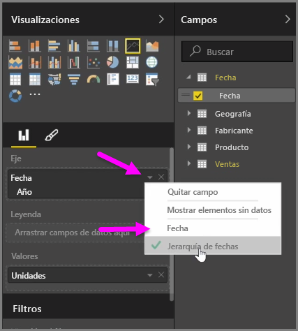
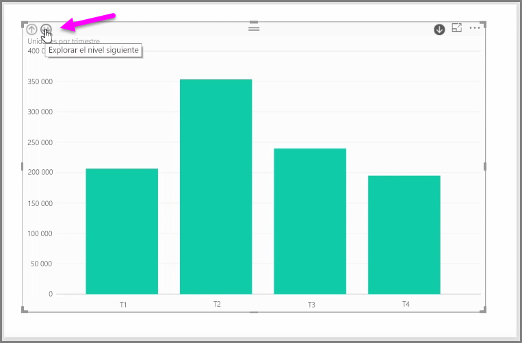

Cuando agregue un campo *Fecha* a un objeto visual en el cubo del campo *Eje*, Power BI agrega automáticamente una jerarquía de tiempo en la que se incluyen los valores *Año*, *Trimestre*, *Mes* y *Día*. Así, Power BI posibilita que los objetos visuales disfruten de una interacción basada en tiempo con las personas que ven sus informes y permite que los usuarios exploren en profundidad esos distintos niveles temporales.

Una vez que se haya establecido la jerarquía, puede comenzar a explorar en profundidad por ella. Por ejemplo, si hace clic en un año en el gráfico, explorará en profundidad hasta el siguiente nivel de la jerarquía; en este caso, *Trimestres*, el cual se muestra en el objeto visual.

En esa jerarquía creada automáticamente, también puede administrar hasta qué nivel pueden llegar los usuarios del informe compartido. Para ello, en el panel Visualizaciones, basta con que haga clic en la X situada junto a la jerarquía que desea quitar. El nivel eliminado se quita del informe y, aunque se explore en profundidad hasta él, no se mostrarán los datos que le corresponden.

Si necesita recuperar ese nivel de la jerarquía, basta con que quite el campo *Fecha* y lo vuelva a agregar en el panel **Campos**. De este modo, la jerarquía se crea automáticamente de nuevo.

Puede haber ocasiones en las que no quiera que la jerarquía se utilice para un objeto visual. Puede controlarlo si selecciona el botón de flecha abajo situado junto al campo *Fecha* (una vez que lo haya agregado al objeto visual) y elige **Fecha** en lugar de **Jerarquía de fechas**. Así se solicita a Power BI que muestre los valores de fecha sin procesar en el objeto visual.

También puede expandir todos los elementos de datos actualmente visibles a la vez, en lugar de seleccionar solo trimestre o año. Para ello, seleccione el icono de dos flechas abajo *Explorar el nivel siguiente*, situado en la esquina superior izquierda del objeto visual.

