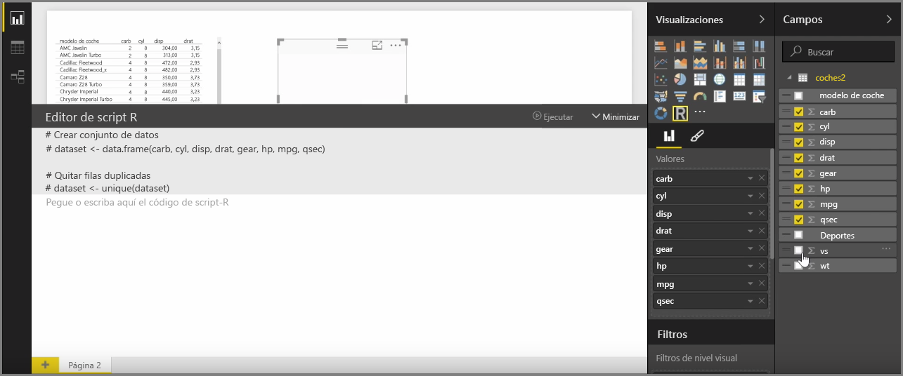
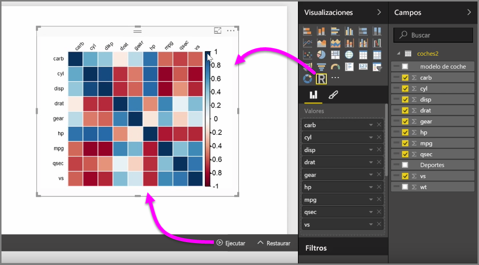
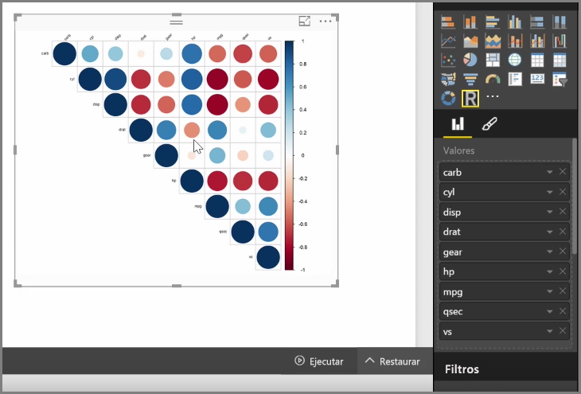

Con Power BI Desktop, puede realizar análisis estadísticos y analíticos, y crear objetos visuales atractivos mediante la integración con R. Puede hospedar las visualizaciones de R en el informe de Power BI Desktop.

Al seleccionar el icono de **objeto visual de R** en el panel **Visualizaciones**, Power BI crea un marcador de posición en el lienzo para hospedar el objeto visual R y, después, presenta un editor de scripts de R a la derecha del lienzo, el cual podrá utilizar. A medida que agregue campos al objeto visual de R, Power BI Desktop los agrega al panel del editor de scripts de R.

Debajo de lo que Power BI genera en el editor de scripts de R, puede empezar a crear el script de R para generar el objeto visual. Una vez completado el script, seleccione **Ejecutar**. Ocurrirá lo siguiente:

1. Los datos agregados al objeto visual (en el panel **Campos**) se envían desde Power BI Desktop a la instalación local de R.
2. El script creado en el editor de scripts de R de Power BI Desktop se ejecuta en esa instalación local de R.
3. Después, Power BI Desktop recibe un objeto visual de la instalación de R y lo muestra en el lienzo.

Estos pasos se desarrollan muy rápido y el resultado se mostrará en la visualización del **objeto visual de R** en el lienzo.

Puede cambiar el objeto visual R si ajusta el script de R y, después, vuelve a seleccionar la opción **Ejecutar**. En la siguiente imagen, hemos cambiado el objeto visual para que muestre círculos en lugar de cuadrados.

Y, como el objeto de R es igual que cualquier otro de Power BI Desktop, también puede interactuar con él y establecer conexiones con otros objetos visuales del lienzo. Cuando interactúe con otros objetos visuales en el lienzo, ya sea filtrándolos o resaltándolos, el objeto visual de R reaccionará automáticamente al igual que cualquier otro objeto visual de Power BI, sin necesidad de ajustar el script de R.

Se trata de una forma excepcional de aprovechar todas las posibilidades de R, directamente en Power BI Desktop.

## Pasos siguientes
**Enhorabuena.** Ha completado la sección **Visualizaciones** del curso de **Aprendizaje guiado** de Power BI. Puede considerarse a sí mismo muy versado en las numerosas visualizaciones que ofrece Power BI y también conocedor de cómo usarlas, modificarlas y personalizadas. Y, buenas noticias: las visualizaciones son básicamente las mismas en Power BI Desktop y en el servicio Power BI, así que lo que ha aprendido se aplica a ambos.

Ya está preparado para poner rumbo a la nube y sumergirse en el servicio Power BI, donde puede **explorar datos**. Como sabe, el flujo de trabajo se compone, aproximadamente, de los siguientes pasos:

* Integrar datos en **Power BI Desktop** y crear un informe
* Publíquelo en el servicio Power BI, donde creará nuevas **visualizaciones** y confeccionará paneles.
* **Comparta** sus paneles con otros usuarios, especialmente con personas que se estén desplazando.
* Vea informes y paneles compartidos e interactúe con ellos en aplicaciones de **Power BI Mobile**

Con independencia de si crea informes o se limita a verlos e interactuar con ellos, ahora sabe cómo se crean todos esos atractivos objetos visuales y cómo se conectan a los datos. Seguidamente, podremos observar a esos objetos visuales e informes en acción.

Nos vemos en la siguiente sección.

