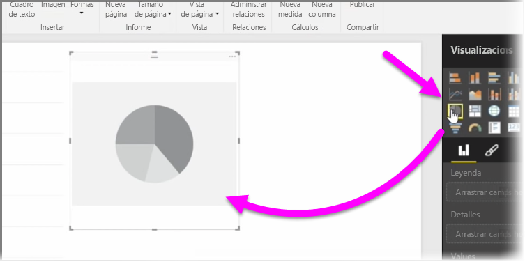
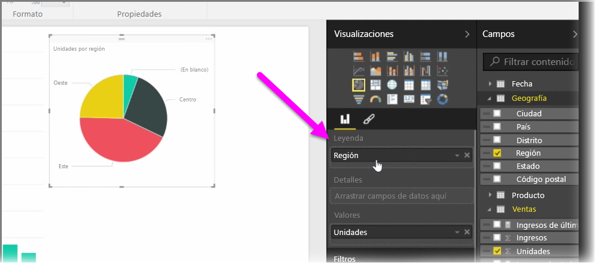
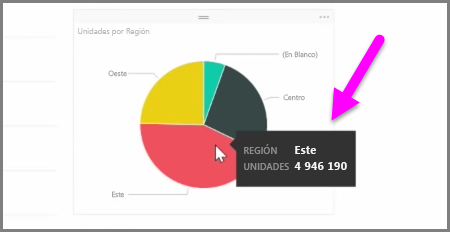
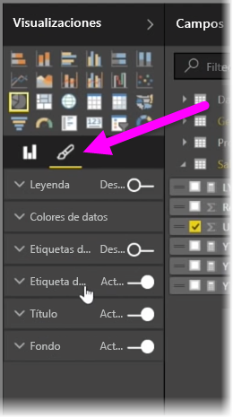

En este artículo aprenderá a crear nuevos gráficos de barras, circulares y de rectángulos, así como a personalizarlos para adaptarlos a sus informes.

Existen dos formas distintas de crear una nueva visualización en Power BI Desktop:

* Puede arrastrar nombres de campos desde el panel **Campos** y colocarlos en el lienzo del informe. De manera predeterminada, la visualización aparece como una tabla de datos.
  
  
* También puede hacer clic en el tipo de visualización que desee crear en el panel **Visualizaciones**. Con este método, el objeto visual predeterminado es un marcador de posición en blanco parecido al tipo de objeto visual seleccionado.
  
  

Una vez creado el gráfico o el mapa, puede comenzar a arrastrar campos de datos a la parte inferior del panel **Visualización** para crear y organizar el objeto visual. Los campos disponibles variarán según el tipo de visualización seleccionado. A medida que arrastre y coloque campos de datos, la visualización se actualizará automáticamente para reflejar los cambios.

Puede cambiar el tamaño de la visualización si la selecciona y, después, arrastra los manipuladores hacia dentro o fuera. También puede mover la visualización a cualquier parte del lienzo haciendo clic en ella y arrastrándola. Si quiere convertir un elemento en un tipo de visualización distinto, seleccione el que desee cambiar y sencillamente elija otro objeto visual entre los iconos del panel **Visualizaciones**. Power BI intenta convertir los campos seleccionados en el nuevo tipo de objeto visual con la mayor precisión posible.

A medida que mantenga el puntero sobre secciones de las visualizaciones, verá información sobre herramientas que contiene detalles sobre ese segmento, como etiquetas y su valor total.

Seleccione el icono del **pincel** en el panel **Visualizaciones** para efectuar cambios cosméticos en el objeto visual, como la alineación del fondo, el texto del título y los colores de los datos.

Las opciones disponibles para efectuar cambios cosméticos en su objeto visual varían según el tipo de objeto seleccionado.

