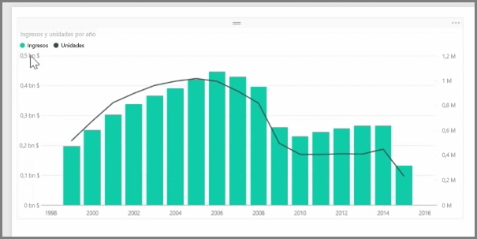
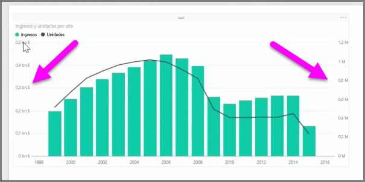
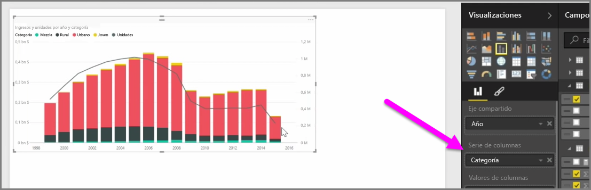

Cuando desee visualizar dos medidas que tengan escalas muy distintas, como ingresos y unidades, los **gráficos combinados** muestran una línea y una barra con distintas escalas de eje, lo cual es muy práctico. De manera predeterminada, Power BI admite muchos tipos distintos de gráficos combinados, incluidos los populares gráficos de **líneas** y de **columnas apiladas**.

Al crear un gráfico combinado, se le mostrará un campo para **Eje compartido** (el eje X) y, después, los valores de los dos campos; en este caso, una columna y una línea. Las leyendas de los dos ejes Y aparecen a ambos lados de la visualización.

También puede dividir cada columna por categoría; para ello, arrastre una categoría al campo Serie de columnas del panel Visualizaciones. Al hacerlo, cada barra se coloreará proporcionalmente de acuerdo con los valores de cada categoría.

Los gráficos combinados representan un modo eficaz de ver en una única visualización varias medidas con escalas muy distintas.

