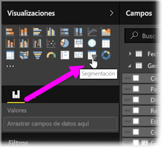
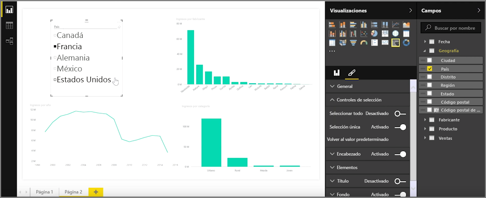
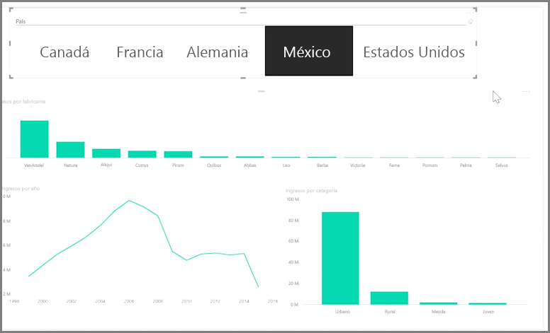

Las segmentaciones constituyen uno de los tipos de visualizaciones más eficaces, especialmente como parte de un informe repleto de elementos. Una **segmentación** es un filtro visual en el propio lienzo en **Power BI Desktop** que permite a cualquier persona que consulte el informe segmentar los datos por un valor concreto, como por año o ubicación geográfica.

Para agregar una segmentación al informe, seleccione **Segmentación de datos** en el panel **Visualizaciones**.

Arrastre el campo por el que quiere segmentar y colóquelo encima del marcador de posición de la segmentación. La visualización se convertirá en una lista de elementos con las casillas. Estos elementos son sus filtros: active la casilla situada junto a uno y las demás visualizaciones de la misma página del informe se filtrarán, o *segmentarán*, por su selección.

Hay varias opciones diferentes disponibles para dar formato a la segmentación. Puede configurarla para aceptar varias entradas a la vez o activar el modo **Selección única** para utilizar una sola. También puede agregar una opción **Seleccionar todo** a los elementos de su segmentación, lo que resulta útil cuando la lista es especialmente extensa. Si cambia la orientación de la segmentación de vertical (opción predeterminada) a horizontal, se convertirá en una barra de selección en lugar de una lista de comprobación.

