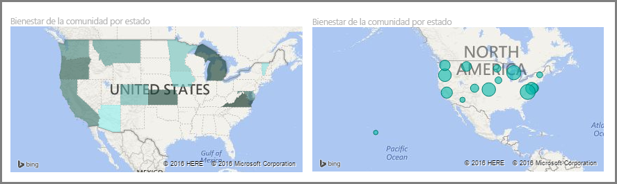
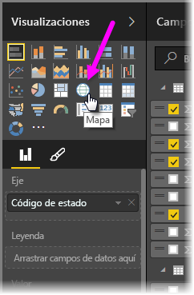
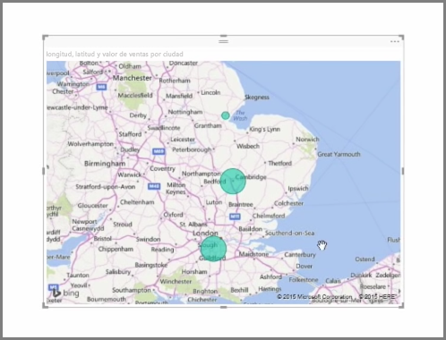
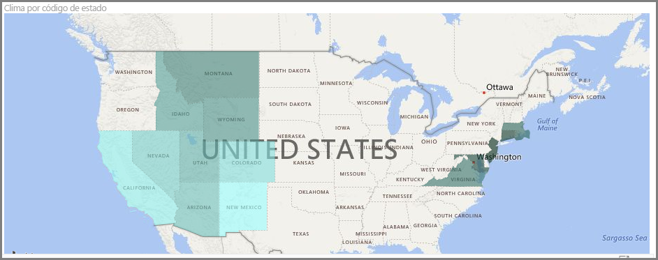
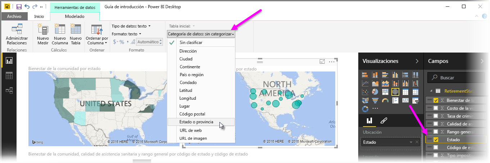

Power BI incorpora dos tipos distintos de visualizaciones de mapas: un mapa de burbujas que coloca una burbuja sobre un punto geográfico y uno de formas que muestra el contorno del área que desea visualizar.

> [!NOTE]
> Si trabaja con países o regiones, use la abreviatura de tres letras para asegurarse de que la geocodificación funciona correctamente durante la visualización de los mapas. *No* use las abreviaturas de dos letras, dado que podría haber muchos países o muchas regiones que no se reconociesen correctamente.
> Si solo dispone de abreviaturas de dos letras, consulte [esta entrada de blog](https://blog.ailon.org/how-to-display-2-letter-country-data-on-a-power-bi-map-85fc738497d6#.yudauacxp) donde se exponen los pasos para asociar las abreviaturas de dos letras de los países o regiones con abreviaturas de tres letras.
> 
> 

## Creación de mapas de burbujas
Para crear un mapa de burbujas, seleccione la opción **Mapa** en el panel **Visualizaciones**. Debe agregar un valor al cubo *Ubicación* en las opciones del panel **Visualizaciones** para utilizar un objeto visual de mapa.

Power BI es flexible en lo que respecta al tipo de valor de ubicación que acepta, desde detalles más generales como el nombre de la ciudad o el código de aeropuerto, hasta datos muy específicos de latitud y longitud. Agregue un campo al cubo **Tamaño** a fin de cambiar el tamaño de la burbuja según corresponda para cada ubicación del mapa.

## Creación de mapas de formas
Para crear un mapa de formas, seleccione la opción **Mapa coroplético** en el panel Visualizaciones. Como sucede en el caso de los mapas de burbujas, debe agregar algún tipo de valor al cubo Ubicación para utilizar este objeto visual. Agregue un campo al cubo Tamaño para cambiar la intensidad del color de relleno según corresponda.

Un icono de advertencia situado en la esquina superior izquierda del objeto visual indica que el mapa necesita más datos de ubicación para trazar los valores con precisión. Se trata de un problema bastante habitual cuando los datos del campo de ubicación son ambiguos, por ejemplo, en los casos en los que se usa el nombre de un área como *Washington* que podría indicar un estado o un distrito. Una manera de solucionar este problema consiste en cambiar el nombre de la columna para que sea más específico, como *Estado*. Otro modo de solucionarlo es restablecer manualmente la categoría de datos seleccionando **Categoría de datos** en la pestaña Modelado. Ahí puede asignar una categoría a los datos, como "Estado" o "Ciudad".

