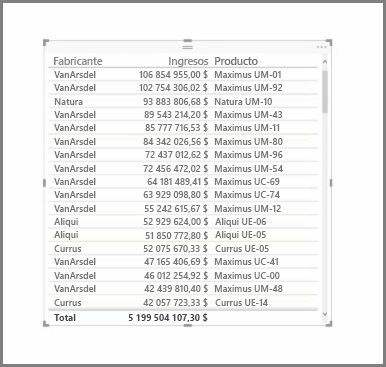
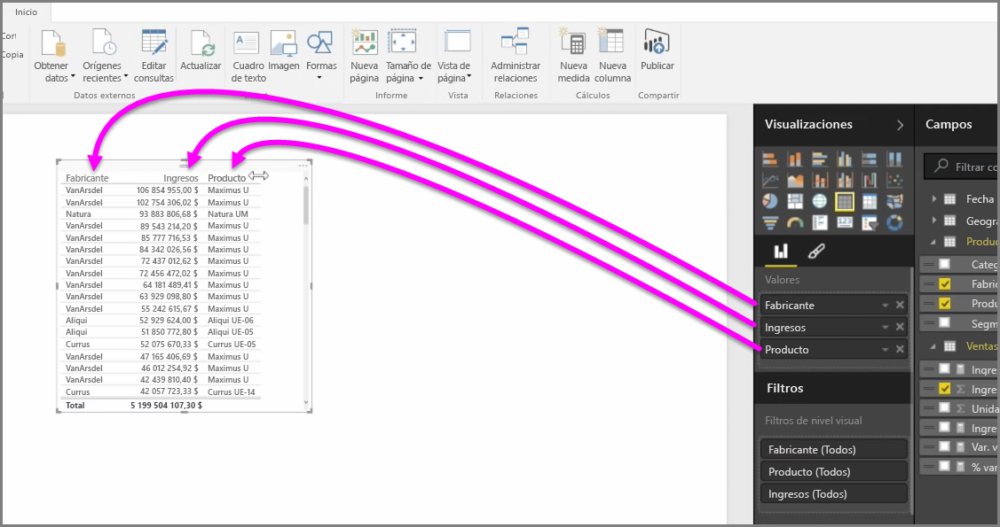
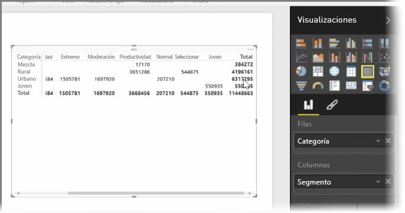

Además de una gran cantidad de gráficos, Power BI Desktop también admite visualizaciones más tabulares. De hecho, si selecciona un campo de categoría o de texto y lo arrastra al lienzo del informe, se creará una tabla de resultados de manera predeterminada. Podrá desplazarse arriba y abajo por la tabla e, inicialmente, estará ordenada alfabéticamente.

Si tiene información numérica en una tabla, como ingresos, en la parte inferior aparecerá una suma con el total. Puede ordenar manualmente cada columna si hace clic en su encabezado para alternar entre el orden ascendente y descendente. Si una columna no es lo suficientemente ancha para mostrar todo su contenido, haga clic en el encabezado y arrástrelo hacia un lado para ampliarla.

El orden de los campos en el cubo *Valores* del panel **Visualizaciones** determina el orden en el que aparecen en la tabla.

Una **matriz** es similar a una tabla, pero tiene encabezados de categorías distintos en las columnas y filas. Como sucede con las tablas, la información numérica se sumará automáticamente abajo y a la derecha de la matriz.

Existen numerosas opciones cosméticas disponibles para las matrices, como columnas con ajuste automático de tamaño, la posibilidad de activar o desactivar los totales de filas y columnas, la capacidad de establecer colores, etc. Cuando cree una matriz, asegúrese de que los datos categóricos (los datos no numerados) estén a la izquierda de la matriz y los archivos numéricos a la derecha para asegurarse de que aparece la barra de desplazamiento horizontal y para asegurarse de que el comportamiento de desplazamiento funciona correctamente.

