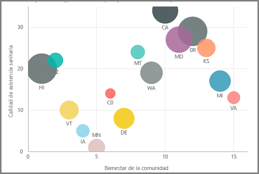
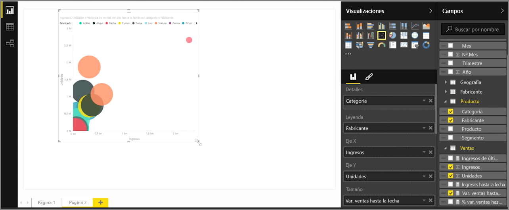
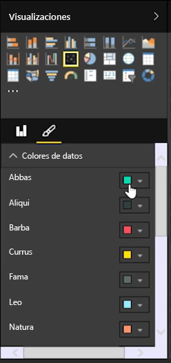
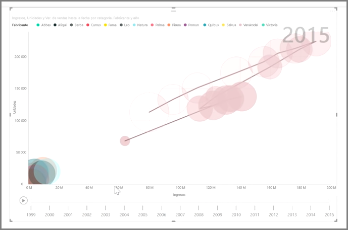

Si quiere comparar dos medidas distintas, como los ingresos por ventas y las unidades, es habitual utilizar un gráfico de dispersión.

Para crear un gráfico en blanco, seleccione **Gráfico de dispersión** en el panel **Visualizaciones**. Arrastre los dos campos que quiere comparar desde el panel **Campos** y colóquelos en los cubos de opciones *Eje X* y *Eje Y*. En este momento, es posible que el gráfico de dispersión no sea más que una pequeña burbuja en el centro del objeto visual; tendrá que agregar una medida al cubo *Detalles* para indicar cómo quiere segmentar los datos. Por ejemplo, si se están comparando ingresos y ventas de artículos, es posible que desee dividir los datos por categoría, fabricante o mes de venta.

Si agrega un campo adicional al cubo *Leyenda*, se codificarán por color las burbujas de acuerdo con el valor del campo. También puede agregar un campo al cubo *Tamaño* para modificar el tamaño de la burbuja según ese valor.

Los gráficos de dispersión también cuentan con numerosas opciones de formato visual, como la posibilidad de activar un contorno para cada burbuja de color y la capacidad de alternar etiquetas individuales. También puede cambiar los colores de datos para otros tipos de gráficos.

Puede crear una animación de los cambios secuenciales del gráfico de burbujas a lo largo del tiempo si agrega un campo de tiempo en el cubo *Eje de reproducción*. Haga clic en una burbuja durante una animación para ver el trazado de su ruta.

>[!NOTE]
>Recuerde, si solo ve una burbuja en el gráfico de dispersión, esto se debe a que Power BI está sumando los datos (lo que es el comportamiento predeterminado). Agregue una categoría al cubo *Detalles*, en el panel **Visualizaciones**, para obtener más burbujas.
> 
> 

