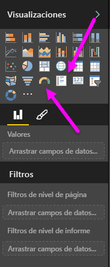
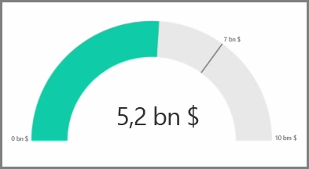
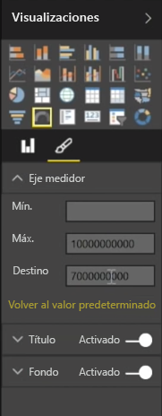
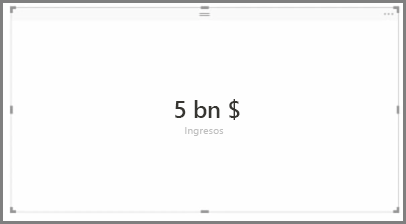
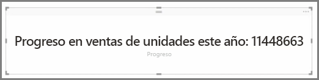

Por lo general, las visualizaciones se utilizan para comparar dos o más valores. Sin embargo, hay ocasiones al crear informes en las que querrá realizar un seguimiento de un solo indicador clave de rendimiento (KPI) o una métrica a lo largo del tiempo. Para ello, debe usar en Power BI Desktop un **medidor** u objeto visual de tarjeta **con un solo número**. Para crear un gráfico en blanco de cualquiera de los dos tipos, seleccione el icono pertinente en el panel **Visualizaciones**.

Los medidores resultan especialmente útiles cuando esté creando paneles y desee mostrar el progreso que se ha realizado con vistas a la consecución de un objetivo determinado. Para crear un medidor, seleccione el icono pertinente en el panel **Visualizaciones** y arrastre el campo del que desee realizar un seguimiento al cubo *Valor*.

Los medidores aparecen de manera predeterminada al 50 %, o el doble del *valor*, y existen dos modos de ajustar esta configuración. Para establecer los valores dinámicamente, arrastre campos los cubos de valor *Mínimo*, *Máximo* y *Destino*. Como alternativa, utilice las opciones de formato visual para personalizar manualmente el intervalo de su medidor.

Las visualizaciones de tarjeta muestran simplemente una representación numérica de un campo. De forma predeterminada, los objetos visuales de tarjeta muestran unidades para garantizar que el número sea corto (por ejemplo, "5 MM $" en lugar de 5 000 000 000 $). Utilice las opciones de formato visual para cambiar la unidad o deshabilitarla por completo.

Una aplicación interesante de las tarjetas consiste en hacer que muestren una medida personalizada que haya concatenado con texto. Por seguir con el ejemplo anterior, con una medida personalizada, su tarjeta podría incluir funciones DAX avanzadas y mostrar un resultado similar a "Ingresos totales este año: 5 MM $" o "Progreso de ventas de unidades este año:" y, después, agregar el número que represente el progreso.

