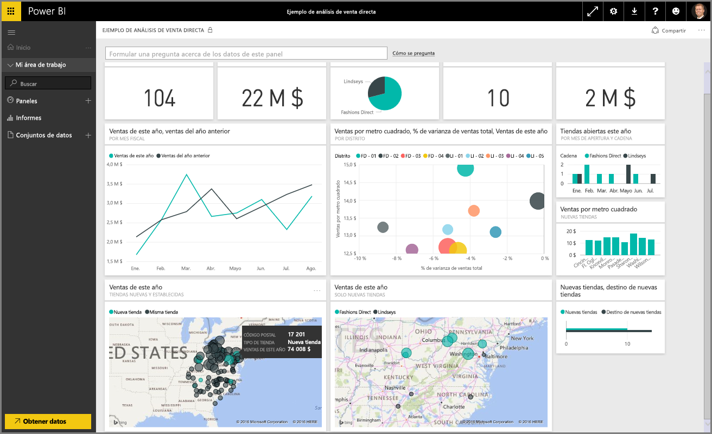
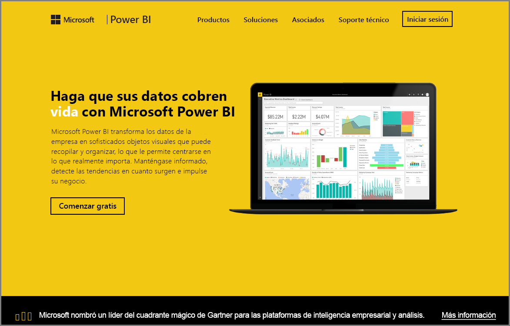

Está en la sección **Exploración de datos** del curso de **Aprendizaje guiado** de Power BI. Ahora que ya conoce Power BI Desktop y sabe cómo obtener y visualizar datos, ya está listo para explorar los datos en el servicio Power BI.

En esta sección aprenderá a hacer de todo con los datos, y es aquí donde el atractivo de la interactividad y el uso compartido de Power BI brillan con luz propia. Por lo tanto, prepárese para una sección interesante y fascinante.

## Introducción al servicio Power BI
*Descubra lo que el servicio Power BI puede hacer por su organización*

El servicio Power BI es la extensión natural de **Power BI Desktop**, y entre sus características se incluyen la carga de informes, la creación de paneles y el planteamiento de preguntas sobre los datos con lenguaje natural. Puede utilizar el servicio para establecer los tiempos de actualización de datos, compartir datos con su organización y crear paquetes de servicio personalizados.

En los temas siguientes, exploraremos el servicio Power BI y le mostraremos cómo puede convertir los datos de inteligencia empresarial en información sobre los datos y en un entorno colaborativo para impulsar la toma de decisiones.

