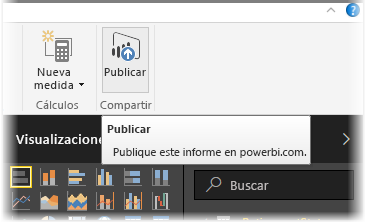
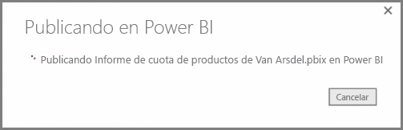
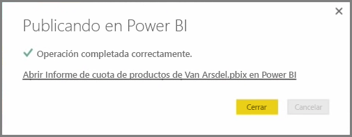
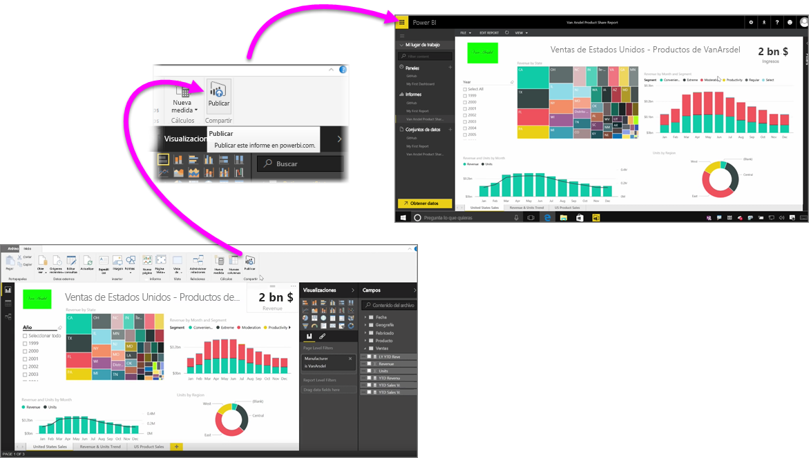

Publicar informes en el servicio Power BI es rápido y fácil.

Una vez que haya completado la creación del informe en **Power BI Desktop**, solo tiene que seleccionar el botón **Publicar** de la pestaña **Inicio** de Power BI Desktop y el proceso comenzará.

El informe y los datos, incluidas las visualizaciones, las consultas y las medidas personalizadas, se recopilan y se cargan en el servicio Power BI.

> NOTA: A los informes de Power BI Desktop se les suele llamar "archivos **.pbix**", ya que esta es la extensión que se les asigna en Windows.
> 
> 

Una vez finalizada la carga, un cuadro de diálogo le informará de que el proceso de publicación se realizó correctamente y le dará un vínculo que le llevará directamente al informe en el servicio Power BI, en un explorador web.

Y ya está: publicar informes de Power BI Desktop en el servicio Power BI es así de sencillo.

