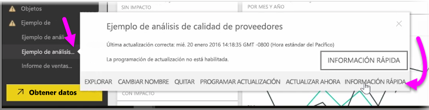
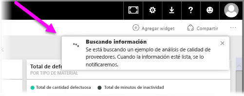
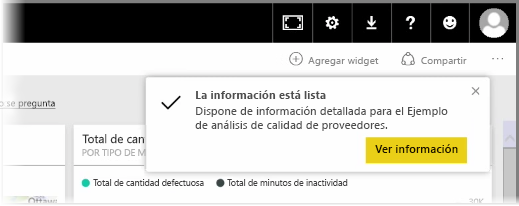
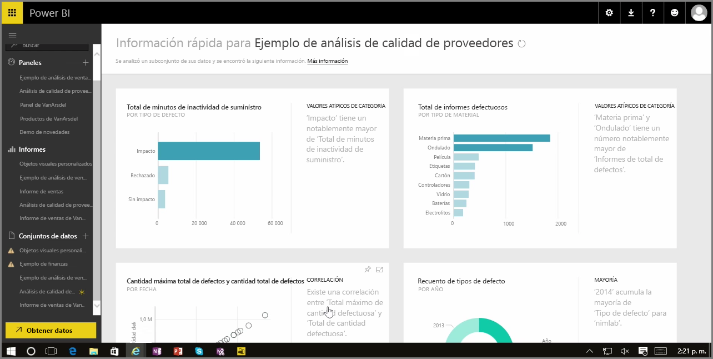

Cuando trabaja con un panel, un informe o un conjunto de datos en el servicio Power BI, puede hacer que Power BI busque información rápida en los datos. En Power BI, en la sección **Conjuntos de datos** del panel izquierdo, seleccione el menú de los *puntos suspensivos* que se encuentra al lado del conjunto de datos que le interesa. Aparecerá un menú de opciones y, en el extremo derecho, verá una opción denominada **Información rápida**.

Si selecciona Información rápida, Power BI realizará un aprendizaje automático, buscará los datos y los analizará para buscar información rápida. Verá una notificación en el lado superior derecha del servicio que le indicará que Power BI está en proceso de búsqueda de información.

Al cabo de aproximadamente quince segundos, la notificación cambiará para que sepa que Power BI ha encontrado información.

Si selecciona el botón **Ver información** de la notificación, se le presentará una página de objetos visuales que muestran la información encontrada por Power BI, de una forma parecida a como se muestra en la imagen siguiente. Aquí encontrará información muy variada, y podrá desplazarse hacia abajo por la página para verla y tenerla en consideración.

Al igual que cualquier otro objeto visual, puede interactuar con los objetos visuales de la página Información rápida, así como anclar cualquiera de ellos a cualquiera de sus paneles o aplicar más filtros a tantos objetos como desee para buscar información adicional que podría estar esperando a que su curiosidad la descubra.

Con **Información rápida**, puede hacer que Power BI detecte valores atípicos y tendencias en los datos, y luego utilizar los resultados en los paneles o, si lo desea, restringirlos y filtrarlos para obtener la información que resulte más importante para usted.

