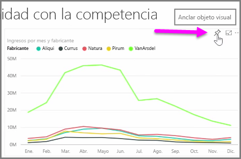
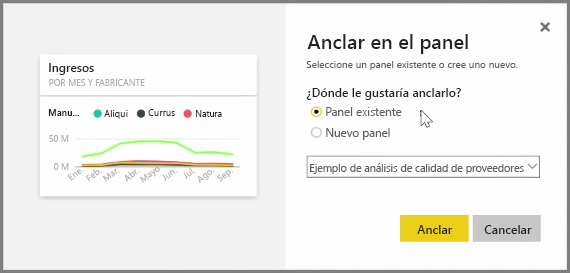
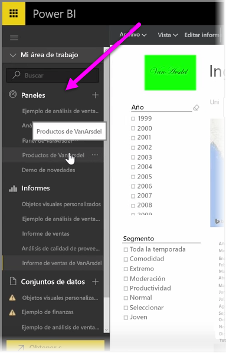
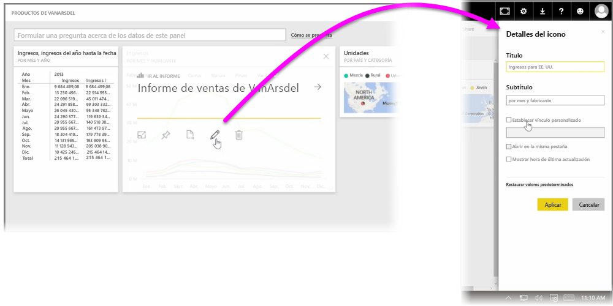

Los **paneles** de Power BI son colecciones de una página de visualizaciones que se crean mediante el servicio Power BI. Puede crear paneles **anclando** visualizaciones de informes que haya creado y publicado con Power BI Desktop o que haya generado dentro del propio servicio Power BI. **Anclar** un objeto visual a un panel se parece mucho a clavar una foto en un tablón de corcho en la pared con una chincheta: consiste en fijar el objeto visual en un punto concreto para que los demás lo vean. Para anclar un objeto visual, abra el informe en el servicio Power BI. Mantenga el puntero sobre el objeto visual que desee anclar y seleccione el icono de la **chincheta**.

Aparecerá un cuadro de diálogo, donde podrá seleccionar un panel de destino para el objeto visual del menú desplegable o bien crear un nuevo panel. También obtendrá una vista previa del aspecto que tendrá el objeto visual anclado en el panel. Puede anclar visualizaciones de varios informes y páginas a un solo panel, lo que le permite agrupar diversos conjuntos de datos y orígenes en una sola página de información.

En **Paneles**, puede agregar cualquier tipo de visualización, incluidos gráficos, mapas, imágenes y formas anclándolos. Cuando un objeto visual está anclado a un panel, se le llama **icono**.

Los paneles, incluido cualquier panel nuevo, aparecen en la sección Paneles del margen izquierdo del servicio Power BI. Seleccione un panel de la lista para verlo.

Puede cambiar a su antojo el diseño de los objetos visuales de un panel. Para cambiar el tamaño de un icono, arrastre los controladores hacia dentro o hacia fuera. Para mover un icono, solo tiene que hacer clic y arrastrarlo a otra ubicación en el panel. Mantenga el puntero sobre un icono y haga clic en el icono del **lápiz** para abrir **Detalles del icono**, donde podrá cambiar el **Título** o el **Subtítulo**.

Haga clic en un icono del panel para ver el informe a partir del cual se creó. Esto le permite ver rápidamente los datos subyacentes bajo un objeto visual. También puede cambiar ese vínculo mediante el campo **Establecer vínculo personalizado** en **Detalles del icono**.

Por ejemplo, puede anclar iconos de un panel a otro si tiene una colección de paneles y desea crear un panel de resumen. El proceso es el mismo: mantenga el puntero sobre el icono y seleccione el **icono de la chincheta**. Los paneles son fáciles de crear y cambiar. Además, puede personalizarlos para hacer que el panel de una página aparezca exactamente donde lo desee.

