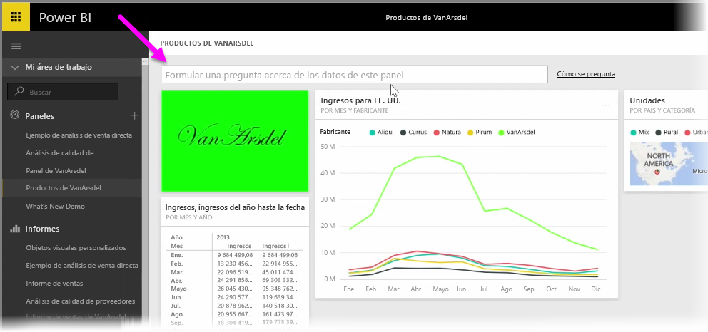
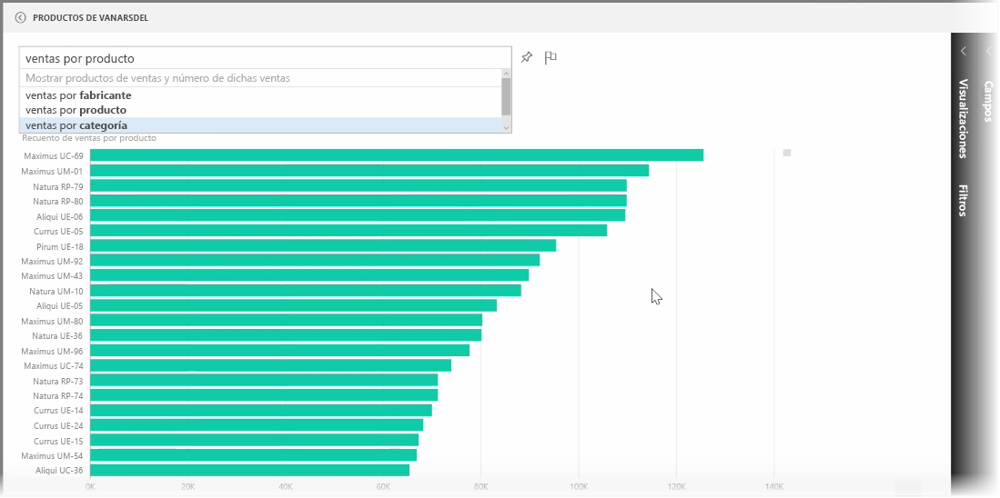
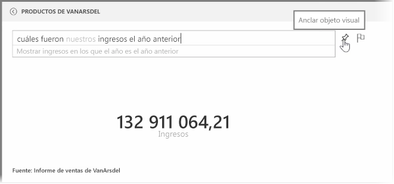
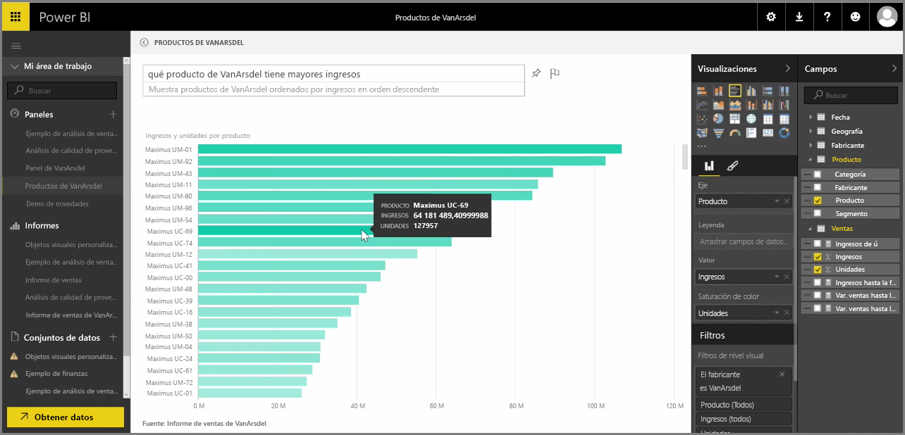

Power BI incluye un motor de reconocimiento de idioma eficaz que le permite plantear preguntas a sus datos mediante frases y preguntas conversacionales. Por lo tanto, además de crear informes y visualizaciones con Power BI, puede crear diagramas y gráficos con solo formular preguntas sencillas.

Para plantear una pregunta sobre sus datos, abra un panel en Power BI y, en la parte superior de la pantalla, verá un cuadro de entrada en el que podrá formular preguntas acerca de los datos mostrados. A esta característica se le suele llamar *Preguntas y respuestas*, o más a menudo, esta característica es solo conoce como **Preguntas y respuestas**.

Al hacer clic en el cuadro, Power BI muestra avisos con algunos de los términos sugeridos a partir de los datos como, por ejemplo, "Ingresos anuales hasta la fecha". Puede hacer clic en uno de los términos sugeridos para ver el resultado, que suele aparecer como una tabla o tarjeta sencillas. Al seleccionar una de las frases sugeridas, Power BI crea automáticamente y en tiempo real un objeto visual a partir de su selección.

También puede plantear preguntas en lenguaje natural como, por ejemplo, "¿cuáles fueron nuestros ingresos el año pasado?" o "¿cuál fue el producto más vendido en marzo de 2014?". Power BI muestra su interpretación de la pregunta y elige el mejor tipo de objeto visual para representar la respuesta. Además, al igual que con cualquier otro objeto visual de Power BI, puede **anclarlo** al panel de su elección seleccionando el icono de la **chincheta**.

Puede editar el objeto visual creado por la pregunta o frase planteadas en lenguaje natural en cualquier momento. Solo tiene que utilizar los paneles **Visualizaciones** y **Campos** del margen derecho de la pantalla. Al igual que en otros objetos visuales de Power BI, puede modificar el diseño, ajustar los filtros y cambiar las entradas de los campos.

Para guardar la visualización en un panel después de crear el objeto visual perfecto, basta con seleccionar el icono de la **chincheta** situado junto al cuadro de entrada de la pregunta.

