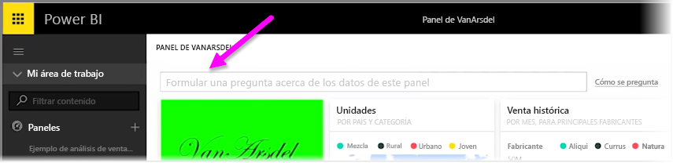
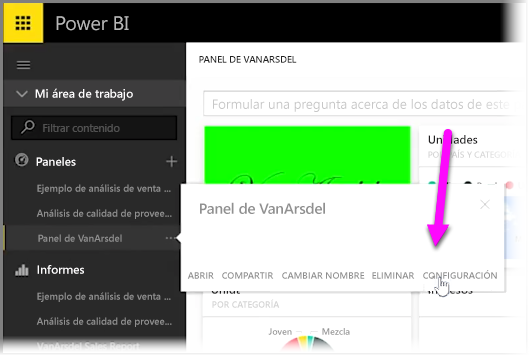
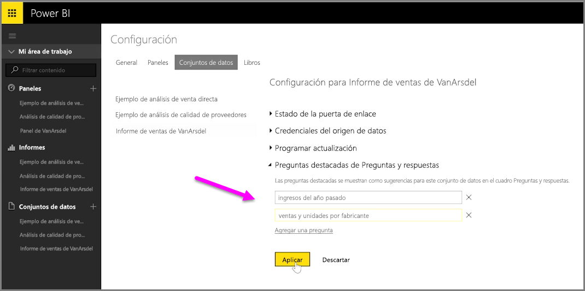

Con Power BI, puede agregar sus propias sugerencias de preguntas para los demás usuarios que utilicen el cuadro de consulta en lenguaje natural de un panel, al que se le suele llamar "el cuadro **Preguntas y respuestas**". Estas sugerencias de preguntas son las que verán los usuarios cuando hagan clic en el cuadro de entrada en la parte superior de un panel.

Para agregar sus propias preguntas, seleccione el menú de los puntos suspensivos situado junto al nombre del panel que desea usar y seleccione **Configuración** en el menú.

 Se abrirá la página **Configuración** del panel y los libros o conjuntos de datos subyacentes. Puede desactivar completamente el cuadro de entrada de búsqueda de preguntas y respuestas en la sección **Paneles** de la página **Configuración**, pero si desea agregar preguntas, debe seleccionar la sección **Conjuntos de datos**.

En la sección **Conjuntos de datos** se muestran todos los conjuntos de datos asociados al panel. Seleccione el conjunto de datos asociado al panel de la lista, seleccione **Preguntas y respuestas destacadas** y, por último, el vínculo **Agregar una pregunta**. Escriba su pregunta o aviso en el cuadro de entrada y seleccione **Aplicar**.

Ahora, siempre que alguien haga clic en el cuadro de entrada de búsquedas del panel seleccionado, verá las entradas que sugirió en la parte superior de la lista de avisos y, si selecciona dicha pregunta, se le llevará directamente a la respuesta correspondiente. Esta es una forma muy eficaz de conseguir que los usuarios del panel piensen en el tipo de datos disponibles y en la forma en que pueden aprovecharlos al máximo.

