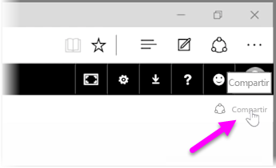
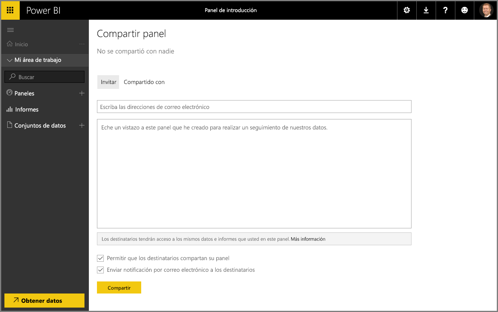

Ya hemos visto cómo lo ayuda Power BI a encontrar datos, a recopilarlos en un modelo de datos y a generar informes y visualizaciones sobre el uso de dichos datos. También hemos visto cómo puede publicar estos informes en el servicio Power BI y crear paneles que lo ayudarán a supervisar su información a lo largo del tiempo. Todas estas características son aún más eficaces si comparte la información con los demás miembros de la organización. Afortunadamente, compartir sus paneles es fácil.

Para compartir un panel, ábralo en el servicio Power BI y seleccione el vínculo **Compartir** situado en la esquina superior derecha.

Aparecerá la página **Compartir panel**, donde podrá seleccionar la sección **Invitar** y luego rellenar el cuadro de entrada **Dirección de correo electrónico** con las personas a las que desea conceder acceso a su panel. Power BI compara las direcciones de correo electrónico con las cuentas de su dominio y el dominio de Office 365 a medida que las escribe, por lo que las autocompleta siempre que sea posible. También puede copiar direcciones de correo electrónico y pegarlas en este cuadro, o utilizar una lista de distribución, un grupo de seguridad o el grupo de Office 365 para abarcar a varias personas a la vez.

Si selecciona la casilla de verificación *Enviar notificación por correo electrónico a los destinatarios* (se encuentra cerca de la parte inferior de la página), los destinatarios recibirán un correo electrónico que les informará de que ha compartido un panel con ellos e incluirá un vínculo al panel. Puede agregar una nota al correo electrónico que recibirán o enviar la nota que Power BI crea automáticamente (se encuentra en el cuadro inmediatamente debajo de donde debe escribir las direcciones de correo electrónico).

>[!NOTE]
>A los destinatarios que todavía no tengan una cuenta de Power BI se les llevará por el proceso de registro antes de que puedan ver el panel.
> 
> 

Toda aquella persona con la que comparta un panel podrá ver e interactuar con él exactamente como usted lo hace, pero tendrán un acceso de *solo lectura* a los informes subyacentes y *no podrán acceder* a los conjuntos de datos subyacentes.

También puede seleccionar la pestaña **Compartido con** de la página Compartir panel para ver las personas con las que ya compartió el panel.

