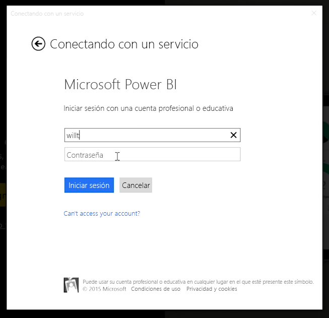
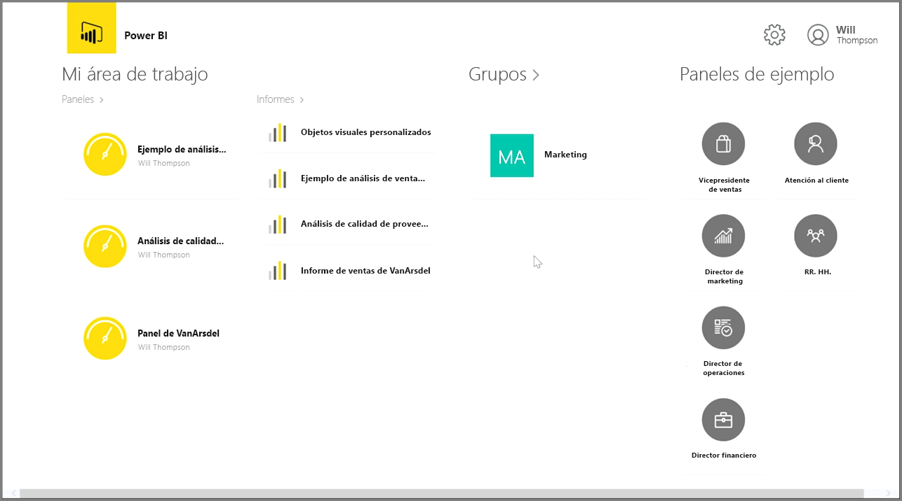

Si desea realizar un seguimiento de los datos esté donde esté, puede utilizar una de las aplicaciones móviles de Power BI para dispositivos iOS, Android y Windows.

Para utilizar la aplicación Power BI, primero debe iniciar sesión en su cuenta con la información de la cuenta del servicio Power BI. En los dispositivos móviles Windows (en este caso una tableta), el inicio de sesión tendrá el siguiente aspecto.

La primera pantalla que verá muestra todo el contenido al que tiene acceso, incluidos los informes, paneles y grupos. También hay paneles de muestra que puede utilizar para inspirarse o, simplemente, para ver las características de Power BI. La aplicación está diseñada para su uso en dispositivos táctiles: puntee un panel o informe para verlos a pantalla completa y desplácese por ellos con el dedo.

Puede abrir cualquier panel punteándolo. Dentro de un panel, puede puntear uno de sus iconos para enfocarlo en una vista más grande.

También puede anotar cualquier información que detecte punteando el botón **Anotar** de la esquina superior derecha. De este modo, podrá dibujar en un icono destacado para resaltar áreas de interés concretas. Las herramientas de anotación se encuentran dispuestas a lo largo de la parte inferior de la pantalla.

Puede compartir el icono anotado punteando el vínculo **Compartir** de la esquina superior derecha.

Puntee el vínculo **Informe** de la esquina superior derecha para ver el informe subyacente de un icono. Esto mostrará exactamente las mismas visualizaciones que vería en un explorador web o en Power BI Desktop y, además, incluye la capacidad de interactuar con el informe punteando las barras, explorándolo en profundidad o usando segmentaciones de datos.

