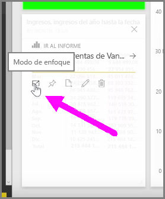
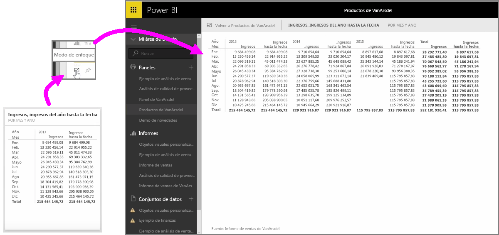

Cuando examina los paneles o informes de Power BI en el servicio, a veces es útil centrarse en un gráfico o visualización individuales. Puede hacerlo de dos formas diferentes.

En un panel, mantenga el puntero sobre un icono para ver unas cuantas opciones distintas en la esquina superior derecha. Si selecciona el menú de los puntos suspensivos, verá una colección de iconos que representan las acciones que puede realizar en el icono.

El icono del extremo izquierdo tiene la etiqueta **modo Enfoque**. Selecciónelo para expandir el icono y abarcar todo el espacio del panel.

El **modo Enfoque** le permite ver los objetos visuales y las leyendas de una forma mucho más detallada. Por ejemplo, cuando cambia el tamaño de un icono en Power BI, es posible que no se muestren algunas de las columnas debido al espacio disponible en el icono.

En el **modo Enfoque**, puede ver todos los datos. También puede anclar el objeto visual directamente desde el modo Enfoque a otro panel seleccionando el icono de la **chincheta**. Para salir del **modo Enfoque**, seleccione el icono **Volver a...** situado en la esquina superior izquierda del **modo Enfoque**.

Este proceso es parecido a la visualización de un informe. Mantenga el puntero sobre un objeto visual para ver los tres iconos en la esquina superior derecha y seleccione el icono del **modo Enfoque**. Al seleccionar esta opción, la visualización se expande para abarcar todo el lienzo del informe. El objeto visual sigue siendo interactivo en este modo, aunque perderá temporalmente cualquier efecto de filtro cruzado entre visualizaciones.

Mantenga el puntero sobre un icono o informe expandidos y seleccione el icono con la flecha hacia la izquierda **Volver a...** de la esquina superior izquierda para volver a la vista anterior.

