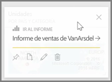
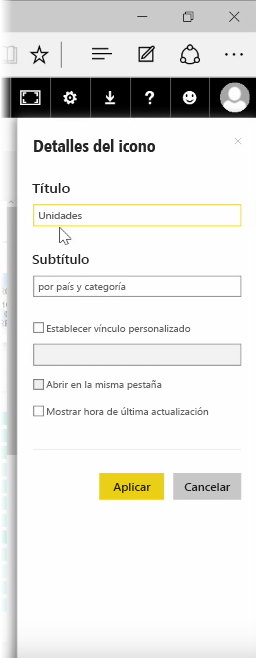
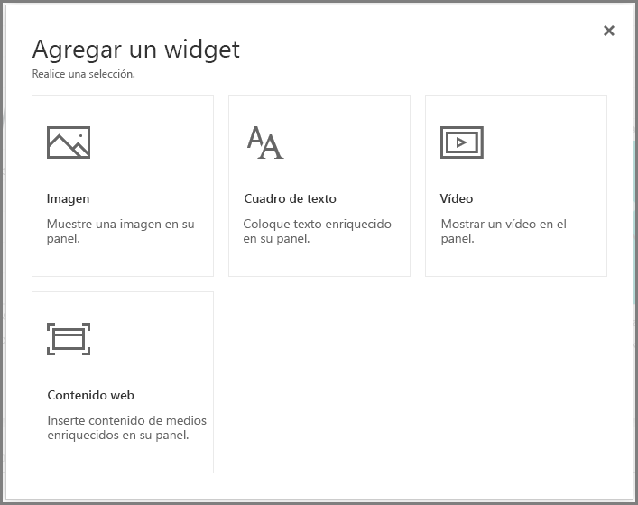
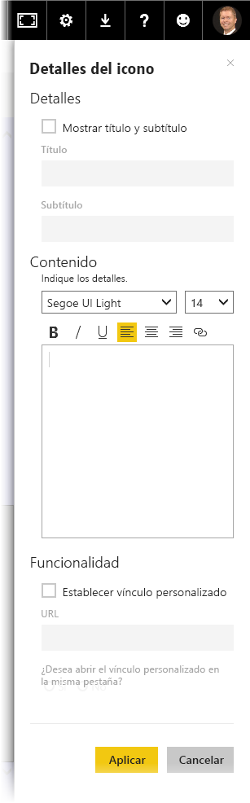

Tras crear un panel, puede editar sus **iconos* en el servicio Power BI para realizar unos cuantos cambios de formato.

Para realizar cambios en un icono, mantenga el puntero sobre él y seleccione el menú de los puntos suspensivos para mostrar la colección de iconos que le permiten realizar cambios.

Seleccione el icono del **lápiz** para abrir el panel **Detalles del icono**. Aquí podrá cambiar el **Título** y **Subtítulo** del icono, lo que incluye la fecha y hora de última actualización, entre otros detalles como, por ejemplo, la creación de un vínculo personalizado.

De forma predeterminada, al hacer clic en un icono del panel, se le llevará al informe a partir del cual se creó. Para cambiar este comportamiento, use el campo **Establecer vínculo personalizado** del panel **Detalles del icono**. Esta característica se suele utilizar para llevar a los usuarios a la página principal de la organización cuando hacen clic en una imagen de logotipo.

## Adición de widgets al panel
También puede agregar widgets al panel. Un **widget** es un icono especial del panel que, en lugar de contener una visualización, contiene otros elementos como, por ejemplo, una imagen, un vídeo en línea, un cuadro de texto o contenido web enriquecido.

Si selecciona el vínculo Agregar widget de la esquina superior derecha de un panel, aparecerá el cuadro de diálogo **Agregar un widget**.

Por ejemplo, al agregar un cuadro de texto, aparecerá el panel **Detalles del icono** en el margen derecho, donde podrá editar los detalles de un modo parecido al que se utiliza para editar los detalles de cualquier icono. Pero con los widgets, también hay una sección que permite definir o modificar el contenido del widget como, por ejemplo, un editor de texto enriquecido para un cuadro de texto.

Con los widgets y la capacidad de editar los detalles del icono, puede personalizar el panel y darle precisamente el aspecto que desea que tenga.

