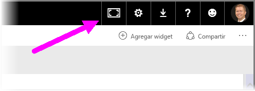
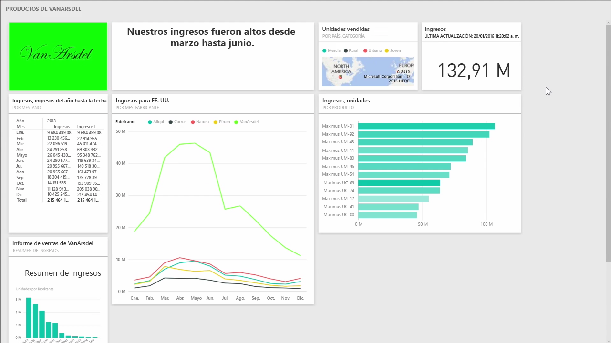
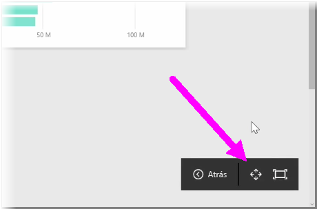
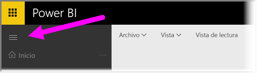

Es posible que, a veces, cuando cree paneles, tenga más contenido que el que cabe en el lienzo. Hay unas cuantas soluciones que lo ayudarán a administrar la forma en que se visualiza el espacio del panel para que pueda ver todo el contenido.

El método más sencillo para visualizar todo el panel en una pantalla es seleccionar el botón **Modo de pantalla completa** de la esquina superior derecha del panel.

Al seleccionar el botón **Modo de pantalla completa**, el explorador pasará al modo de pantalla completa, se retirarán todos los elementos del explorador que rodean el panel y, por lo tanto, aumentará la cantidad de espacio visible.

Desde el **modo de pantalla completa**, puede seleccionar la opción **Ajustar a la pantalla** para reducir todos los iconos de forma que quepan en una sola pantalla, sin necesidad de barras de desplazamiento. A esto se le suele llamar *modo de televisión*, y es útil para realizar presentaciones con paneles o mostrar un panel en los monitores de los pasillos de la oficina.

Otra forma de administrar el espacio del panel es contraer el panel de navegación del margen izquierdo de la página seleccionando el icono de la hamburguesa. Para expandir el panel de navegación, vuelva a hacer clic en este icono.

Para que el panel aparezca siempre con la barra de navegación contraída, anexe lo siguiente al final de la dirección URL:

> ? collapseNavigation = true
> 
> 

Los usuarios que sigan este vínculo abrirán el panel con una barra de navegación contraída.

