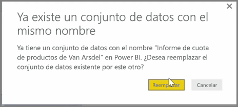
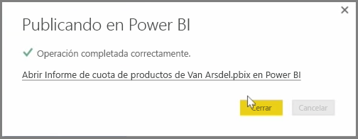

Puede actualizar los informes y conjuntos de datos que ya se hayan publicado desde Power BI Desktop en el servicio Power BI. Para ello, seleccione **Publicar** en la pestaña **Inicio** de la cinta de opciones.

Si publica un informe que ya existe en el servicio Power BI, se le pedirá que confirme que desea reemplazar los informes y el conjunto de datos anteriores por la versión editada que eligió para la actualización.

Al seleccionar **Reemplazar**, los conjuntos de datos e informes del servicio Power BI se sobrescriben con los conjuntos de datos e informes de la versión más reciente de Power BI Desktop del archivo.

Y como en cualquier otro evento de **publicación** de Power BI Desktop, verá un cuadro de diálogo que le indicará si el evento de publicación se realizó correctamente y obtendrá un vínculo al informe en el servicio Power BI.

Esta es una manera de actualizar los datos manualmente. También puede actualizar automáticamente los conjuntos de datos e informes, pero este proceso se tratará en otro tema de aprendizaje.

