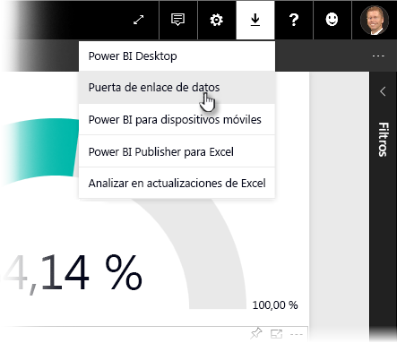
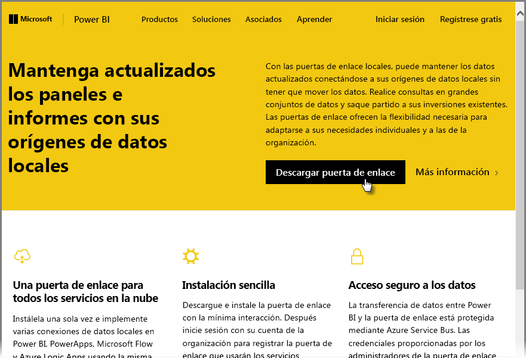
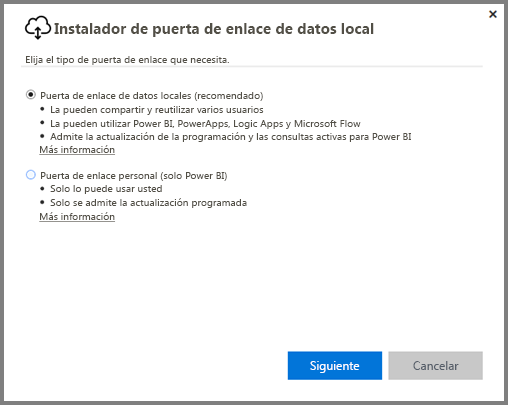
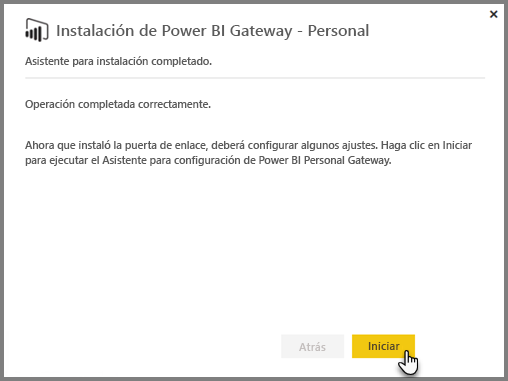
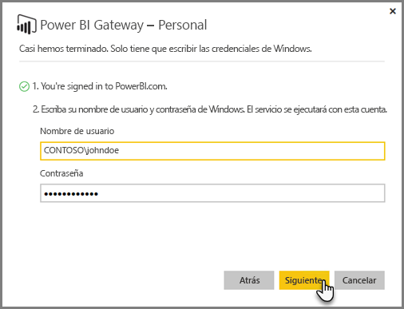
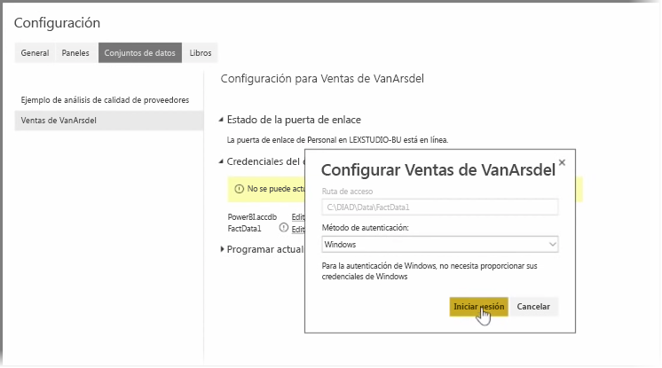
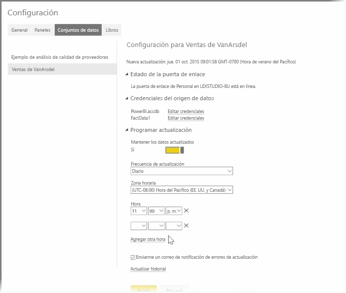

En los temas anteriores, hemos analizado cómo se puede utilizar Power BI para conectarse a orígenes de datos y cómo actualizar manualmente los conjuntos de datos en el servicio Power BI. Sin embargo, realizar actualizaciones manuales todo el tiempo cada vez que sus datos cambien no es algo deseable, por lo que puede usar Power BI para configurar una actualización programada que se conectará a los orígenes de datos y publicarlos en el servicio Power BI automáticamente. De este modo, también podrá conectar el servicio a todo tipo de orígenes de datos locales, incluidos archivos de Excel, bases de datos de Access, bases de datos SQL y muchos más.

El sistema que le permite conectar los orígenes de datos locales al servicio Power BI se llama **Puerta de enlace de datos**. Se trata de una pequeña aplicación que se ejecuta en el equipo y utiliza una programación predeterminada para conectarse a los datos, recopilar todas las actualizaciones e insertarlas en el servicio Power BI. **Puerta de enlace personal** es una versión de **Puerta de enlace de datos**, que se puede utilizar sin ninguna configuración de administrador.

>[!NOTE]
>El equipo en el que se ejecute Power BI Personal Gateway *debe* estar encendido y conectado a Internet para que **Personal Gateway** funcione correctamente.
> 

Para configurar **Puerta de enlace personal**, primero debe iniciar sesión en el servicio Power BI. Seleccione el icono **Descargar** de la esquina superior derecha de la pantalla y luego seleccione **Puertas de enlace de datos** en el menú.

Desde allí, se le llevará a una página web en la que podrá seleccionar **Power BI Gateway - Personal**, tal y como se muestra a continuación.

Ejecute la aplicación cuando termine la descarga y complete el Asistente para instalación.

Se solicitará que inicie el asistente de configuración para configurar la puerta de enlace.

Primero que se le pedirá es que inicie sesión en la cuenta del servicio Power BI y luego que inicie sesión en la cuenta de Windows de la máquina, ya que el servicio Puerta de enlace se ejecuta según su cuenta.

Vuelva al servicio Power BI. Seleccione el menú de los puntos suspensivos situado al lado del conjunto de datos que desea actualizar y seleccione **Programar actualización**. Se abrirá la página **Actualizar configuración**. Power BI detectará que ha instalado **Personal Gateway** y le informará del estado.

Seleccione **Editar credenciales** junto a los orígenes de datos pertinentes y configure la autenticación.

Por último, establezca las opciones de **Programar actualización** para activar las actualizaciones automáticas y establecer cuándo y con qué frecuencia se deben producir.

Y ya está. A las horas programadas, Power BI accederá a esos orígenes de datos mediante las credenciales que proporcionó y la conexión con el equipo en el que se ejecuta **Personal Gateway**, y actualizará los informes y conjuntos de datos según la programación. La próxima vez que acceda a Power BI, estos paneles, informes y conjuntos de datos reflejarán los datos correspondientes a la última actualización programada.

## Pasos siguientes
**Enhorabuena.** Ha completado la sección **Exploración de datos** del curso de **Aprendizaje guiado** de Power BI. El servicio Power BI está lleno de formas interesantes para explorar datos, compartir información e interactuar con los objetos visuales. Además, podrá acceder a todas estas características mediante un explorador, desde un servicio al que se podrá conectar esté donde esté.

Power BI cuenta con famoso y eficaz aliado: **Excel**. Power BI y Excel están diseñados para funcionar bien juntos: sus libros se sentirán como en casa en Power BI y podrá importarlos allí fácilmente.

¿Hasta qué punto es fácil? En la siguiente sección, **Power BI y Excel** aprenderá precisamente eso.

Nos vemos en la siguiente sección.

