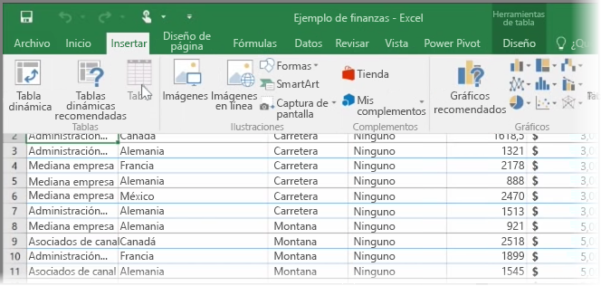

En primer lugar, en este tema echaremos un vistazo a cómo importar un archivo de libro de Excel que contiene una sencilla **tabla** desde una unidad local hasta Power BI. Después, aprenderá cómo empezar a explorar los datos de dicha tabla en Power BI generando un informe.

## Datos obligatoriamente con formato de tabla
Para que Power BI pueda importar los datos del libro, los datos deben tener **formato de tabla**. Es fácil. En Excel, puede resaltar un rango de celdas y, en la pestaña **Insertar** de la cinta de Excel, haga clic en **Tabla**.

Debe asegurarse de que todas las columnas tengan un nombre adecuado. De este modo, podrá encontrar con mayor facilidad los datos que desee al crear informes en Power BI.

## Importación desde una unidad local
Independientemente de la ubicación de los archivos, Power BI permite importarlos fácilmente. En Power BI, puede usar **Obtener datos** > **Archivos** > **Archivo Local** para buscar y seleccionar el archivo de Excel que desea.

Una vez importado en Power BI, podrá empezar a generar informes.

Obviamente, los archivos no tienen que estar necesariamente en una unidad local. Si guarda los archivos en OneDrive o en un sitio de grupo de SharePoint, será incluso mejor. Hablaremos sobre esto con mayor detalle en otro tema más adelante.

## Inicio de la creación de informes
Una vez importados los datos del libro, se crea un conjunto de datos en Power BI. Aparece en **Conjuntos de datos**. Ahora podrá empezar a explorar los datos creando informes y paneles. Basta con hacer clic en el icono del **menú Abrir** situado junto al conjunto de datos y hacer clic en **Explorar**. Aparecerá un nuevo lienzo de informe en blanco. En el margen derecho, en **Campos**, verá las tablas y columnas. Solo tiene que seleccionar los campos que desea para crear una nueva visualización en el lienzo.

Puede cambiar el tipo de visualización y aplicar **filtros** y otras propiedades en **Visualizaciones**.

