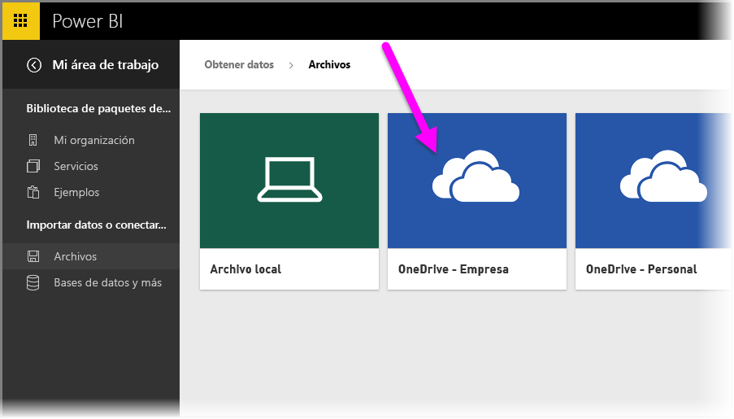
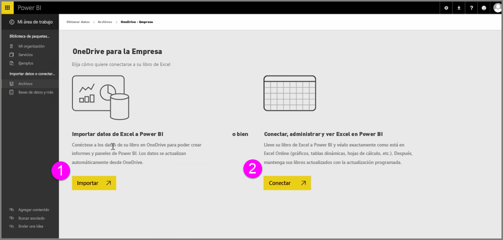
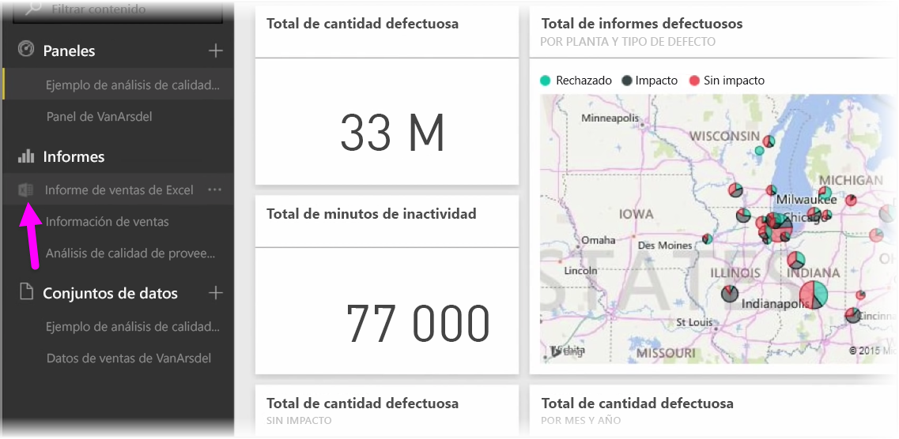
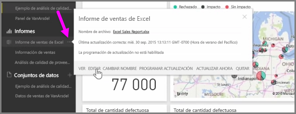

Consiga una integración perfecta entre Power BI y Excel al guardar los libros de Excel en OneDrive.

Dado que OneDrive se encuentra en la nube, al igual que Power BI, se establece una conexión activa entre Power BI y OneDrive. Si realiza cambios en el libro en OneDrive, se *sincronizan automáticamente* con Power BI. Las visualizaciones en los informes y los paneles se mantienen actualizadas. Si el libro se conecta a orígenes de datos externos como una fuente de OData o una base de datos, puede usar la función **Programar actualización** de Power BI para buscar actualizaciones. ¿Le surgen dudas sobre los datos de su libro? No hay problema. Para ello, le invitamos a utilizar la función de **Preguntas y respuestas** de Power BI.

Existen dos formas de conectarse a los archivos de Excel en OneDrive para la Empresa:

1. Importe datos de Excel en Power BI
2. Conectar, administrar y ver Excel en Power BI

### Importe datos de Excel en Power BI
Cuando elija importar datos de Excel en Power BI, se cargan los datos de tabla del libro en un conjunto de datos nuevo en Power BI. Si dispone de hojas **Power View** en el libro, estas se importan y, además, se crean automáticamente nuevos informes en Power BI.

Power BI mantendrá activa la conexión entre este archivo de libro y el de OneDrive para la Empresa. Si realiza cambios en el libro, al guardarlo, se *sincronizarán automáticamente** con Power BI, generalmente en menos de una hora. Si conecta el libro con orígenes de datos externos, puede configurar una actualización programada de forma que el conjunto de datos de Power BI permanezca actualizado. Debido a que las visualizaciones de los informes y los paneles de Power BI utilizan los datos del conjunto de datos, cuando explore, las consultas que realice serán muy veloces.

### Conexión, administración y visualización de Excel en Power BI
Cuando elija conectarse al libro de Excel, disfrutará de una experiencia de trabajo perfecta con el libro en Excel y Power BI. Al conectarse de este modo, el informe del libro mostrará un pequeño icono de Excel junto a él.

En el informe, verá el libro de Excel en Power BI tal como lo vería en **Excel Online**. Puede explorar y editar las hojas de cálculo en Excel Online seleccionando Edición en el menú de puntos suspensivos. Cuando realice cambios, las visualizaciones que haya anclado a los paneles se actualizarán automáticamente.

En Power BI no se crea ningún conjunto de datos. Todos los datos permanecen en el libro de OneDrive. Una de las muchas ventajas de este enfoque es que puede configurar **actualizaciones programadas** si el libro se conecta a orígenes de datos externos. Puede seleccionar elementos como tablas dinámicas y gráficos y **anclarlos** directamente a los paneles en Power BI. Si realiza cambios, se reflejarán automáticamente en Power BI. Además, puede usar la fantástica función **Preguntas y respuestas** de Power BI para formular preguntas acerca de los datos del libro.  

