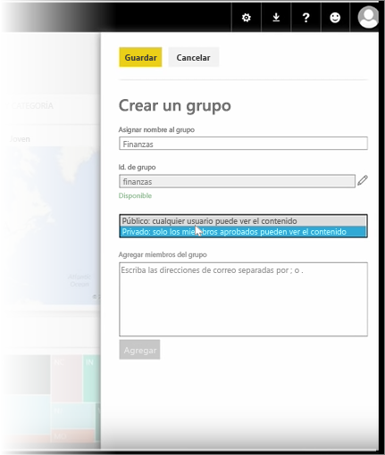
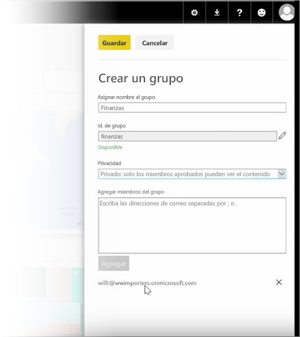

En esta lección, empezamos creando un *grupo*. Un **grupo** se define como un conjunto de usuarios que tienen acceso a datos, informes y paneles específicos.

Los grupos de Power BI se basan en los grupos de Office 365, por lo que si ya utiliza esta opción para administrar su grupo de correo electrónico, calendario y documentos, comprobará que Power BI ofrece las mismas funciones y mucho más. Al crear un grupo en Power BI, realmente lo crea en Office 365.

En este módulo se sigue el ejemplo de configuración de un nuevo grupo de finanzas. Le mostraremos cómo configurar el grupo, compartir paneles, informes y conjuntos de datos en el grupo, y agregar miembros que dispondrán de acceso a los elementos del grupo.

Comenzaré aquí en Mi área de trabajo. Estos son los paneles, los informes y los conjuntos de datos que he creado o que alguien ha compartido conmigo.

Si expando Mi área de trabajo, puedo seleccionar **Crear un grupo**.

Aquí puedo asignarle un nombre. Vamos a seguir el ejemplo de un grupo de finanzas, por lo que lo llamaré Finance. Power BI se asegura de que el nombre no existe en el dominio.

Puedo establecer el nivel de privacidad para que cualquier integrante de mi organización pueda ver el contenido del grupo o bien solo sus miembros.

Aquí escribo las direcciones de correo electrónico, los grupos de seguridad y las listas de distribución. Selecciono **Agregar** para incorporarlos al grupo y lo guardo.

Pasemos a la siguiente lección.

