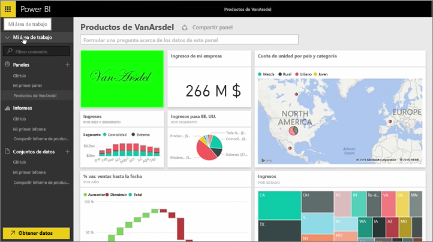
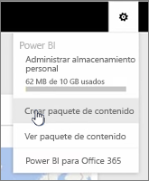
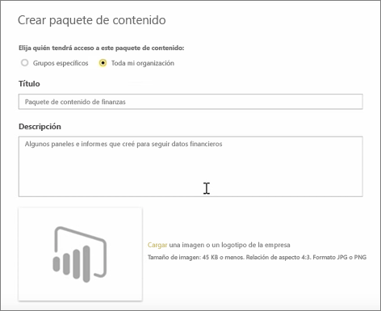
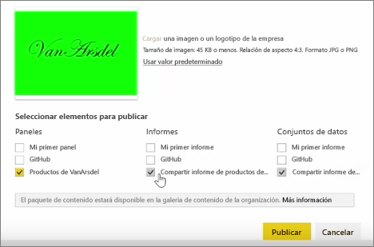
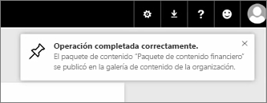

En esta lección, crearemos un *paquete de contenido* con artefactos existentes que ya disponemos en Power BI y, a continuación, los compartiremos con los compañeros.

En **Mi área de trabajo** tengo un panel, el informe debajo y el conjunto de datos. Quiero compartirlos como un paquete con integrantes de mi organización para que puedan volver a usarlos.

Si selecciono el icono de **configuración** (el engranaje de la parte superior derecha del servicio), puedo comprobar cuánto almacenamiento he usado y crear un paquete de contenido.

En el cuadro de diálogo que aparece, puedo elegir distribuirlo a determinados usuarios o grupos y asignarle un nombre. También es buena idea redactar una descripción detallada en el cuadro **Descripción** para que las personas que busquen un paquete de contenido sepan lo que contiene o lo que aporta.

En la parte inferior del cuadro de diálogo, se ofrece la opción de cargar una imagen para el paquete de contenido y, a continuación, llegamos al paso más importante: seleccionar el panel que quiero incluir en el paquete de contenido. Al hacerlo, Power BI selecciona automáticamente el informe y el conjunto de datos que se utilizan en el panel. No puedo anular la selección del informe o conjunto de datos porque el panel que quiero incluir en el paquete de contenido precisa de ellos.

También podría seleccionar otros paneles, informes y conjuntos de datos, pero en este caso no lo haré.

Al publicarlo, el paquete de contenido se agrega a la galería de contenido de la organización.

Pasemos a la siguiente lección.

