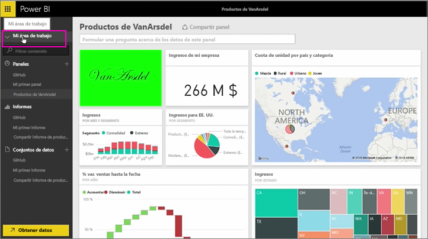
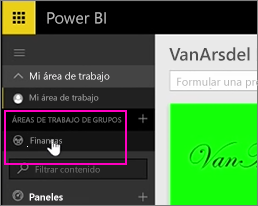
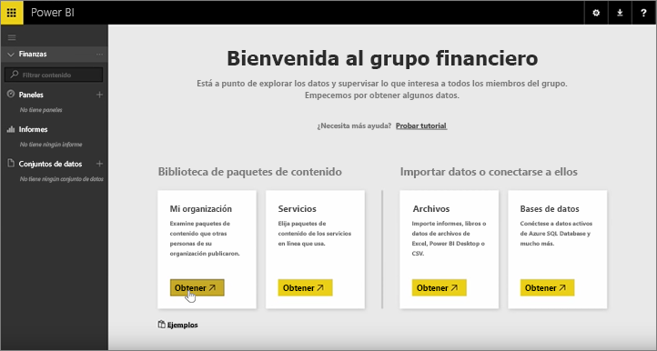
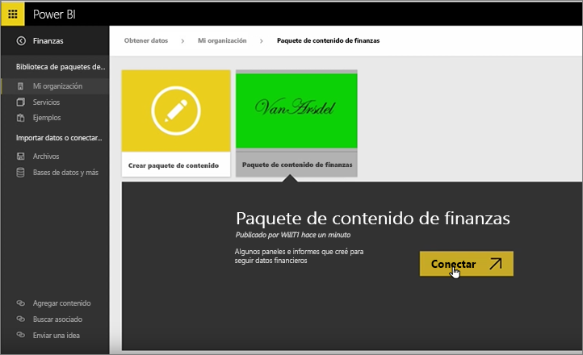
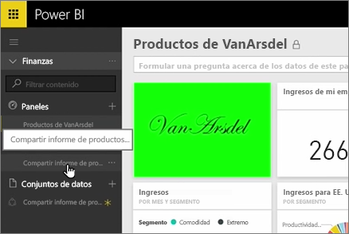
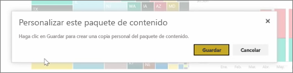
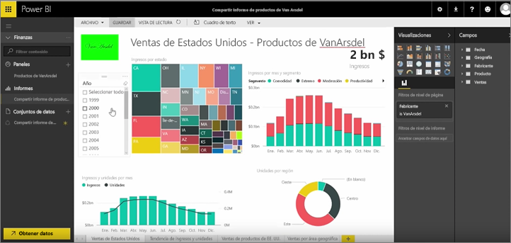

En lecciones anteriores ya creamos un paquete de contenido y un grupo. En esta ocasión vamos a crear una instancia del paquete de contenido para todos los usuarios del grupo.

Comienzo en Mi área de trabajo...

... y regreso al grupo Finance que cree en la lección anterior.

En este grupo todavía no hay paneles, informes ni conjuntos de datos. Voy a utilizar el paquete de contenido que he creado. Busco paquetes de contenido de mi organización en lugar de aquellos de servicios de terceros.

Localizo el paquete de contenido que cree hace un momento. Es importante asignarle un buen nombre e incluir una descripción y una imagen para que otras personas puedan encontrarlo. Ahora, me conecto a él.

Power BI importa los paneles, los informes y los conjuntos de datos que se encuentran en el paquete de contenido.

Al seleccionar el conjunto de datos, Power BI me pregunta si quiero personalizar el paquete de contenido.

Voy a crear una copia del paquete de contenido en la que pueda efectuar cambios y la desconectaré de la versión publicada del paquete de contenido. Si el autor del paquete de contenido realiza cambios en la versión publicada, esas actualizaciones no se aplicarán automáticamente en mi versión.

Sin embargo, si quiero puedo editar el panel, el informe e incluso el conjunto de datos.

Los paquetes de contenido son una forma sencilla de reaprovechar el contenido que otras personas de su organización han creado.

Pasemos a la siguiente lección.

