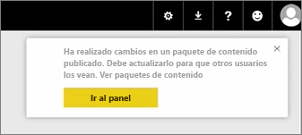
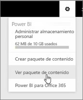
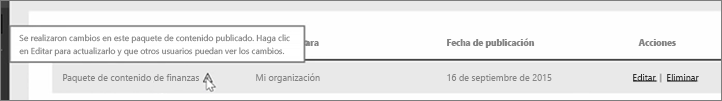

En esta lección, editaremos el paquete de contenido original que creamos previamente y comprobaremos como esas actualizaciones se aplican a las versiones de los usuarios que se hayan conectado a él.

He regresado a Mi área de trabajo y voy a editar el panel original.

Cada vez que efectúo un cambio en el panel, este aviso me recuerda que he cambiado algo que he compartido con otras personas en un paquete de contenido y me insta a que actualice la versión compartida.

Regreso al icono de configuración y selecciono **Ver paquete de contenido** para acceder a los paquetes de contenido que ya he publicado.

Ahora veo el paquete de contenido que he creado. Este pequeño icono indica que he cambiado algo en el paquete de contenido y que debo editarlo para que los otros usuarios puedan ver los cambios.

Cuando selecciono **Editar**, regresó de nuevo a la pantalla en la que puedo evitar el título y la descripción, pero esta vez muestra el botón **Actualizar**, por lo que en este caso lo selecciono.

Power BI adopta los cambios y publica el paquete de contenido actualizado en la galería de paquetes de contenido.

Cualquiera que se haya conectado a mi paquete de contenido recibe un mensaje en el que se informa de que el paquete de contenido ha cambiado y le pregunta si desea aceptar los cambios o conservar la versión anterior.

Como propietario del paquete de contenido, puede administrar las versiones que utilizan sus compañeros.

