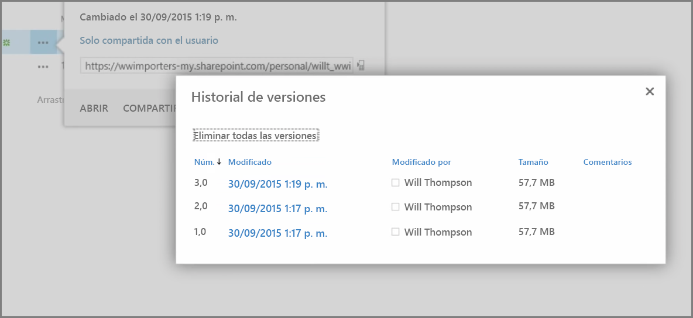
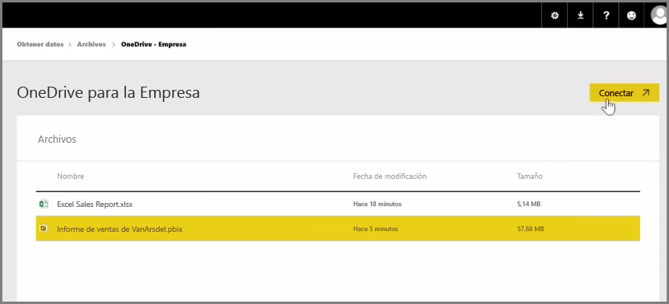

En un artículo anterior, repasamos la creación de grupos para ayudar a que su organización pueda administrar y trabajar conjuntamente con contenido que se encuentra en Power BI. También puede usar los grupos de Power BI/Office365 para trabajar conjuntamente y compartir datos mediante **OneDrive para la Empresa**.

El uso de OneDrive para la Empresa como origen de su contenido de Power BI le permite acceder a una serie de herramientas útiles, como el historial de versiones. También puede compartir los archivos con un grupo de Office365 desde OneDrive para la Empresa con el fin de otorgar acceso y permitir que varias personas trabajen en los mismos archivos de Power BI o Excel.

Para conectarse a un archivo PBIX (Power BI Desktop) en OneDrive para la Empresa, inicie sesión en el servicio Power BI y seleccione **Obtener datos**. Elija **Archivos** en Importar datos o conectarse a ellos y seleccione **OneDrive - Empresa**. Resalte el archivo deseado y seleccione **Conectar**.

El contenido aparece en la barra de navegación del lado izquierdo.

Ahora, los cambios que se realicen en el archivo en **OneDrive para la Empresa** también se reflejarán automáticamente en el entorno de Power BI y se registrarán en el historial de versiones.

