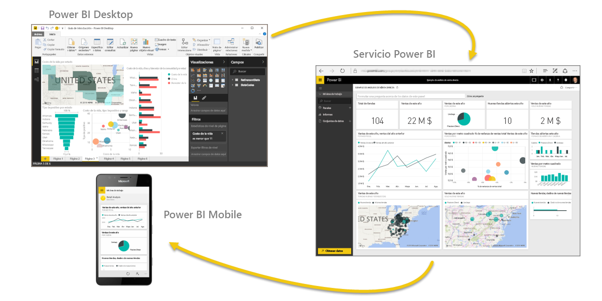
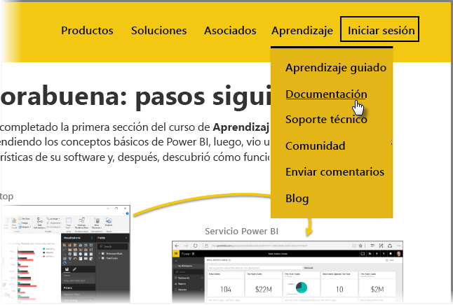

¡Lo logró! **Enhorabuena.** Ha completado el curso de **Aprendizaje guiado** de Power BI. Primero, comenzó aprendiendo los conceptos básicos de Power BI, luego, vio una introducción sobre los elementos y las características de su software y, después, descubrió cómo funcionan en conjunto.

Esta es la última sección (y el tema final, a menos que quiera aprender DAX) del curso, así que, si las ha completado todas en orden, puede sentirse orgulloso. Buen trabajo. Ahora, ya está familiarizado con todos estos **conceptos importantes**:

* Definición de [Power BI](0-0-what-is-power-bi.md)
* [Bloques de creación](0-0b-building-blocks-power-bi.md) de Power BI
* [Obtención](1-2-connect-to-data-sources-in-power-bi-desktop.md) y [modelado](2-1-intro-modeling-data.md) de datos
* [Visualizaciones](3-1-intro-visualizations.md)
* [Exploración de datos](4-0-intro-power-bi-service.md) en el servicio Power BI
* Uso de [Excel y Power BI](5-1-intro-excel-data.md) juntos
* [Publicación y uso compartido](6-0-intro-content-packs-groups.md) del trabajo

Ha adquirido una gran cantidad de conocimientos, así que ya está preparado para comenzar a ponerlos en práctica. Si hace clic en los **vínculos siguientes, podrá realizar descargas** o **conectar el explorador al servicio Power BI**:

* [La versión más reciente de Power BI Desktop siempre está disponible para descargarse](https://powerbi.microsoft.com/desktop).
* Descubra lo fácil que es acceder al [servicio Power BI](https://powerbi.microsoft.com/).
* Obtenga rápidamente las [aplicaciones móviles para Power BI](https://powerbi.microsoft.com/mobile/).

Hay mucho más contenido de **ayuda y referencia** disponible. Solo tiene que desplazarse a la parte superior de esta página y seleccionar **Learning > Documentación** para consultar nuestra amplia colección de contenido de referencia sobre Power BI.

Esperamos que haya disfrutado realizando este curso de **Aprendizaje guiado de Power BI**. Le deseamos mucha suerte y que consiga lograr que sus objetos visuales de Power BI sean interactivos y atractivos.

## Una sección más para los usuarios DAX
¿Aún quiere más? ¿Está interesado en usar **DAX (expresiones de análisis de datos)** para crear, filtrar o usar tablas y columnas personalizadas en Power BI? Hay una sección más dirigida a los usuarios que quieran trabajar con código en Power BI y se llama **Introducción a DAX**. Eche un vistazo si está interesado: usa el mismo enfoque descriptivo que el resto del aprendizaje guiado.

